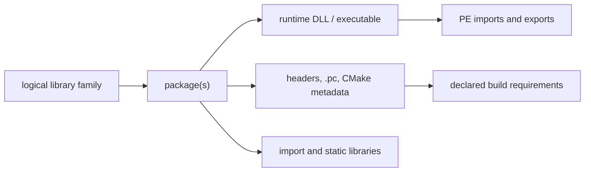

# MSYS2 Library Architecture

This volume organizes library families as logical interfaces connected to
separate package, binary, development, and dependency objects. It is a
navigation layer over the canonical package-inventory evidence in Volume 11;
it does not make package names or file suffixes into ABI claims.

## Architecture layers

| Question | Canonical evidence | Not established by that evidence |
| --- | --- | --- |
| Which package owns a library-related path? | Snapshot-qualified package/file ownership | Local byte presence or ABI compatibility |
| What does a DLL declare or export? | Hash-qualified PE import/export analysis | Dynamic loader selection or successful execution |
| Which headers and metadata describe a consumption surface? | Package paths plus parsed `.pc`/CMake metadata | Public API stability or a successful build |
| Which archive members exist? | Hash-qualified archive-member inventory | Runtime behavior or object-level ABI compatibility |
| Which binaries consume a DLL? | Static `imports-dll` relationships in one observation | Transitive runtime loading or reverse package dependency |

## First library pages

[libstdc++](LIBSTDCXX.md), [libc++](LIBCXX.md), [zlib](ZLIB.md),
[GNU libiconv](GNU-LIBICONV.md), [GNU gettext](GNU-GETTEXT.md),
[Expat](EXPAT.md), [libxml2](LIBXML2.md), [ICU](ICU.md), [Boost](BOOST.md),
[SQLite](SQLITE3.md), [GNU Readline](GNU-READLINE.md),
[GNU MP (GMP)](GNU-GMP.md), [GNU MPFR](GNU-MPFR.md), [GNU MPC](GNU-MPC.md),
[isl](LIBISL.md), [libwinpthread](LIBWINPTHREAD.md),
[winpthreads](WINPTHREADS.md), [PCRE2](PCRE2.md),
[libgpg-error](LIBGPG-ERROR.md), [libgcrypt](LIBGCRYPT.md),
[libassuan](LIBASSUAN.md), [libksba](LIBKSBA.md),
[nPth](NPTH.md), [Nettle](NETTLE.md), and [GnuTLS](GNUTLS.md) are this
volume's first per-library pages. The
first pair resolved the "C++ library" row the
[Toolchain Role Model](TOOLCHAIN-ROLE-MODEL.md) left open; the rest are
foundational libraries cited by dependency rationale across dozens of
pages elsewhere in this knowledge base (character-set conversion, NLS,
DEFLATE compression, XML parsing) that had not yet been given pages of
their own. zlib's 299 recorded reverse dependents make it the
most-depended-upon package identified anywhere in this knowledge base to
date (`claim:library:zlib-hub`). One cross-package mixup was caught and
corrected while writing [SQLite](SQLITE3.md): GnuPG depends on a
*separate*, MSYS-environment `libsqlite` package, not the UCRT64
`sqlite3` package this page documents — the same upstream project, two
distinct catalog entities, now stated explicitly rather than conflated.
All twenty-five pages are deliberately scoped to package/dependency-level
evidence only — package identity, bundling, provides/depends
relationships, and reverse-dependency counts — and all explicitly flag
that the fuller methodology below (headers, `pkg-config`/CMake metadata,
PE import/export analysis) has not been applied to them and remains open.
[winpthreads](WINPTHREADS.md) goes further and states outright that most
of its own headings could not be filled in at this evidence level. Its
relationship to [libwinpthread](LIBWINPTHREAD.md) started as a
medium-confidence dev/runtime-split inference and was revised down to
`low` after discovering a third package, `winpthreads-stub`, that
`provides`/`conflicts` with `winpthreads` as a near-empty placeholder —
new evidence that complicated the original theory rather than confirming
it, recorded as such rather than quietly dropped. The GnuPG crypto-stack
pages ([libgpg-error](LIBGPG-ERROR.md), [libgcrypt](LIBGCRYPT.md),
[libassuan](LIBASSUAN.md), [libksba](LIBKSBA.md), [nPth](NPTH.md),
[Nettle](NETTLE.md), and [GnuTLS](GNUTLS.md)) also close a loop back into
Volume 5: `component:gnupg:gnupg` now has explicit `requires` edges to
each of them, rather than the dependencies living only in
[GnuPG's](GNUPG.md) own prose table. [GnuTLS](GNUTLS.md) closes a second
such loop into `component:gnu:emacs`, whose
[dependency table](GNU-EMACS.md#dependencies) already cited it by package
name before this page existed. These pages are a starting point for this
volume, not a demonstration that its full evidence model is populated.

## Family navigation

Start with a logical family and carry environment, architecture, CRT/ABI,
package version, and evidence snapshot through every drill-down. Follow
package ownership to artifacts, then use the appropriate specialized view:

1. [Library family classification](LIBRARY-FAMILY-CLASSIFICATION.md) defines
   the distinct object types and membership rules.
2. [Header and development-metadata indexes](HEADER-AND-METADATA-INDEXES.md)
   covers source-facing headers and metadata.
3. [Binary-to-DLL dependency graph](BINARY-DLL-DEPENDENCY-GRAPH.md) covers
   static PE import/export facts.
4. [Reverse dependency impact analysis](REVERSE-DEPENDENCY-IMPACT-ANALYSIS.md)
   explains qualified reverse navigation.

## Evidence boundary

The local-only isolated MSYS/UCRT64 collection provides direct bytes for a
bounded installed subset. The repository-wide file-index projection provides
broad ownership coverage with `present: false`. Neither observation proves a
logical library identity, a complete API, binary compatibility, dynamic loader
outcome, or repository-wide byte coverage without further evidence.

## Related volumes

- Volume 4: [Runtime environments](RUNTIME-ENVIRONMENTS.md)
- Volume 8: [Toolchain role model](TOOLCHAIN-ROLE-MODEL.md)
- Volume 11: [Package file inventory](PACKAGE-FILE-INVENTORY.md)
- Volume 13: [Reverse dependency impact analysis](REVERSE-DEPENDENCY-IMPACT-ANALYSIS.md)
