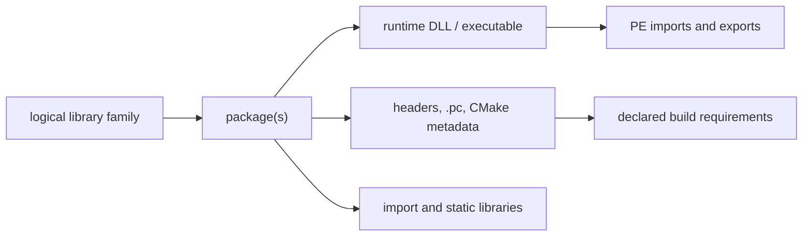

# MSYS2 Library Architecture

This volume organizes library families as logical interfaces connected to
separate package, binary, development, and dependency objects. It is a
navigation layer over the canonical package-inventory evidence in Volume 11;
it does not make package names or file suffixes into ABI claims.

## Architecture layers

| Question | Canonical evidence | Not established by that evidence |
| --- | --- | --- |
| Which package owns a library-related path? | Snapshot-qualified package/file ownership | Local byte presence or ABI compatibility |
| What does a DLL declare or export? | Hash-qualified PE import/export analysis | Dynamic loader selection or successful execution |
| Which headers and metadata describe a consumption surface? | Package paths plus parsed `.pc`/CMake metadata | Public API stability or a successful build |
| Which archive members exist? | Hash-qualified archive-member inventory | Runtime behavior or object-level ABI compatibility |
| Which binaries consume a DLL? | Static `imports-dll` relationships in one observation | Transitive runtime loading or reverse package dependency |

## First library pages

[libstdc++](LIBSTDCXX.md), [libc++](LIBCXX.md), [zlib](ZLIB.md),
[GNU libiconv](GNU-LIBICONV.md), [GNU gettext](GNU-GETTEXT.md),
[Expat](EXPAT.md), [libxml2](LIBXML2.md), [ICU](ICU.md), [Boost](BOOST.md),
[SQLite](SQLITE3.md), [GNU Readline](GNU-READLINE.md),
[GNU MP (GMP)](GNU-GMP.md), [GNU MPFR](GNU-MPFR.md), [GNU MPC](GNU-MPC.md),
[isl](LIBISL.md), [libwinpthread](LIBWINPTHREAD.md),
[winpthreads](WINPTHREADS.md), [PCRE2](PCRE2.md),
[libgpg-error](LIBGPG-ERROR.md), [libgcrypt](LIBGCRYPT.md),
[libassuan](LIBASSUAN.md), [libksba](LIBKSBA.md),
[nPth](NPTH.md), [Nettle](NETTLE.md), [GnuTLS](GNUTLS.md),
[GNU libidn2](GNU-LIBIDN2.md), [GNU Libtasn1](GNU-LIBTASN1.md),
[p11-kit](P11-KIT.md), [libpsl](LIBPSL.md),
[GNU libunistring](GNU-LIBUNISTRING.md), [libnghttp2](LIBNGHTTP2.md),
[libnghttp3](LIBNGHTTP3.md), [libngtcp2](LIBNGTCP2.md),
[libedit](LIBEDIT.md), [libxcrypt](LIBXCRYPT.md),
[libfido2](LIBFIDO2.md), [Heimdal](HEIMDAL.md), [cppdap](CPPDAP.md),
[JsonCpp](JSONCPP.md), [libarchive](LIBARCHIVE.md), [libuv](LIBUV.md),
[RHash](RHASH.md), [file](FILE.md), [GNU termcap](GNU-TERMCAP.md),
[WinEditLine](WINEDITLINE.md), [libgcrypt (MSYS)](LIBGCRYPT-MSYS.md),
[libassuan (MSYS)](LIBASSUAN-MSYS.md), [libksba (MSYS)](LIBKSBA-MSYS.md),
[nPth (MSYS)](NPTH-MSYS.md), [Nettle (MSYS)](NETTLE-MSYS.md),
[libgpg-error (MSYS)](LIBGPG-ERROR-MSYS.md),
[GNU libintl](GNU-LIBINTL.md), [libcurl](LIBCURL.md),
[PCRE2 (MSYS)](PCRE2-MSYS.md), [PCRE (MSYS)](PCRE-MSYS.md),
[GNU Readline (MSYS)](GNU-READLINE-MSYS.md),
[GNU Libltdl](GNU-LIBLTDL.md), [Zstandard (library)](LIBZSTD.md),
[LLVM libraries](LLVM-LIBS.md), [Clang libraries](CLANG-LIBS.md),
[xxHash](XXHASH.md), [liblzma](LIBLZMA.md),
[GNU libiconv (MSYS)](GNU-LIBICONV-MSYS.md), [GNU MP (MSYS)](GNU-GMP-MSYS.md),
[Expat (MSYS)](EXPAT-MSYS.md), [libxml2 (MSYS)](LIBXML2-MSYS.md),
[zlib (CLANG64)](ZLIB-CLANG64.md), [Zstandard (CLANG64)](LIBZSTD-CLANG64.md),
[libcbor](LIBCBOR.md), [Heimdal runtime libraries](HEIMDAL-LIBS.md),
[zlib (MSYS)](ZLIB-MSYS.md), [Brotli](BROTLI.md),
[ca-certificates](CA-CERTIFICATES.md), [libssh2](LIBSSH2.md),
[Zstandard (MSYS library)](LIBZSTD-MSYS.md), [libbz2](LIBBZ2.md),
[GNU MPFR (MSYS)](GNU-MPFR-MSYS.md), [libnettle (MSYS)](LIBNETTLE-MSYS.md),
[Hogweed (MSYS)](LIBHOGWEED-MSYS.md), [libopenssl](LIBOPENSSL.md),
[ncurses (UCRT64)](NCURSES-UCRT64.md), [libxml2 (CLANG64)](LIBXML2-CLANG64.md),
and [liblzma (CLANG64)](LIBLZMA-CLANG64.md) are
this volume's first
per-library pages. The
first pair resolved the "C++ library" row the
[Toolchain Role Model](TOOLCHAIN-ROLE-MODEL.md) left open; the rest are
foundational libraries cited by dependency rationale across dozens of
pages elsewhere in this knowledge base (character-set conversion, NLS,
DEFLATE compression, XML parsing) that had not yet been given pages of
their own. zlib's 299 recorded reverse dependents make it the
most-depended-upon package identified anywhere in this knowledge base to
date (`claim:library:zlib-hub`). One cross-package mixup was caught and
corrected while writing [SQLite](SQLITE3.md): GnuPG depends on a
*separate*, MSYS-environment `libsqlite` package, not the UCRT64
`sqlite3` package this page documents — the same upstream project, two
distinct catalog entities, now stated explicitly rather than conflated.
All eighty-three pages are deliberately scoped to package/dependency-level
evidence only — package identity, bundling, provides/depends
relationships, and reverse-dependency counts — and all explicitly flag
that the fuller methodology below (headers, `pkg-config`/CMake metadata,
PE import/export analysis) has not been applied to them and remains open.
[winpthreads](WINPTHREADS.md) goes further and states outright that most
of its own headings could not be filled in at this evidence level. Its
relationship to [libwinpthread](LIBWINPTHREAD.md) started as a
medium-confidence dev/runtime-split inference and was revised down to
`low` after discovering a third package, `winpthreads-stub`, that
`provides`/`conflicts` with `winpthreads` as a near-empty placeholder —
new evidence that complicated the original theory rather than confirming
it, recorded as such rather than quietly dropped. The GnuPG crypto-stack
pages ([libgpg-error](LIBGPG-ERROR.md), [libgcrypt](LIBGCRYPT.md),
[libassuan](LIBASSUAN.md), [libksba](LIBKSBA.md), [nPth](NPTH.md),
[Nettle](NETTLE.md), and [GnuTLS](GNUTLS.md)) also close a loop back into
Volume 5: `component:gnupg:gnupg` now has explicit `requires` edges to
each of them, rather than the dependencies living only in
[GnuPG's](GNUPG.md) own prose table. [GnuTLS](GNUTLS.md) closes a second
such loop into `component:gnu:emacs`, whose
[dependency table](GNU-EMACS.md#dependencies) already cited it by package
name before this page existed. [GnuTLS's](GNUTLS.md) own sub-dependencies
were themselves left as an explicitly open item on first publication;
[GNU libidn2](GNU-LIBIDN2.md), [GNU Libtasn1](GNU-LIBTASN1.md), and
[p11-kit](P11-KIT.md) close that item with three more pages and `requires`
edges from `library:gnutls:gnutls`, following the dependency chain one
level deeper than any other family in this volume has gone so far. The
same pattern was then applied to [curl's](CURL.md) own directly-declared
dependencies: [libpsl](LIBPSL.md), [GNU libunistring](GNU-LIBUNISTRING.md),
[libnghttp2](LIBNGHTTP2.md), [libnghttp3](LIBNGHTTP3.md), and
[libngtcp2](LIBNGTCP2.md) now each have pages and `requires` edges from
`component:curl:curl`, plus their own inter-library edges where the
catalog records them (libpsl on libidn2 and libunistring, p11-kit on
libtasn1). One dependency was deliberately left as a prose-only mention
rather than a graph edge: libidn2 is a dependency of `libcurl`, curl's own
transfer library, not of the `curl` CLI package itself, so no `requires`
edge from `component:curl:curl` to `library:gnu:libidn2` was added,
recorded explicitly on [GNU libidn2's own page](GNU-LIBIDN2.md#reverse-dependencies)
rather than silently added or silently omitted. The same
directly-declared-dependency pattern was applied a third time to
[OpenSSH's](OPENSSH.md) remaining uncovered dependencies:
[libedit](LIBEDIT.md), [libxcrypt](LIBXCRYPT.md),
[libfido2](LIBFIDO2.md), and [Heimdal](HEIMDAL.md) now each have pages
and `requires` edges from `component:openssh:openssh`, closing every
dependency edge in OpenSSH's own table to a page of its own except
[OpenSSL](OPENSSL.md), which already had one from Volume 5. The same
pattern crossed volumes for the first time in this batch:
[CMake's](CMAKE.md) own dependency table (Volume 8) named
[cppdap](CPPDAP.md), [JsonCpp](JSONCPP.md), [libarchive](LIBARCHIVE.md),
[libuv](LIBUV.md), and [RHash](RHASH.md) by package without pages of
their own; all five are now modeled here in Volume 6, each with a
`requires` edge from `component:cmake:cmake`, and
[libarchive's](LIBARCHIVE.md) own UCRT64 sub-dependencies close a further
loop onto four libraries this volume already documented
([Expat](EXPAT.md), [GNU libiconv](GNU-LIBICONV.md), [PCRE2](PCRE2.md),
[zlib](ZLIB.md)), each of which now lists libarchive as a reverse
dependent in its own Related Objects. These five are also this volume's
first UCRT64-native library pages sourced from a cross-volume dependency
table rather than a Volume 5 MSYS component's, following the same
`contains`/`packaged-by` pattern (without a `uses-runtime` edge to
`msys-2.0.dll`) already established for [libstdc++](LIBSTDCXX.md),
[Expat](EXPAT.md), and the other native libraries earlier in this
volume. A final small batch mopped up three remaining single-dependency
items already named by package elsewhere in this knowledge base but
never modeled: [file](FILE.md) (a [GNU Nano](GNU-NANO.md) dependency,
Volume 5), [GNU termcap](GNU-TERMCAP.md) (GNU Readline's sole recorded
dependency), and [WinEditLine](WINEDITLINE.md) (a [PCRE2](PCRE2.md)
dependency, and the native-Windows-Console counterpart to
[libedit](LIBEDIT.md), which targets the MSYS/POSIX-emulated terminal
instead). A final batch corrected a genuine pre-existing modeling error
rather than adding new coverage: five `requires` edges from
`component:gnupg:gnupg` (to `libgcrypt`, `libassuan`, `libksba`, `nPth`,
and `Nettle`) had pointed at this volume's UCRT64-packaged entities for
those names, when `package:msys2:gnupg` is itself an MSYS-environment
package whose actual catalog-recorded dependencies are separately
versioned MSYS sibling packages — in two cases (`libassuan`, `libksba`)
a full major version apart. The five edges are now corrected to point at
six new `(MSYS)`-suffixed pages
([libgcrypt](LIBGCRYPT-MSYS.md), [libassuan](LIBASSUAN-MSYS.md),
[libksba](LIBKSBA-MSYS.md), [nPth](NPTH-MSYS.md), [Nettle](NETTLE-MSYS.md),
and [libgpg-error](LIBGPG-ERROR-MSYS.md), the last added because the
other three depend on it in turn), and the five original UCRT64 pages
were rewritten to remove their now-false GnuPG-dependency claims rather
than silently left inconsistent with the corrected graph. This is the
fourth and largest instance of the MSYS/UCRT64 conflation risk this
volume has caught this session, after the SQLite mixup, the avoided
libcurl mismatch, and GnuTLS's own careful environment check — this one
was not caught before publication, only discovered afterward while
investigating a follow-on batch, and is recorded as such rather than
quietly corrected without a trace. A systematic re-sweep of every
Volume 5 and Volume 8 dependency table for still-undocumented package
names then surfaced [GNU libintl](GNU-LIBINTL.md), the MSYS gettext
runtime — with 59 recorded reverse dependents, the single most
widely-depended-upon library discovered in this session, ahead of
zlib's 299 total reverse dependents only because zlib's count spans both
environments where libintl's is MSYS-only. Sixteen already-documented
entities (eleven Volume 5 components, one Volume 8 component, and four
Volume 6 libraries) now have explicit `requires` edges to it, closing
every libintl citation this sweep found across the two volumes in a
single pass. The same sweep also caught one small standalone gap: Vim's
own `libxcrypt` dependency, already correctly identified in Vim's prose
as the same package OpenSSH depends on, had never been given a formal
graph edge or cross-link — both are now added. One more gap the sweep
found: `libcurl` itself, curl's own transfer library, was cited by
package name on both [curl's](CURL.md) and [GnuPG's](GNUPG.md) pages —
two independent consumers — without ever being modeled as an entity of
its own. [libcurl's](LIBCURL.md) new page picks up six sibling-library
`requires` edges essentially for free, since its own MSYS dependency
list happens to match six libraries this volume had already added while
covering curl's CLI dependencies directly. The same sweep also closed out
the MSYS PCRE pair: [PCRE2 (MSYS)](PCRE2-MSYS.md) (`libpcre2_8`, backing
Git's `--perl-regexp` and less's search) and [PCRE (MSYS)](PCRE-MSYS.md)
(`libpcre`, the older PCRE1 line GNU Grep's `-P` engine depends on
instead) — both already correctly distinguished in prose from this
volume's existing [PCRE2 (UCRT64)](PCRE2.md) page before these pages
existed, now given pages and graph edges of their own. Two more
single-item gaps closed this batch: [GNU Readline (MSYS)](GNU-READLINE-MSYS.md)
(`libreadline`, backing GnuPG's interactive prompts and gawk's built-in
debugger, distinct from this volume's existing UCRT64 Readline entity —
[GNU Readline (UCRT64)](GNU-READLINE.md)'s own page previously claimed
GnuPG as a direct dependent, corrected here the same way the GnuPG
crypto-stack pages were corrected earlier this session) and
[GNU Libltdl](GNU-LIBLTDL.md) (`libltdl`, Libtool's own companion
dlopen() wrapper library). A final batch expanded the sweep into Volume
8's LLVM/native-toolchain dependency tables for the first time:
[Zstandard (library)](LIBZSTD.md) (the UCRT64 `zstd` library backing
compressed debug sections in [GCC](GNU-GCC.md) and
[GNU Binutils](GNU-BINUTILS.md), a distinct catalog entity from the
MSYS `zstd` CLI tool Volume 5 already documents, with 94 recorded
reverse dependents — second only to
[GNU libintl's](GNU-LIBINTL.md) 59 among MSYS-only libraries, and the
widest of any UCRT64-native library added this session), plus
[LLVM libraries](LLVM-LIBS.md) and [Clang libraries](CLANG-LIBS.md)
(the CLANG64-packaged infrastructure underlying [LLD](LLD.md),
[LLDB](LLDB.md), and [Clang](CLANG.md) itself). Two already-modeled
libraries also picked up new dependency edges in this batch without new
pages: [zlib](ZLIB.md#reverse-dependencies) and
[GNU gettext](GNU-GETTEXT.md#related-objects) both gained `requires`
edges from GCC and/or Binutils, since those UCRT64 packages' own
dependency lists matched these existing entities exactly. A follow-on
pass through [GDB's](GNU-GDB.md) own dependency table (not yet checked
this session) found the richest single-page yield: eight of GDB's twelve
declared dependencies matched entities already modeled in this volume
(Expat, GNU MP, GNU MPFR, GNU libiconv, GNU Readline, GNU gettext, zlib,
Zstandard), each getting a new `requires` edge and cross-link, plus two
genuinely new libraries — [xxHash](XXHASH.md) (GDB's debug-info cache
hashing) and [liblzma](LIBLZMA.md) (GDB's xz-compressed debug-section
support, distinct from Volume 5's MSYS `xz` CLI tool the same way
Zstandard's library form is distinct from its own CLI sibling). A final
batch closed four more explicitly-flagged MSYS/UCRT64 gaps discovered
while re-reading this volume's own prior pages:
[GNU libiconv (MSYS)](GNU-LIBICONV-MSYS.md) (the widest fan-in of any
single addition this session — six already-documented entities,
[GnuTLS](GNUTLS.md), [GnuPG](GNUPG.md), [GNU Coreutils](GNU-COREUTILS.md),
[GNU libintl](GNU-LIBINTL.md), [GNU libunistring](GNU-LIBUNISTRING.md),
and [libgpg-error (MSYS)](LIBGPG-ERROR-MSYS.md), each had explicitly
declined or silently omitted this exact edge before now),
[GNU MP (MSYS)](GNU-GMP-MSYS.md) (closing an item
[GnuTLS's own page](GNUTLS.md#dependencies) stated outright it was
declining to model), [Expat (MSYS)](EXPAT-MSYS.md) (Git's XML
dependency), and [libxml2 (MSYS)](LIBXML2-MSYS.md) (GNU Emacs's XML
dependency). Fixing these also surfaced two more false GnuPG-style
claims this batch corrected in place rather than left standing:
[Expat (UCRT64)](EXPAT.md) had claimed Git as a direct dependent, and
[libxml2 (UCRT64)](LIBXML2.md) had claimed both GNU Emacs and LLDB as
direct dependents — Emacs actually depends on the MSYS sibling and LLDB
on a third, CLANG64-packaged sibling not modeled in this knowledge
base, neither the UCRT64 package this page documents. A further batch
picked up the previously-deferred CLANG64 compression siblings for
[LLD](LLD.md) and [LLDB](LLDB.md) —
[zlib (CLANG64)](ZLIB-CLANG64.md) and
[Zstandard (CLANG64)](LIBZSTD-CLANG64.md), the third distinct catalog
entity for each name alongside their MSYS and UCRT64 siblings — plus
two more small, previously-flagged single-dependent gaps:
[libcbor](LIBCBOR.md) (libfido2's CBOR encoding dependency) and
[Heimdal runtime libraries](HEIMDAL-LIBS.md) (Heimdal's own
CLI/library-package split, the same pattern already documented for
curl/libcurl and OpenSSL/libopenssl). Investigating libcbor surfaced one
more real error: [LIBFIDO2.md](LIBFIDO2.md#dependencies) had
misidentified its own `zlib` dependency as this knowledge base's UCRT64
zlib entity, when it is in fact a third, MSYS-packaged zlib sibling —
[zlib (MSYS)](ZLIB-MSYS.md), now modeled with 60 recorded reverse
dependents, six already documented in this knowledge base
([curl](CURL.md), [GNU Emacs](GNU-EMACS.md), [GnuPG](GNUPG.md),
[libcurl](LIBCURL.md), [libfido2](LIBFIDO2.md), and [file](FILE.md)),
matching [GNU libiconv (MSYS)](GNU-LIBICONV-MSYS.md)'s own six-dependent
fan-in as the widest found this session. A final batch closed
[libcurl's](LIBCURL.md) last four remaining declared dependencies,
completing full coverage of all twelve: [Brotli](BROTLI.md)
(`Content-Encoding: br`), [ca-certificates](CA-CERTIFICATES.md) (TLS
trust-store data, also a direct [curl](CURL.md) CLI dependency in its
own right), [libssh2](LIBSSH2.md) (`sftp://`/`scp://` support), and
[Zstandard (MSYS library)](LIBZSTD-MSYS.md) (`Content-Encoding: zstd`,
also a [file](FILE.md) dependency, closing another item that page had
left open). This knowledge base now documents three separately
versioned zlib catalog entities (MSYS, UCRT64, CLANG64) and four
separately versioned Zstandard entities (an MSYS CLI tool plus MSYS,
UCRT64, and CLANG64 library packages), each cross-linked to the others
rather than conflated. A follow-on batch closed
[libbz2](LIBBZ2.md), the Burrows-Wheeler codec library split from
[the bzip2 CLI](BZIP2.md), already cited by package name across five
already-documented pages ([bzip2](BZIP2.md), [file](FILE.md),
[GnuPG](GNUPG.md), [Info-ZIP Zip](INFO-ZIP-ZIP.md), and
[Info-ZIP UnZip](INFO-ZIP-UNZIP.md)) without ever being modeled as an
entity of its own — each now has a `requires` edge to it. Investigating
libbz2's remaining catalog dependents caught a near-miss before
publication rather than after: `package:msys2:pcre` and
`package:msys2:pcre2` also declare a `libbz2` dependency, but those are
the separate `pcregrep`/`pcre2grep` CLI meta-packages, not the
`libpcre`/`libpcre2_8` library packages this volume already documents
on [PCRE (MSYS)](PCRE-MSYS.md) and [PCRE2 (MSYS)](PCRE2-MSYS.md) — an
initial draft of libbz2's reverse-dependency edges pointed at those two
existing library entities before this distinction was caught and
corrected, so the edges were removed rather than left standing, and the
two meta-packages are recorded as an explicitly open, not-yet-modeled
item on [libbz2's own page](LIBBZ2.md#reverse-dependencies) instead.
A further batch closed
[GNU MPFR (MSYS)](GNU-MPFR-MSYS.md), gawk's `--bignum` arbitrary-precision
dependency, already cited by package name on
[GNU-AWK.md's dependency table](GNU-AWK.md#dependencies) — a distinct
catalog entity from this volume's existing
[GNU MPFR (UCRT64)](GNU-MPFR.md) page, the same MSYS-vs-native pattern
applied throughout this session, with its own `requires` edge back onto
[GNU MP (MSYS)](GNU-GMP-MSYS.md) closing an inter-library loop between
two now-modeled MSYS math libraries. A final batch closed the MSYS
Nettle sub-library pair GnuTLS and GNU Emacs actually depend on:
[libnettle (MSYS)](LIBNETTLE-MSYS.md) (GnuTLS's own direct Nettle
dependency, already flagged by name but not modeled on both
[GnuTLS's](GNUTLS.md) and [Nettle (MSYS)'s](NETTLE-MSYS.md) own pages)
and [Hogweed (MSYS)](LIBHOGWEED-MSYS.md) (Nettle's public-key
sublibrary, depended on by libnettle and directly by
[GNU Emacs](GNU-EMACS.md), already flagged on Emacs' own page). Modeling
these caught a real error rather than just filling a gap:
[Nettle (MSYS)'s](NETTLE-MSYS.md#dependencies) own Dependencies section
had stated `package:msys2:nettle` depends directly on `libhogweed`, but
the catalog's actual edge targets `libnettle` instead, with `libhogweed`
one level further down `libnettle`'s own dependency chain — corrected in
place rather than left standing, the same discipline applied to every
other conflation this session has caught. [Hogweed (MSYS)](LIBHOGWEED-MSYS.md)
also picked up a `requires` edge onto [GNU MP (MSYS)](GNU-GMP-MSYS.md)
for its own arbitrary-precision arithmetic needs, its fourth modeled
reverse dependent alongside GnuTLS, Coreutils, and MPFR. A final batch
closed [libopenssl](LIBOPENSSL.md), the OpenSSL runtime library split
from [the openssl CLI package](OPENSSL.md) — explicitly flagged as
not-yet-modeled on both [Heimdal runtime libraries'](HEIMDAL-LIBS.md)
and [libngtcp2's](LIBNGTCP2.md) own pages before this page existed, and
the widest reverse-dependency footprint of any library added in this
batch at 27 recorded catalog dependents. Modeling it closed
[libngtcp2's](LIBNGTCP2.md#dependencies) own previously-declined
dependency edge (corrected in place, 2026-07-30) in addition to picking
up the split-package edge from [openssl](OPENSSL.md) itself and a third
edge from [Heimdal runtime libraries](HEIMDAL-LIBS.md). A final pass
added no new pages but closed six missing graph edges found by
re-checking every already-modeled library's own dependents' prose
against the graph: [GCC's](GNU-GCC.md#dependencies) own dependency table
had cited `gmp`, `mpfr`, `mpc`, `isl`, and `winpthreads` by package name
since this page's first publication, each already backed by its own
page in this volume, but only its zlib/zstd edges had ever been added as
formal `requires` relationships — the five missing edges are now added.
[GNU Binutils'](GNU-BINUTILS.md#dependencies) own table had the same gap
for its `libwinpthread` dependency, alongside its already-modeled
zlib/zstd/gettext edges — that sixth edge is now added too. Both
corrections are recorded in place on the affected pages
(GNU-GCC.md, GNU-BINUTILS.md, GNU-GMP.md, GNU-MPFR.md, GNU-MPC.md,
LIBISL.md, WINPTHREADS.md, LIBWINPTHREAD.md) rather than silently
patched. That same re-check surfaced GDB's own missing `ncurses`
dependency edge — its dependency table cited
`mingw-w64-ucrt-x86_64-ncurses` by name, but this is a separate,
UCRT64-native catalog entity from the MSYS `ncurses` hub
([ncurses (MSYS)](NCURSES.md), 40 reverse dependents) rather than an
existing library missing an edge; [ncurses (UCRT64)](NCURSES-UCRT64.md)
is now modeled with its own `requires` edge from
[GDB](GNU-GDB.md#dependencies). The same pass closed two items
[LLDB's](LLDB.md#dependencies) own dependency table had left open:
[libxml2 (CLANG64)](LIBXML2-CLANG64.md) (correcting a false claim on
[libxml2 (UCRT64)](LIBXML2.md), which had listed LLDB as a direct
dependent before this CLANG64-packaged sibling was modeled — 126
recorded reverse dependents, the widest of any library added this
session) and [liblzma (CLANG64)](LIBLZMA-CLANG64.md) (explicitly
flagged as not-yet-modeled on [liblzma (UCRT64)'s](LIBLZMA.md) own page
before now). These pages are a starting point for this
volume, not a demonstration that its full evidence model is populated.

## Family navigation

Start with a logical family and carry environment, architecture, CRT/ABI,
package version, and evidence snapshot through every drill-down. Follow
package ownership to artifacts, then use the appropriate specialized view:

1. [Library family classification](LIBRARY-FAMILY-CLASSIFICATION.md) defines
   the distinct object types and membership rules.
2. [Header and development-metadata indexes](HEADER-AND-METADATA-INDEXES.md)
   covers source-facing headers and metadata.
3. [Binary-to-DLL dependency graph](BINARY-DLL-DEPENDENCY-GRAPH.md) covers
   static PE import/export facts.
4. [Reverse dependency impact analysis](REVERSE-DEPENDENCY-IMPACT-ANALYSIS.md)
   explains qualified reverse navigation.

## Evidence boundary

The local-only isolated MSYS/UCRT64 collection provides direct bytes for a
bounded installed subset. The repository-wide file-index projection provides
broad ownership coverage with `present: false`. Neither observation proves a
logical library identity, a complete API, binary compatibility, dynamic loader
outcome, or repository-wide byte coverage without further evidence.

## Related volumes

- Volume 4: [Runtime environments](RUNTIME-ENVIRONMENTS.md)
- Volume 8: [Toolchain role model](TOOLCHAIN-ROLE-MODEL.md)
- Volume 11: [Package file inventory](PACKAGE-FILE-INVENTORY.md)
- Volume 13: [Reverse dependency impact analysis](REVERSE-DEPENDENCY-IMPACT-ANALYSIS.md)
