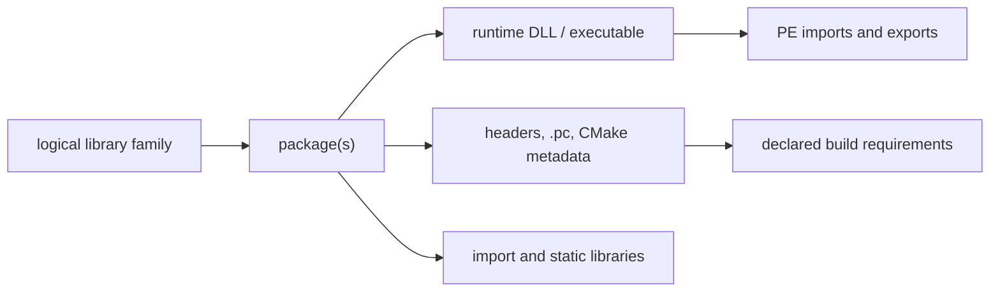

# MSYS2 Library Architecture

This volume organizes library families as logical interfaces connected to
separate package, binary, development, and dependency objects. It is a
navigation layer over the canonical package-inventory evidence in Volume 11;
it does not make package names or file suffixes into ABI claims.

## Architecture layers

| Question | Canonical evidence | Not established by that evidence |
| --- | --- | --- |
| Which package owns a library-related path? | Snapshot-qualified package/file ownership | Local byte presence or ABI compatibility |
| What does a DLL declare or export? | Hash-qualified PE import/export analysis | Dynamic loader selection or successful execution |
| Which headers and metadata describe a consumption surface? | Package paths plus parsed `.pc`/CMake metadata | Public API stability or a successful build |
| Which archive members exist? | Hash-qualified archive-member inventory | Runtime behavior or object-level ABI compatibility |
| Which binaries consume a DLL? | Static `imports-dll` relationships in one observation | Transitive runtime loading or reverse package dependency |

## Family navigation

Start with a logical family and carry environment, architecture, CRT/ABI,
package version, and evidence snapshot through every drill-down. Follow
package ownership to artifacts, then use the appropriate specialized view:

1. [Library family classification](LIBRARY-FAMILY-CLASSIFICATION.md) defines
   the distinct object types and membership rules.
2. [Header and development-metadata indexes](HEADER-AND-METADATA-INDEXES.md)
   covers source-facing headers and metadata.
3. [Binary-to-DLL dependency graph](BINARY-DLL-DEPENDENCY-GRAPH.md) covers
   static PE import/export facts.
4. [Reverse dependency impact analysis](REVERSE-DEPENDENCY-IMPACT-ANALYSIS.md)
   explains qualified reverse navigation.

## Evidence boundary

The local-only isolated MSYS/UCRT64 collection provides direct bytes for a
bounded installed subset. The repository-wide file-index projection provides
broad ownership coverage with `present: false`. Neither observation proves a
logical library identity, a complete API, binary compatibility, dynamic loader
outcome, or repository-wide byte coverage without further evidence.

## Related volumes

- Volume 4: [Runtime environments](RUNTIME-ENVIRONMENTS.md)
- Volume 8: [Toolchain role model](TOOLCHAIN-ROLE-MODEL.md)
- Volume 11: [Package file inventory](PACKAGE-FILE-INVENTORY.md)
- Volume 13: [Reverse dependency impact analysis](REVERSE-DEPENDENCY-IMPACT-ANALYSIS.md)
