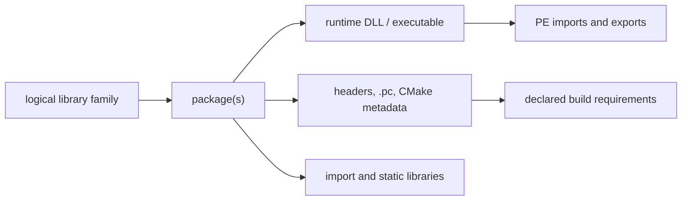

# MSYS2 Library Architecture

This volume organizes library families as logical interfaces connected to
separate package, binary, development, and dependency objects. It is a
navigation layer over the canonical package-inventory evidence in Volume 11;
it does not make package names or file suffixes into ABI claims.

## Architecture layers

| Question | Canonical evidence | Not established by that evidence |
| --- | --- | --- |
| Which package owns a library-related path? | Snapshot-qualified package/file ownership | Local byte presence or ABI compatibility |
| What does a DLL declare or export? | Hash-qualified PE import/export analysis | Dynamic loader selection or successful execution |
| Which headers and metadata describe a consumption surface? | Package paths plus parsed `.pc`/CMake metadata | Public API stability or a successful build |
| Which archive members exist? | Hash-qualified archive-member inventory | Runtime behavior or object-level ABI compatibility |
| Which binaries consume a DLL? | Static `imports-dll` relationships in one observation | Transitive runtime loading or reverse package dependency |

## First library pages

[libstdc++](LIBSTDCXX.md), [libc++](LIBCXX.md), [zlib](ZLIB.md),
[GNU libiconv](GNU-LIBICONV.md), [GNU gettext](GNU-GETTEXT.md),
[Expat](EXPAT.md), [libxml2](LIBXML2.md), [ICU](ICU.md), [Boost](BOOST.md),
[SQLite](SQLITE3.md), [GNU Readline](GNU-READLINE.md),
[GNU MP (GMP)](GNU-GMP.md), [GNU MPFR](GNU-MPFR.md), [GNU MPC](GNU-MPC.md),
[isl](LIBISL.md), [libwinpthread](LIBWINPTHREAD.md),
[winpthreads](WINPTHREADS.md), [PCRE2](PCRE2.md),
[libgpg-error](LIBGPG-ERROR.md), [libgcrypt](LIBGCRYPT.md),
[libassuan](LIBASSUAN.md), [libksba](LIBKSBA.md),
[nPth](NPTH.md), [Nettle](NETTLE.md), [GnuTLS](GNUTLS.md),
[GNU libidn2](GNU-LIBIDN2.md), [GNU Libtasn1](GNU-LIBTASN1.md),
[p11-kit](P11-KIT.md), [libpsl](LIBPSL.md),
[GNU libunistring](GNU-LIBUNISTRING.md), [libnghttp2](LIBNGHTTP2.md),
[libnghttp3](LIBNGHTTP3.md), [libngtcp2](LIBNGTCP2.md),
[libedit](LIBEDIT.md), [libxcrypt](LIBXCRYPT.md),
[libfido2](LIBFIDO2.md), [Heimdal](HEIMDAL.md), [cppdap](CPPDAP.md),
[JsonCpp](JSONCPP.md), [libarchive](LIBARCHIVE.md), [libuv](LIBUV.md),
[RHash](RHASH.md), [file](FILE.md), [GNU termcap](GNU-TERMCAP.md),
[WinEditLine](WINEDITLINE.md), [libgcrypt (MSYS)](LIBGCRYPT-MSYS.md),
[libassuan (MSYS)](LIBASSUAN-MSYS.md), [libksba (MSYS)](LIBKSBA-MSYS.md),
[nPth (MSYS)](NPTH-MSYS.md), [Nettle (MSYS)](NETTLE-MSYS.md), and
[libgpg-error (MSYS)](LIBGPG-ERROR-MSYS.md) are this volume's first
per-library pages. The
first pair resolved the "C++ library" row the
[Toolchain Role Model](TOOLCHAIN-ROLE-MODEL.md) left open; the rest are
foundational libraries cited by dependency rationale across dozens of
pages elsewhere in this knowledge base (character-set conversion, NLS,
DEFLATE compression, XML parsing) that had not yet been given pages of
their own. zlib's 299 recorded reverse dependents make it the
most-depended-upon package identified anywhere in this knowledge base to
date (`claim:library:zlib-hub`). One cross-package mixup was caught and
corrected while writing [SQLite](SQLITE3.md): GnuPG depends on a
*separate*, MSYS-environment `libsqlite` package, not the UCRT64
`sqlite3` package this page documents — the same upstream project, two
distinct catalog entities, now stated explicitly rather than conflated.
All fifty-one pages are deliberately scoped to package/dependency-level
evidence only — package identity, bundling, provides/depends
relationships, and reverse-dependency counts — and all explicitly flag
that the fuller methodology below (headers, `pkg-config`/CMake metadata,
PE import/export analysis) has not been applied to them and remains open.
[winpthreads](WINPTHREADS.md) goes further and states outright that most
of its own headings could not be filled in at this evidence level. Its
relationship to [libwinpthread](LIBWINPTHREAD.md) started as a
medium-confidence dev/runtime-split inference and was revised down to
`low` after discovering a third package, `winpthreads-stub`, that
`provides`/`conflicts` with `winpthreads` as a near-empty placeholder —
new evidence that complicated the original theory rather than confirming
it, recorded as such rather than quietly dropped. The GnuPG crypto-stack
pages ([libgpg-error](LIBGPG-ERROR.md), [libgcrypt](LIBGCRYPT.md),
[libassuan](LIBASSUAN.md), [libksba](LIBKSBA.md), [nPth](NPTH.md),
[Nettle](NETTLE.md), and [GnuTLS](GNUTLS.md)) also close a loop back into
Volume 5: `component:gnupg:gnupg` now has explicit `requires` edges to
each of them, rather than the dependencies living only in
[GnuPG's](GNUPG.md) own prose table. [GnuTLS](GNUTLS.md) closes a second
such loop into `component:gnu:emacs`, whose
[dependency table](GNU-EMACS.md#dependencies) already cited it by package
name before this page existed. [GnuTLS's](GNUTLS.md) own sub-dependencies
were themselves left as an explicitly open item on first publication;
[GNU libidn2](GNU-LIBIDN2.md), [GNU Libtasn1](GNU-LIBTASN1.md), and
[p11-kit](P11-KIT.md) close that item with three more pages and `requires`
edges from `library:gnutls:gnutls`, following the dependency chain one
level deeper than any other family in this volume has gone so far. The
same pattern was then applied to [curl's](CURL.md) own directly-declared
dependencies: [libpsl](LIBPSL.md), [GNU libunistring](GNU-LIBUNISTRING.md),
[libnghttp2](LIBNGHTTP2.md), [libnghttp3](LIBNGHTTP3.md), and
[libngtcp2](LIBNGTCP2.md) now each have pages and `requires` edges from
`component:curl:curl`, plus their own inter-library edges where the
catalog records them (libpsl on libidn2 and libunistring, p11-kit on
libtasn1). One dependency was deliberately left as a prose-only mention
rather than a graph edge: libidn2 is a dependency of `libcurl`, curl's own
transfer library, not of the `curl` CLI package itself, so no `requires`
edge from `component:curl:curl` to `library:gnu:libidn2` was added,
recorded explicitly on [GNU libidn2's own page](GNU-LIBIDN2.md#reverse-dependencies)
rather than silently added or silently omitted. The same
directly-declared-dependency pattern was applied a third time to
[OpenSSH's](OPENSSH.md) remaining uncovered dependencies:
[libedit](LIBEDIT.md), [libxcrypt](LIBXCRYPT.md),
[libfido2](LIBFIDO2.md), and [Heimdal](HEIMDAL.md) now each have pages
and `requires` edges from `component:openssh:openssh`, closing every
dependency edge in OpenSSH's own table to a page of its own except
[OpenSSL](OPENSSL.md), which already had one from Volume 5. The same
pattern crossed volumes for the first time in this batch:
[CMake's](CMAKE.md) own dependency table (Volume 8) named
[cppdap](CPPDAP.md), [JsonCpp](JSONCPP.md), [libarchive](LIBARCHIVE.md),
[libuv](LIBUV.md), and [RHash](RHASH.md) by package without pages of
their own; all five are now modeled here in Volume 6, each with a
`requires` edge from `component:cmake:cmake`, and
[libarchive's](LIBARCHIVE.md) own UCRT64 sub-dependencies close a further
loop onto four libraries this volume already documented
([Expat](EXPAT.md), [GNU libiconv](GNU-LIBICONV.md), [PCRE2](PCRE2.md),
[zlib](ZLIB.md)), each of which now lists libarchive as a reverse
dependent in its own Related Objects. These five are also this volume's
first UCRT64-native library pages sourced from a cross-volume dependency
table rather than a Volume 5 MSYS component's, following the same
`contains`/`packaged-by` pattern (without a `uses-runtime` edge to
`msys-2.0.dll`) already established for [libstdc++](LIBSTDCXX.md),
[Expat](EXPAT.md), and the other native libraries earlier in this
volume. A final small batch mopped up three remaining single-dependency
items already named by package elsewhere in this knowledge base but
never modeled: [file](FILE.md) (a [GNU Nano](GNU-NANO.md) dependency,
Volume 5), [GNU termcap](GNU-TERMCAP.md) (GNU Readline's sole recorded
dependency), and [WinEditLine](WINEDITLINE.md) (a [PCRE2](PCRE2.md)
dependency, and the native-Windows-Console counterpart to
[libedit](LIBEDIT.md), which targets the MSYS/POSIX-emulated terminal
instead). A final batch corrected a genuine pre-existing modeling error
rather than adding new coverage: five `requires` edges from
`component:gnupg:gnupg` (to `libgcrypt`, `libassuan`, `libksba`, `nPth`,
and `Nettle`) had pointed at this volume's UCRT64-packaged entities for
those names, when `package:msys2:gnupg` is itself an MSYS-environment
package whose actual catalog-recorded dependencies are separately
versioned MSYS sibling packages — in two cases (`libassuan`, `libksba`)
a full major version apart. The five edges are now corrected to point at
six new `(MSYS)`-suffixed pages
([libgcrypt](LIBGCRYPT-MSYS.md), [libassuan](LIBASSUAN-MSYS.md),
[libksba](LIBKSBA-MSYS.md), [nPth](NPTH-MSYS.md), [Nettle](NETTLE-MSYS.md),
and [libgpg-error](LIBGPG-ERROR-MSYS.md), the last added because the
other three depend on it in turn), and the five original UCRT64 pages
were rewritten to remove their now-false GnuPG-dependency claims rather
than silently left inconsistent with the corrected graph. This is the
fourth and largest instance of the MSYS/UCRT64 conflation risk this
volume has caught this session, after the SQLite mixup, the avoided
libcurl mismatch, and GnuTLS's own careful environment check — this one
was not caught before publication, only discovered afterward while
investigating a follow-on batch, and is recorded as such rather than
quietly corrected without a trace. These pages are a starting point for
this volume, not a demonstration that its full evidence model is
populated.

## Family navigation

Start with a logical family and carry environment, architecture, CRT/ABI,
package version, and evidence snapshot through every drill-down. Follow
package ownership to artifacts, then use the appropriate specialized view:

1. [Library family classification](LIBRARY-FAMILY-CLASSIFICATION.md) defines
   the distinct object types and membership rules.
2. [Header and development-metadata indexes](HEADER-AND-METADATA-INDEXES.md)
   covers source-facing headers and metadata.
3. [Binary-to-DLL dependency graph](BINARY-DLL-DEPENDENCY-GRAPH.md) covers
   static PE import/export facts.
4. [Reverse dependency impact analysis](REVERSE-DEPENDENCY-IMPACT-ANALYSIS.md)
   explains qualified reverse navigation.

## Evidence boundary

The local-only isolated MSYS/UCRT64 collection provides direct bytes for a
bounded installed subset. The repository-wide file-index projection provides
broad ownership coverage with `present: false`. Neither observation proves a
logical library identity, a complete API, binary compatibility, dynamic loader
outcome, or repository-wide byte coverage without further evidence.

## Related volumes

- Volume 4: [Runtime environments](RUNTIME-ENVIRONMENTS.md)
- Volume 8: [Toolchain role model](TOOLCHAIN-ROLE-MODEL.md)
- Volume 11: [Package file inventory](PACKAGE-FILE-INVENTORY.md)
- Volume 13: [Reverse dependency impact analysis](REVERSE-DEPENDENCY-IMPACT-ANALYSIS.md)
