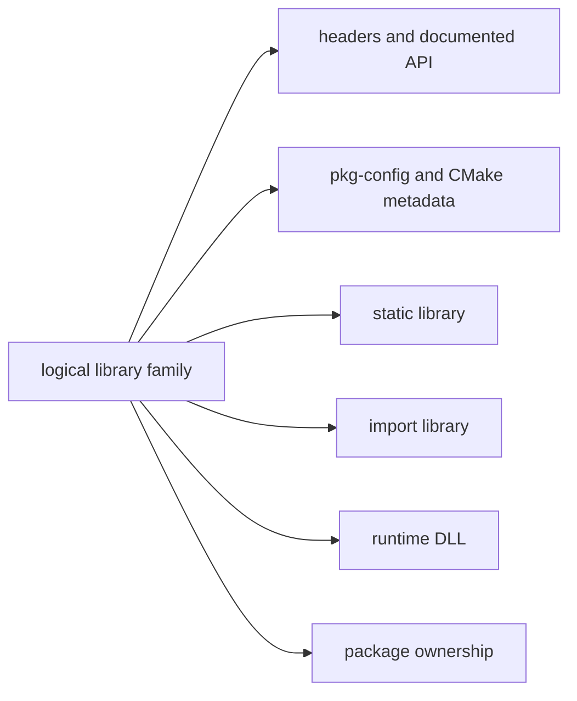
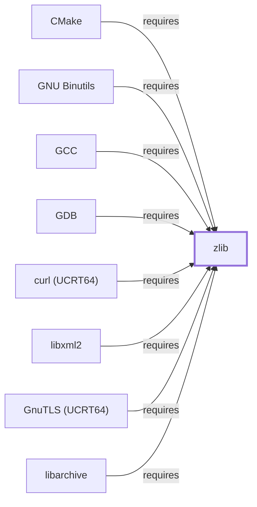

# Library Family Classification Model

<!-- BEGIN GENERATED object-facts -->

| Model fact | Value |
| --- | --- |
| Object | `library:gnu:zlib` |
| Kind | `library` |
| Status | `partial` |
| Confidence | `high` |
| Authority | Jean-loup Gailly and Mark Adler |
| Environments | `ucrt64` |
| Upstream | <https://www.zlib.net/> |
| Packaged as | `package:msys2:mingw-w64-ucrt-x86_64-zlib` |
| Version (observed) | 1.3.2-2 |
| License (observed) | spdx:Zlib |
| Architecture (observed) | any |
| Installed size (observed) | 427.78 KiB |

**Evidence on this object**

- `evidence:catalog:current` — MSYS2 pacman package catalog (`observed`, retrieved 2026-08-05)
- `evidence:zlib:manual-2026-07-30` — zlib Manual (`primary`, retrieved 2026-07-30)

**Claims about this object**

- `claim:library:zlib:hub` (`observation`, `verified`) — zlib is the most-depended-upon package observed in this catalog snapshot among all components and libraries modeled in this knowledge base, with 299 recorded reverse dependents, exceeding gcc-libs' 167.

Generated from the composed model by `tools/build_object_facts.py`. Observed values come from the catalog snapshot and change when it is refreshed.
Edits between the surrounding markers are overwritten on the next build.

<!-- END GENERATED object-facts -->

A library family groups related development and runtime artifacts around a
qualified logical API. The grouping is an evidence-backed classification, not
an equivalence claim based on a package name, filename stem, or one DLL import.

| Member type | Classification evidence | Relationship to logical library | Must remain distinct |
| --- | --- | --- | --- |
| Header or header set | Package path, include layout, API metadata | Exposes source-facing interface | Binary implementation and ABI guarantee |
| `pkg-config`/CMake module | Parsed module identity and declared targets/requirements | Describes a consumption surface | Runtime dependency proof |
| Static library | Archive path and member inventory | Link-time implementation artifact | Import library and loaded DLL |
| Import library | Import-archive classification and member evidence | Link-time binding surface for a DLL | Static archive contents and runtime loader result |
| Runtime DLL | PE artifact identity, exports, imports, architecture | Deployable binary implementation | Logical API compatibility across versions |
| Package | Snapshot-qualified ownership and metadata | Distribution/deployment container | The library family itself |

## Classification Rules

1. Create a logical library-family association only when package, metadata,
   headers, archive, or binary evidence establishes a meaningful relationship.
   Filename similarity alone is insufficient.
2. Qualify classifications by environment, architecture, CRT/ABI, package
   version, and inventory snapshot wherever those properties are known.
3. Preserve many-to-many membership: one package can ship several libraries,
   and a family can span runtime, development, compatibility, or split
   packages.
4. Do not equate an import library with a static library, or either with its
   runtime DLL. Their file formats, linkage roles, and compatibility evidence
   differ.
5. Treat API/source compatibility, ABI compatibility, and loader resolution
   as separate claims requiring their own qualified evidence.

## Classification Sequence

1. Start with a snapshot-qualified package and owned artifact paths.
2. Collect headers, metadata modules, archives, and PE artifacts.
3. Compare declared names, imported targets, exports, and ownership evidence.
4. Record supported family membership plus confidence and unresolved ambiguity.
5. Use explicit ABI or runtime observations before making compatibility claims.

## Worked Examples

[zlib](ZLIB.md#family-classification) was, as of 2026-07-30, the first
library in this knowledge base to have this methodology fully applied: a
package-archive static analysis recorded its header set, `pkg-config`
module, static library, import library, and runtime DLL as five separate
typed entities, each linked to `library:gnu:zlib` and to their shared
package via the relationship types this document's diagram implies
(`exposes`, `documents`, `implements`, `wraps`, `packaged-by`).

A 2026-07-31 update applied the identical methodology to
[zstd (UCRT64)](LIBZSTD.md#family-classification), reusing the archive
already downloaded for a Volume 11 worked example rather than a fresh
collection: `header-set:facebook:zstd-headers`,
`pkg-config-module:facebook:zstd-pc`, `static-library:facebook:libzstd.a`,
`import-library:facebook:libzstd.dll.a`, and `dll:facebook:libzstd.dll`.
The other documented library pages — 157 exist as of 2026-08-02 — have
not yet received this treatment.

## Category Coverage

Seven categories are documented as categories rather than per library,
each ranked by dependents summed across all environment variants. All
seven were recomputed against build-time edges on 2026-08-02: runtime
figures come from catalog snapshot `20260729T113151Z`, build and check
figures from the MSYS2 and MinGW-w64 PKGBUILD trees read the same day.

| Category | Leader | Runtime | Build + check | Total |
| --- | --- | ---: | ---: | ---: |
| [GUI](LIBRARY-CATEGORY-GUI.md) | `qt6-base` | 637 | 422 | **1,059** |
| [Imaging](LIBRARY-CATEGORY-IMAGING.md) | `libpng` | 471 | 110 | **581** |
| [Graphics](LIBRARY-CATEGORY-GRAPHICS.md) | `cairo` | 321 | 165 | **486** |
| [Video](LIBRARY-CATEGORY-VIDEO.md) | `ffmpeg` | 161 | 53 | **214** |
| [Audio](LIBRARY-CATEGORY-AUDIO.md) | SDL2 | 158 | 36 | **194** |
| [Testing](LIBRARY-CATEGORY-TESTING.md) | `python-pytest` | 81 | 1,247 | **1,328** |
| [Logging](LIBRARY-CATEGORY-LOGGING.md) | `spdlog` | 27 | 0 | **27** |

**One category leader changed and four internal orderings moved:**

- **GUI**: `qt6-base` (1,059) displaces `glib2` (794). The page previously
  had to explain that its leader was not a GUI library at all; it now is.
  Qt 5 also edges past GTK 3 by a single edge, 382 to 381 — a tie, not a
  finding.
- **Audio**: `libvorbis` overtakes `libsndfile`, 125 to 121, having trailed
  it 98 to 100, and `openal` climbs from fifth to fourth on 42 build edges.
- **Video**: `libtheora`, `libass`, `aom`, and `x265` rise past `dav1d` and
  `libvpx`.
- **Graphics**: `pixman` edges past `libepoxy`, 36 to 31.
- **Imaging**: `openjpeg2` rises from sixth to fifth past `lcms2`, at 99
  build against 119 runtime — the most build-weighted library in its
  category.
- **Testing** is not a reordering but a category that was invisible:
  `python-pytest` at 1,328 is the most-depended-upon test framework in the
  ecosystem, 1,239 of those check-time, and recorded nothing at all before
  build and check edges existed.

### Where the build column comes from, and how to read it

Two sources were built and compared, because the first turned out not to
be trustworthy on its own.

`tools/import_build_dependencies.py` reads `%MAKEDEPENDS%` and
`%CHECKDEPENDS%` from the pacman **repository databases** — what the built
package records. `tools/import_recipe_dependencies.py` reads the same two
fields from the **PKGBUILD trees** — the declaration makepkg actually
consumes. Measured against each other, the recipe confirms **94.6%** of the
database's edges and adds 9,742 more, 95% of them virtual provides.

The decisive difference is the compiler. Recipes name
`${MINGW_PACKAGE_PREFIX}-cc`; no package is called that, so the database
importer dropped it, and **under that projection not one package in the
ecosystem had a build edge to its own compiler.** Resolving provides makes
`gcc` (4,945) and `clang` (4,675) the two most-declared build dependencies
in the catalog. The recipe projection is the one composed; the database
tool is kept for hosts without the recipe trees.

**A nonzero build count is still a floor, not a measure.** MSYS2 recipes
declare a library needed at both build and run time only once, in
`depends` — `SDL2_image` builds against SDL2 and lists it in `DEPENDS`,
with `MAKEDEPENDS` carrying only `cc` and `autotools`. What `makedepends`
reliably carries is build-*only* dependencies: toolchains and build
systems, header and code-generation packages, and `-devel` split packages
on the MSYS side. So the build column is evidence of use, and its absence
is not evidence of non-use. Each category page repeats this where its own
numbers depend on it.

**Check-time edges are a Python phenomenon.** Outside testing they are
essentially zero across all six other categories — the only non-testing
entry anywhere is `gtk3` at 4 — and inside testing they are dominated by
`python-pytest` and its plugins.

The build-time graph is a genuinely different graph. Its leaders — `gcc`
4,945, `clang` 4,675, `ninja` 4,382, `cmake` 4,107, `python-installer`
4,107, `python-build` 4,056, `python-setuptools` 3,096, `autotools` 2,589,
`pkgconf` 2,098 — do not appear anywhere in a runtime ranking, and between
them are declared by more packages than any runtime dependency in the
catalog.

All seven category pages now carry both measures. No ranking in this
section is runtime-only any more.

## Related Views

- [Header and development-metadata indexes](HEADER-AND-METADATA-INDEXES.md)
- [Binary-to-DLL dependency graph](BINARY-DLL-DEPENDENCY-GRAPH.md)
- [Package-to-file inventory](PACKAGE-FILE-INVENTORY.md)

<!-- BEGIN GENERATED dependency-subgraph -->

## Dependency Diagram

Dependencies and dependents of `library:gnu:zlib` in the composed graph: 13 dependents and 0 dependencies, of which 5 are omitted here for legibility.

Generated from the composed model by `tools/build_object_diagrams.py`.
Edits between the surrounding markers are overwritten on the next build.

<!-- END GENERATED dependency-subgraph -->
