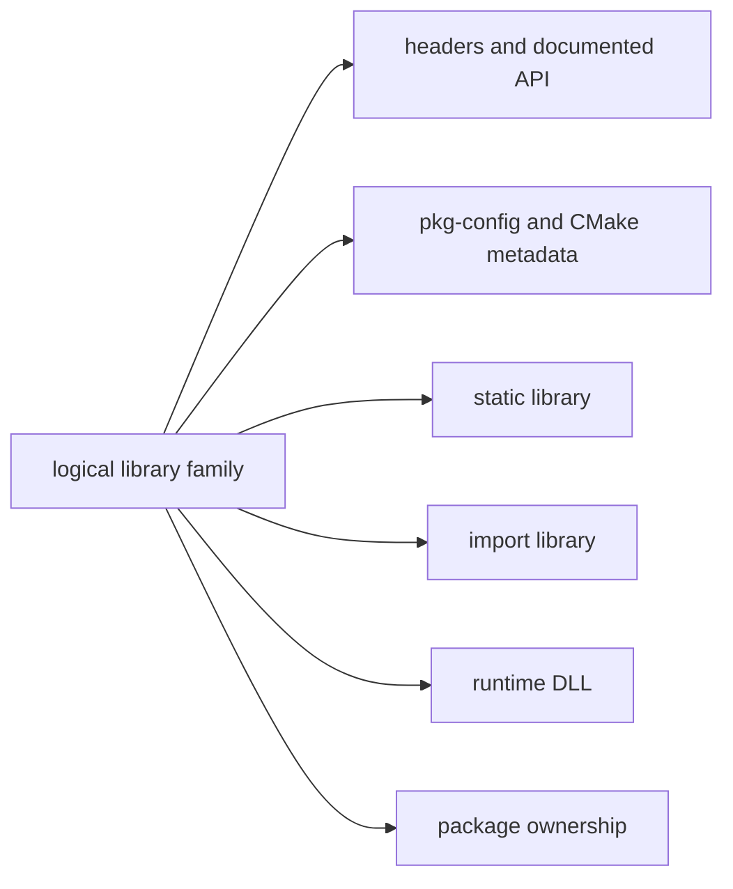

# Library Family Classification Model

A library family groups related development and runtime artifacts around a
qualified logical API. The grouping is an evidence-backed classification, not
an equivalence claim based on a package name, filename stem, or one DLL import.

| Member type | Classification evidence | Relationship to logical library | Must remain distinct |
| --- | --- | --- | --- |
| Header or header set | Package path, include layout, API metadata | Exposes source-facing interface | Binary implementation and ABI guarantee |
| `pkg-config`/CMake module | Parsed module identity and declared targets/requirements | Describes a consumption surface | Runtime dependency proof |
| Static library | Archive path and member inventory | Link-time implementation artifact | Import library and loaded DLL |
| Import library | Import-archive classification and member evidence | Link-time binding surface for a DLL | Static archive contents and runtime loader result |
| Runtime DLL | PE artifact identity, exports, imports, architecture | Deployable binary implementation | Logical API compatibility across versions |
| Package | Snapshot-qualified ownership and metadata | Distribution/deployment container | The library family itself |

## Classification Rules

1. Create a logical library-family association only when package, metadata,
   headers, archive, or binary evidence establishes a meaningful relationship.
   Filename similarity alone is insufficient.
2. Qualify classifications by environment, architecture, CRT/ABI, package
   version, and inventory snapshot wherever those properties are known.
3. Preserve many-to-many membership: one package can ship several libraries,
   and a family can span runtime, development, compatibility, or split
   packages.
4. Do not equate an import library with a static library, or either with its
   runtime DLL. Their file formats, linkage roles, and compatibility evidence
   differ.
5. Treat API/source compatibility, ABI compatibility, and loader resolution
   as separate claims requiring their own qualified evidence.

## Classification Sequence

1. Start with a snapshot-qualified package and owned artifact paths.
2. Collect headers, metadata modules, archives, and PE artifacts.
3. Compare declared names, imported targets, exports, and ownership evidence.
4. Record supported family membership plus confidence and unresolved ambiguity.
5. Use explicit ABI or runtime observations before making compatibility claims.

## Category Coverage

Seven categories are documented as categories rather than per library,
each ranked from the catalog snapshot by dependents summed across all
environment variants:

| Category | Leader | Runtime | Build + check |
| --- | --- | ---: | ---: |
| [GUI](LIBRARY-CATEGORY-GUI.md) | `glib2` (infrastructure); `qt6-base` is the leading toolkit | 735 / 637 | — |
| [Imaging](LIBRARY-CATEGORY-IMAGING.md) | `libpng` | 471 | — |
| [Graphics](LIBRARY-CATEGORY-GRAPHICS.md) | `cairo` | 321 | — |
| [Video](LIBRARY-CATEGORY-VIDEO.md) | `ffmpeg` | 161 | — |
| [Audio](LIBRARY-CATEGORY-AUDIO.md) | `libsndfile` | 100 | — |
| [Logging](LIBRARY-CATEGORY-LOGGING.md) | `spdlog` | 27 | **0** |
| [Testing](LIBRARY-CATEGORY-TESTING.md) | `gtest` | 0 | **79** |

**Corrected 2026-08-02.** The testing row previously read `0` and this
section said so was an artifact rather than a fact — the catalog projection
carried no build-time or check-time edges, because
`tools/import_repository_db.py` read `%DEPENDS%` and `%OPTDEPENDS%` from
each package's `desc` record and dropped `%MAKEDEPENDS%` and
`%CHECKDEPENDS%`.

That is fixed. `model/build-dependencies/current.json` carries 54,035
`build-depends-on` and 3,428 `check-depends-on` edges, and
`build-depends-on` is now the largest single edge type in the composed
graph — ahead of `runtime-depends-on` at 41,061.

Two results followed, in opposite directions:

- **Testing was an artifact.** The category goes from 1 dependent to 202,
  and `python-pytest` turns out to have 1,262 dependents — 1,254 of them
  check-time — making it the most-depended-upon test framework in the
  ecosystem by an order of magnitude, previously invisible.
- **Logging was not.** Every logging library records zero on both new edge
  classes. Its low counts are a fact about how logging is consumed.

The build-time graph is a genuinely different graph. Its leaders — `ninja`
(4,455), `cmake` (4,194), `python-installer` (4,187), `python-build`
(4,132), `python-setuptools` (3,206), `autotools` (2,593), `pkgconf`
(2,081) — do not appear anywhere in a runtime ranking, and between them
are declared by more packages than any runtime dependency in the catalog.

The five categories showing `—` above have not been recomputed against
build-time edges; their leaders are runtime-centrality leaders, and that
qualifier now belongs on them explicitly rather than on the table as a
whole.

## Related Views

- [Header and development-metadata indexes](HEADER-AND-METADATA-INDEXES.md)
- [Binary-to-DLL dependency graph](BINARY-DLL-DEPENDENCY-GRAPH.md)
- [Package-to-file inventory](PACKAGE-FILE-INVENTORY.md)
