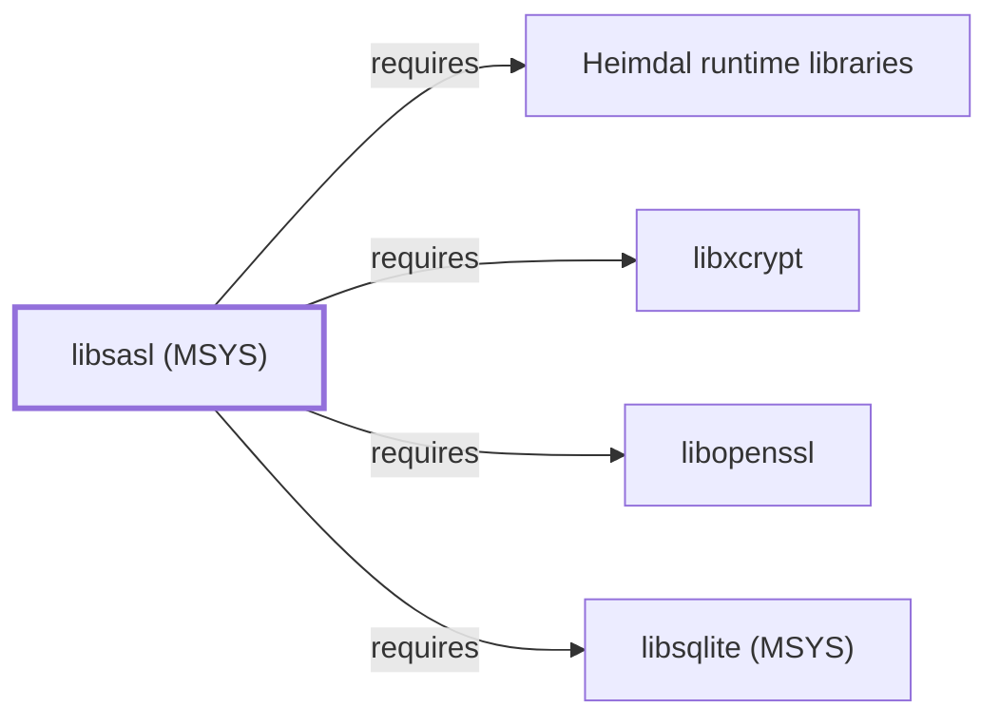

# libsasl (MSYS)

## Purpose

This page documents `package:msys2:libsasl`, the Cyrus Simple
Authentication and Security Layer (SASL) library — a pluggable
authentication framework consumed by mail clients and version-control
tooling for mechanism-negotiated authentication (PLAIN, CRAM-MD5,
DIGEST-MD5, GSSAPI, and others). See the
[official Cyrus SASL project site](https://www.cyrusimap.org/sasl/) for
the full reference.

## Architectural Classification

`library:sasl:libsasl@msys` is packaged as `package:msys2:libsasl`
(version `2.1.28-5` in the current catalog snapshot, license `custom`),
authored by the Cyrus SASL project (part of the broader Cyrus IMAP
project). It belongs to the MSYS environment. All four of its own
recorded runtime dependencies were already modeled entities in this
knowledge base before this page was written, letting this addition
close its full dependency footprint in a single pass — the same
full-coverage pattern documented for
[libarchive (MSYS)](LIBARCHIVE-MSYS.md).

## Responsibilities

- Providing pluggable SASL authentication mechanism negotiation and
  execution, letting client and server programs support multiple
  authentication schemes (PLAIN, CRAM-MD5, DIGEST-MD5, GSSAPI, SCRAM)
  through one common API rather than each implementing its own.

## Boundaries

libsasl handles the authentication-mechanism negotiation layer
specifically; it is not itself a network protocol implementation —
consuming programs (mail clients, Subversion's `libserf`-based HTTP
transport) still own the underlying protocol session that SASL is
negotiated within.

## Interfaces

- The Cyrus SASL C API (`sasl_client_new`, `sasl_server_new`,
  `sasl_client_start`, and related functions), per the documentation.

## Dependencies

The catalog snapshot records four `runtime-depends-on` edges for
`package:msys2:libsasl`, all now modeled in this knowledge base:

| Dependency | Package | Architectural reason |
| --- | --- | --- |
| [libxcrypt](LIBXCRYPT.md) | `package:msys2:libxcrypt` | Backs `crypt()`-family password hashing for SASL mechanisms that verify local password hashes. |
| [libopenssl](LIBOPENSSL.md) | `package:msys2:libopenssl` | Backs cryptographic support for SASL mechanisms such as SCRAM and DIGEST-MD5. |
| [Heimdal runtime libraries](HEIMDAL-LIBS.md) | `package:msys2:heimdal-libs` | Backs the GSSAPI SASL mechanism, which delegates to Heimdal's Kerberos V5 implementation for authentication. |
| [libsqlite (MSYS)](LIBSQLITE-MSYS.md) | `package:msys2:libsqlite` | Backs SASL's SQL-backed authentication-secrets storage option (`sasldb` via SQLite). |

## Reverse Dependencies

The catalog snapshot records 5 relationships targeting
`package:msys2:libsasl`: `cyrus-sasl`, `libsasl-devel`, `mutt`,
`neomutt`, and `subversion`. None of these five are currently modeled
as entities in this knowledge base; see the
[reverse dependency impact analysis](REVERSE-DEPENDENCY-IMPACT-ANALYSIS.md)
for the current full list.

## Configuration

Cyrus SASL is conventionally configured through `.conf` files under a
SASL application-config-path directory (e.g. `smtpd.conf` for Postfix-
style consumers); this page does not confirm which, if any, config
files ship in this MSYS packaging.

## Initialization and Execution Flow

As a library, libsasl has no independent process lifecycle: it
initializes and executes within the process of whatever program links
against it — the reverse dependents listed above, none yet modeled in
this knowledge base.

## Runtime Behavior

libsasl's mechanism negotiation is exercised at authentication time in
a consuming program's protocol session; which specific mechanisms are
available depends on which of libsasl's own optional plugin
dependencies (openssl, Heimdal, sqlite, libxcrypt) are present, all
recorded above as hard runtime dependencies in this snapshot rather
than optional plugins.

## Compatibility and Variants

Whether other native environments (UCRT64, CLANG64, i686) in this
catalog package libsasl separately was not confirmed while writing this
page; this is recorded as an open item rather than assumed either way.

## Security Considerations

As an authentication-mechanism library, libsasl sits in a
security-sensitive position for any consuming program's credential
handling; this page does not assert this specific package version's
mitigation status. See
[Threat Model and Supply Chain](THREAT-MODEL-AND-SUPPLY-CHAIN.md) for
the project's general supply-chain posture; no version-qualified CVE
review has been performed for the recorded `2.1.28-5` version.

## Failure Modes and Diagnostics

An authentication failure in a consuming program should first be
checked against that program's own SASL mechanism configuration and
credential validity before being treated as a libsasl defect.

## Evidence, Assumptions, and Open Questions

SASL framework scope is backed by the official Cyrus SASL project site
(`evidence:cyrusimap:libsasl-manual-2026-08-02`), matching the
`project_url` recorded for `package:msys2:libsasl` in the catalog.
Package identity, version, license, and all four recorded dependency
edges are backed by the pacman catalog snapshot
(`evidence:catalog:current`). Open: whether other native environments
package libsasl separately was not confirmed, and the five recorded
reverse dependents (`cyrus-sasl`, `libsasl-devel`, `mutt`, `neomutt`,
`subversion`) are not individually modeled in this knowledge base.

<!-- BEGIN GENERATED dependency-subgraph -->

## Dependency Diagram

Dependencies and dependents of `library:sasl:libsasl@msys` in the composed graph: 0 dependents and 4 dependencies.

Generated from the composed model by `tools/build_object_diagrams.py`.
Edits between the surrounding markers are overwritten on the next build.

<!-- END GENERATED dependency-subgraph -->

## Related Objects

- [MSYS2 Library Architecture](LIBRARIES-ARCHITECTURE.md)
- [libxcrypt](LIBXCRYPT.md)
- [libopenssl](LIBOPENSSL.md)
- [Heimdal runtime libraries](HEIMDAL-LIBS.md)
- [libsqlite (MSYS)](LIBSQLITE-MSYS.md)
