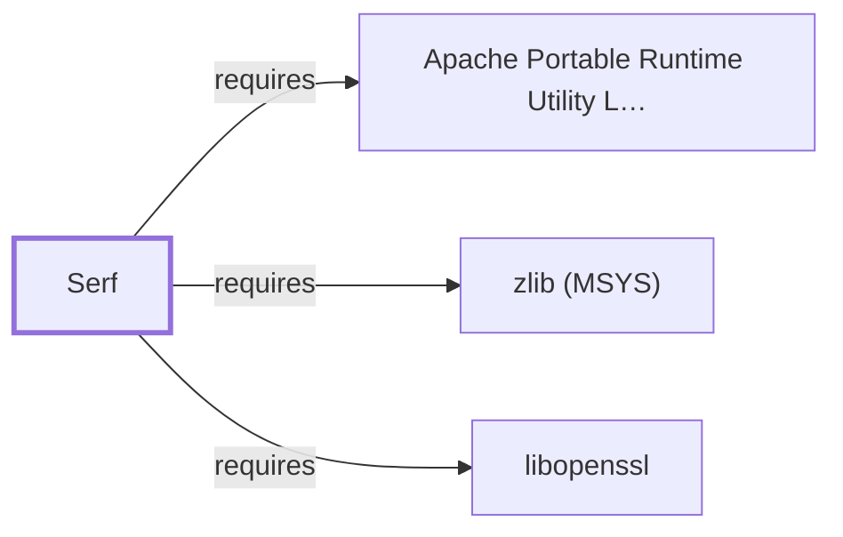

# Serf (MSYS)

<!-- BEGIN GENERATED object-facts -->

| Model fact | Value |
| --- | --- |
| Object | `library:apache:libserf@msys` |
| Kind | `library` |
| Status | `partial` |
| Confidence | `high` |
| Authority | Apache Software Foundation |
| Environments | `msys` |
| Upstream | <https://serf.apache.org/> |
| Packaged as | `package:msys2:libserf` |
| Version (observed) | 1.3.10-2 |
| License (observed) | Apache |
| Architecture (observed) | x86_64 |
| Installed size (observed) | 94.9 KB |

**Evidence on this object**

- `evidence:apache:serf-manual-2026-08-02` — Serf (official project site) (`primary`, retrieved 2026-08-02)
- `evidence:catalog:current` — MSYS2 pacman package catalog (`observed`, retrieved 2026-07-29)

Generated from the composed model by `tools/build_object_facts.py`. Observed values come from the catalog snapshot and change when it is refreshed.
Edits between the surrounding markers are overwritten on the next build.

<!-- END GENERATED object-facts -->

## Purpose

This page documents `package:msys2:libserf`, a high-performance HTTP
client library built on the [Apache Portable Runtime](APR-MSYS.md),
used by `subversion` (not yet a modeled entity) as its HTTP/WebDAV
repository-access transport. See the
[official Serf project site](https://serf.apache.org/) for the full
reference.

## Architectural Classification

`library:apache:libserf@msys` is packaged as `package:msys2:libserf`
(version `1.3.10-2` in the current catalog snapshot, license
`Apache`), developed by the Apache Software Foundation. It belongs to
the MSYS environment. All three of its own recorded runtime
dependencies were already modeled entities in this knowledge base
before this page was written (the last, [APR-util](APR-UTIL-MSYS.md),
added earlier in this same batch), letting this addition close its
full dependency footprint in a single pass — the same full-coverage
pattern documented for [libsasl (MSYS)](LIBSASL-MSYS.md) and
[popt (MSYS)](POPT-MSYS.md).

## Responsibilities

- Providing a high-performance, asynchronous HTTP client built on
  APR's I/O and buckets model, consumed by `subversion` for its
  HTTP/WebDAV-based repository access (as an alternative to
  Subversion's file:// or svn:// access methods).

## Boundaries

Serf provides the HTTP/WebDAV transport layer specifically; the
version-control semantics and repository format above that transport
belong to `subversion` itself, not yet a modeled entity in this
knowledge base.

## Interfaces

- The Serf C API (`serf_context_create`, `serf_connection_create`, and
  the bucket-based I/O model), per the project documentation.

## Dependencies

The catalog snapshot records three `runtime-depends-on` edges for
`package:msys2:libserf`, all now modeled in this knowledge base:

| Dependency | Package | Architectural reason |
| --- | --- | --- |
| [APR-util](APR-UTIL-MSYS.md) | `package:msys2:apr-util` | Serf is built atop APR/APR-util's cross-platform abstractions for its own I/O and buckets model. |
| [libopenssl](LIBOPENSSL.md) | `package:msys2:libopenssl` | Backs TLS support for Serf's HTTPS repository-access transport. |
| [zlib (MSYS)](ZLIB-MSYS.md) | `package:msys2:zlib` | Backs HTTP response decompression for Serf's own transport layer. |

## Reverse Dependencies

The catalog snapshot records 2 relationships targeting
`package:msys2:libserf`: `libserf-devel` and `subversion` (not yet a
modeled entity in this knowledge base). See the
[reverse dependency impact analysis](REVERSE-DEPENDENCY-IMPACT-ANALYSIS.md)
for the current full list.

## Configuration

Serf has no persistent configuration file of its own; its behavior is
determined entirely by how the calling program (`subversion`) uses its
API and configures its underlying APR context.

## Initialization and Execution Flow

As a library, Serf has no independent process lifecycle: it initializes
and executes within the process of whatever program links against it —
`subversion` in this dependency chain, not yet a modeled entity in this
knowledge base.

## Runtime Behavior

Serf's asynchronous, bucket-based I/O model is exercised during HTTP
request/response processing; requests and responses flow through a
pipeline of composable "bucket" objects (for encoding, decompression,
and TLS) rather than a single monolithic transfer call.

## Compatibility and Variants

Whether other native environments (UCRT64, CLANG64, i686) in this
catalog package Serf separately was not confirmed while writing this
page; this is recorded as an open item rather than assumed either way.

## Security Considerations

As the TLS-terminating HTTP transport for Subversion's network-facing
repository access, Serf sits in a security-sensitive position; this
page does not assert this specific package version's mitigation
status. See [Threat Model and Supply Chain](THREAT-MODEL-AND-SUPPLY-CHAIN.md)
for the project's general supply-chain posture; no version-qualified
CVE review has been performed for the recorded `1.3.10-2` version.

## Failure Modes and Diagnostics

An HTTP/WebDAV transport failure in `subversion` should be checked
against Serf's own connection and TLS handshake diagnostics before
being treated as a defect in Subversion's own version-control logic.

## Evidence, Assumptions, and Open Questions

HTTP client scope is backed by the official Serf project site
(`evidence:apache:serf-manual-2026-08-02`), matching the `project_url`
recorded for `package:msys2:libserf` in the catalog. Package identity,
version, license, and all three recorded dependency edges are backed
by the pacman catalog snapshot (`evidence:catalog:current`). Open:
whether other native environments package Serf separately was not
confirmed, and `subversion` — the reason this entire APR/APR-util/Serf
chain was modeled — is not itself yet a modeled entity in this
knowledge base; it remains a candidate for a future batch.

<!-- BEGIN GENERATED dependency-subgraph -->

## Dependency Diagram

Dependencies and dependents of `library:apache:libserf@msys` in the composed graph: 0 dependents and 3 dependencies.

Generated from the composed model by `tools/build_object_diagrams.py`.
Edits between the surrounding markers are overwritten on the next build.

<!-- END GENERATED dependency-subgraph -->

## Related Objects

- [MSYS2 Library Architecture](LIBRARIES-ARCHITECTURE.md)
- [APR](APR-MSYS.md)
- [APR-util](APR-UTIL-MSYS.md)
- [libopenssl](LIBOPENSSL.md)
- [zlib (MSYS)](ZLIB-MSYS.md)
