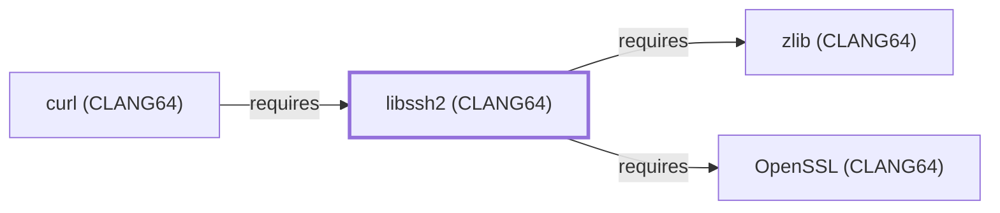

# libssh2 (CLANG64)

<!-- BEGIN GENERATED object-facts -->

| Model fact | Value |
| --- | --- |
| Object | `library:libssh2:libssh2@clang64` |
| Kind | `library` |
| Status | `partial` |
| Confidence | `high` |
| Authority | libssh2 project |
| Environments | `clang64` |
| Upstream | <https://www.libssh2.org/> |
| Packaged as | `package:msys2:mingw-w64-clang-x86_64-libssh2` |
| Version (observed) | 1.11.1-2 |
| License (observed) | spdx:BSD-3-Clause |
| Architecture (observed) | any |
| Installed size (observed) | 895.4 KB |

**Evidence on this object**

- `evidence:catalog:current` — MSYS2 pacman package catalog (`observed`, retrieved 2026-07-29)
- `evidence:libssh2:manual-2026-07-30` — libssh2 (official project site) (`primary`, retrieved 2026-07-30)

Generated from the composed model by `tools/build_object_facts.py`. Observed values come from the catalog snapshot and change when it is refreshed.
Edits between the surrounding markers are overwritten on the next build.

<!-- END GENERATED object-facts -->

## Purpose

This page documents `package:msys2:mingw-w64-clang-x86_64-libssh2`,
the CLANG64-environment build of libssh2 — a client-side C library
implementing the SSH2 protocol. Both of its own catalog dependencies
were modeled this batch ([OpenSSL (CLANG64)](OPENSSL-CLANG64.md), just
added, and [zlib (CLANG64)](ZLIB-CLANG64.md), already modeled),
letting this addition close its full dependency footprint in a single
pass. See the [official libssh2 project site](https://libssh2.org/)
for the full reference.

## Architectural Classification

`library:libssh2:libssh2@clang64` is packaged as
`package:msys2:mingw-w64-clang-x86_64-libssh2` (version `1.11.1-2` in
the current catalog snapshot, license `BSD-3-Clause`) — a separately
built, separate catalog entity from
[libssh2 (UCRT64)](LIBSSH2-UCRT64.md) and [libssh2 (MSYS)](LIBSSH2.md).
It belongs to the CLANG64 environment.

## Responsibilities

- Providing a client-side SSH2 protocol implementation for
  CLANG64-native consumers (SFTP/SCP transfer support), the same role
  [libssh2 (UCRT64)](LIBSSH2-UCRT64.md#responsibilities) documents for
  its own environment.

## Boundaries

This page's package serves CLANG64-environment consumers specifically;
[curl (UCRT64)](CURL-UCRT64.md) instead depends on
[libssh2 (UCRT64)](LIBSSH2-UCRT64.md#reverse-dependencies) — the two
are not interchangeable, matching the same distinction already drawn
throughout this volume for MSYS/UCRT64/CLANG64 sibling packages.

## Interfaces

- A C API (`libssh2_session_init`, `libssh2_sftp_open`, and related
  functions) for SSH2 session and SFTP/SCP operations, the same
  interface [libssh2 (UCRT64)](LIBSSH2-UCRT64.md#interfaces) documents,
  per the documentation.

## Dependencies

The catalog snapshot records two `runtime-depends-on` edges for
`package:msys2:mingw-w64-clang-x86_64-libssh2`, both now modeled in
this knowledge base:

| Dependency | Package | Architectural reason |
| --- | --- | --- |
| [OpenSSL (CLANG64)](OPENSSL-CLANG64.md) | `package:msys2:mingw-w64-clang-x86_64-openssl` | Backs the cryptographic and TLS-adjacent primitives (key exchange, ciphers, MACs) libssh2's own SSH2 protocol implementation uses. |
| [zlib (CLANG64)](ZLIB-CLANG64.md) | `package:msys2:mingw-w64-clang-x86_64-zlib` | Backs libssh2's optional zlib-based SSH2 transport compression. |

## Reverse Dependencies

The catalog snapshot records 18 relationships targeting
`package:msys2:mingw-w64-clang-x86_64-libssh2`. One is now modeled in
this knowledge base: [curl (CLANG64)](CURL-CLANG64.md)
(`relationship:foundation-libraries:curl-clang64-requires-libssh2-clang64`,
added 2026-08-02). The remaining recorded dependents (`aria2`,
`cargo-c`, `cargo-generate`, `cargo-local-registry`, `curl-gnutls`,
`gitui`, `gst-plugins-bad`, `lapce`, `libgit2`, `libgit2-glib`,
`libgit2-winhttp`, `libvirt`, `qemu`, `qemu-image-util`, `rust`, `vlc`,
`wezterm`) are not individually modeled as entities in this knowledge
base; see the
[reverse dependency impact analysis](REVERSE-DEPENDENCY-IMPACT-ANALYSIS.md)
for the current full list.

## Configuration

libssh2 has no persistent configuration file; session and
authentication parameters are set entirely through its C API by the
calling program, the same convention documented for
[libssh2 (UCRT64)](LIBSSH2-UCRT64.md#configuration).

## Initialization and Execution Flow

As a library, libssh2 has no independent process lifecycle: it
initializes and executes within the process of whatever program links
against it. As a native MinGW-w64 library, this process model is
Windows-facing directly rather than mediated by `msys-2.0.dll`.

## Runtime Behavior

Identical functional behavior to
[libssh2 (UCRT64)](LIBSSH2-UCRT64.md#runtime-behavior); see that page
for detail not specific to the CLANG64/UCRT64 packaging distinction.

## Compatibility and Variants

The CLANG64, UCRT64, and MSYS libssh2 packages are three separately
versioned catalog entities (see Architectural Classification); code
built against one is not automatically compatible with another without
matching the correct package/environment.

## Security Considerations

libssh2 negotiates and terminates SSH2 cryptographic sessions, a
security-sensitive role by nature; this page does not assert this
specific package version's robustness. See
[Threat Model and Supply Chain](THREAT-MODEL-AND-SUPPLY-CHAIN.md) for
the project's general supply-chain posture; no version-qualified CVE
review has been performed for the recorded `1.11.1-2` version.

## Failure Modes and Diagnostics

A dependent program's SFTP/SCP transfer failure should be checked
against libssh2's own error reporting
(`libssh2_session_last_error`) before being treated as a defect in the
consuming program, the same triage order documented for
[libssh2 (UCRT64)](LIBSSH2-UCRT64.md#failure-modes-and-diagnostics).

## Evidence, Assumptions, and Open Questions

SSH2 client scope is backed by the official libssh2 project site
(`evidence:libssh2:manual-2026-07-30`), the same evidence record
[libssh2 (UCRT64)](LIBSSH2-UCRT64.md) cites. Package identity, version,
license, and both recorded dependency edges are backed by the pacman
catalog snapshot (`evidence:catalog:current`). Open: the recorded
reverse dependents are not individually modeled in this knowledge
base.

<!-- BEGIN GENERATED dependency-subgraph -->

## Dependency Diagram

Dependencies and dependents of `library:libssh2:libssh2@clang64` in the composed graph: 1 dependent and 2 dependencies.

Generated from the composed model by `tools/build_object_diagrams.py`.
Edits between the surrounding markers are overwritten on the next build.

<!-- END GENERATED dependency-subgraph -->

## Related Objects

- [MSYS2 Library Architecture](LIBRARIES-ARCHITECTURE.md)
- [libssh2 (UCRT64)](LIBSSH2-UCRT64.md)
- [libssh2 (MSYS)](LIBSSH2.md)
- [OpenSSL (CLANG64)](OPENSSL-CLANG64.md)
- [zlib (CLANG64)](ZLIB-CLANG64.md)
- [curl (CLANG64)](CURL-CLANG64.md)
