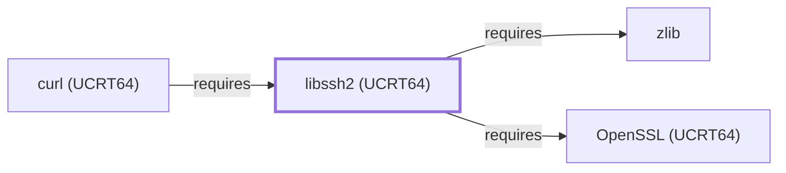

# libssh2 (UCRT64)

<!-- BEGIN GENERATED object-facts -->

| Model fact | Value |
| --- | --- |
| Object | `library:libssh2:libssh2@ucrt64` |
| Kind | `library` |
| Status | `partial` |
| Confidence | `high` |
| Authority | libssh2 project |
| Environments | `ucrt64` |
| Upstream | <https://libssh2.org/> |
| Packaged as | `package:msys2:mingw-w64-ucrt-x86_64-libssh2` |
| Version (observed) | 1.11.1-2 |
| License (observed) | spdx:BSD-3-Clause |
| Architecture (observed) | any |
| Installed size (observed) | 978.5 KB |

**Evidence on this object**

- `evidence:catalog:current` — MSYS2 pacman package catalog (`observed`, retrieved 2026-07-29)
- `evidence:libssh2:manual-2026-07-30` — libssh2 (official project site) (`primary`, retrieved 2026-07-30)

Generated from the composed model by `tools/build_object_facts.py`. Observed values come from the catalog snapshot and change when it is refreshed.
Edits between the surrounding markers are overwritten on the next build.

<!-- END GENERATED object-facts -->

## Purpose

This page documents the **UCRT64-environment** libssh2 package
specifically — a client-side C library implementing the SSH2 protocol
— depended on by [curl (UCRT64)](CURL-UCRT64.md) to back the `sftp://`
and `scp://` URL schemes, closing one of the sub-dependencies that
page's own Dependencies section had left explicitly unmodeled. See the
[official libssh2 project site](https://libssh2.org/) for the full
reference.

## Architectural Classification

`library:libssh2:libssh2@ucrt64` is packaged in the UCRT64 environment
as `package:msys2:mingw-w64-ucrt-x86_64-libssh2` (version `1.11.1-2` in
the current catalog snapshot, license `BSD-3-Clause`) — a separately
built, separate catalog entity from [libssh2 (MSYS)](LIBSSH2.md)'s
`libssh2` package. This is the package
[curl (UCRT64)](CURL-UCRT64.md) — a UCRT64-native component itself —
actually depends on.

## Responsibilities

- Providing a client-side SSH2 protocol implementation, consumed by
  [curl (UCRT64)](CURL-UCRT64.md#dependencies) to back the `sftp://`
  and `scp://` URL schemes, the same functional role
  [libssh2 (MSYS)](LIBSSH2.md#responsibilities) documents for libcurl
  (MSYS).

## Boundaries

This page's package serves UCRT64-environment consumers specifically;
[libcurl (MSYS)](LIBCURL.md) instead depends on
[libssh2 (MSYS)](LIBSSH2.md#reverse-dependencies) — the two are not
interchangeable, matching the same distinction already made throughout
this volume for MSYS/UCRT64 sibling pairs.

## Interfaces

- A C API (`libssh2_session_init`, `libssh2_sftp_open`, and related
  functions) for SSH2 session and SFTP/SCP operations, the same
  interface [libssh2 (MSYS)](LIBSSH2.md#interfaces) documents, per the
  documentation.

## Dependencies

The UCRT64 `package:msys2:mingw-w64-ucrt-x86_64-libssh2` declares
dependencies on [OpenSSL (UCRT64)](OPENSSL-UCRT64.md) (SSH2's own
cryptographic primitives — key exchange, ciphers, MACs,
`relationship:foundation-libraries:libssh2-ucrt64-requires-openssl-ucrt64`)
and [zlib](ZLIB.md) (SSH2's optional transport compression,
`relationship:foundation-libraries:libssh2-ucrt64-requires-zlib`) —
both already-modeled UCRT64-environment sibling libraries.

## Reverse Dependencies

The catalog snapshot records 18 relationships targeting
`package:msys2:mingw-w64-ucrt-x86_64-libssh2`. One is now modeled in
this knowledge base: [curl (UCRT64)](CURL-UCRT64.md)
(`relationship:foundation-libraries:curl-ucrt64-requires-libssh2-ucrt64`).
The remaining ~17 recorded dependents (a broad mix of UCRT64 packages
including `aria2`, `libgit2`, `qemu`, `rust`, `vlc`, and `wezterm`) are
not individually modeled in this knowledge base; see the
[reverse dependency impact analysis](REVERSE-DEPENDENCY-IMPACT-ANALYSIS.md)
for the current full list.

## Configuration

libssh2 has no persistent configuration file; session and
authentication parameters are set entirely through its C API by the
calling program, the same convention documented for
[libssh2 (MSYS)](LIBSSH2.md#configuration).

## Initialization and Execution Flow

As a library, libssh2 has no independent process lifecycle: it
initializes and executes within the process of whatever program links
against it — [curl (UCRT64)](CURL-UCRT64.md) in this dependency chain.
As a native MinGW-w64 library, this process model is Windows-facing
directly rather than mediated by `msys-2.0.dll`.

## Runtime Behavior

Identical functional behavior to [libssh2 (MSYS)](LIBSSH2.md#runtime-behavior);
see that page for detail not specific to the UCRT64/MSYS packaging
distinction.

## Compatibility and Variants

The UCRT64 and MSYS libssh2 packages are separately versioned catalog
entities (see Architectural Classification); code built against one is
not automatically compatible with the other without matching the
correct package/environment.

## Security Considerations

libssh2 negotiates and terminates SSH2 cryptographic sessions, a
security-sensitive role by nature; this page does not assert this
specific package version's robustness. See
[Threat Model and Supply Chain](THREAT-MODEL-AND-SUPPLY-CHAIN.md) for
the project's general supply-chain posture; no version-qualified CVE
review has been performed for the recorded `1.11.1-2` version.

## Failure Modes and Diagnostics

A curl `sftp://`/`scp://` transfer failure should be checked against
libssh2's own error reporting (`libssh2_session_last_error`) before
being treated as a curl defect, the same triage order documented for
[libssh2 (MSYS)](LIBSSH2.md#failure-modes-and-diagnostics).

## Evidence, Assumptions, and Open Questions

SSH2 client scope is backed by the official libssh2 project site
(`evidence:libssh2:manual-2026-07-30`), the same evidence record
[libssh2 (MSYS)](LIBSSH2.md) cites. Package identity, version, license,
and the recorded dependency/dependent edges are backed by the pacman
catalog snapshot (`evidence:catalog:current`). Open, and explicitly out
of scope for this page: the ~17 remaining recorded dependents not
individually modeled, and header-level API surface / PE
import/export-level evidence, per the
[Library Family Classification](LIBRARY-FAMILY-CLASSIFICATION.md)
methodology.

<!-- BEGIN GENERATED dependency-subgraph -->

## Dependency Diagram

Dependencies and dependents of `library:libssh2:libssh2@ucrt64` in the composed graph: 1 dependent and 2 dependencies.

Generated from the composed model by `tools/build_object_diagrams.py`.
Edits between the surrounding markers are overwritten on the next build.

<!-- END GENERATED dependency-subgraph -->

## Related Objects

- [MSYS2 Library Architecture](LIBRARIES-ARCHITECTURE.md)
- [libssh2 (MSYS)](LIBSSH2.md)
- [curl (UCRT64)](CURL-UCRT64.md)
- [OpenSSL (UCRT64)](OPENSSL-UCRT64.md)
- [zlib](ZLIB.md)
- [libssh2 (CLANG64)](LIBSSH2-CLANG64.md)
