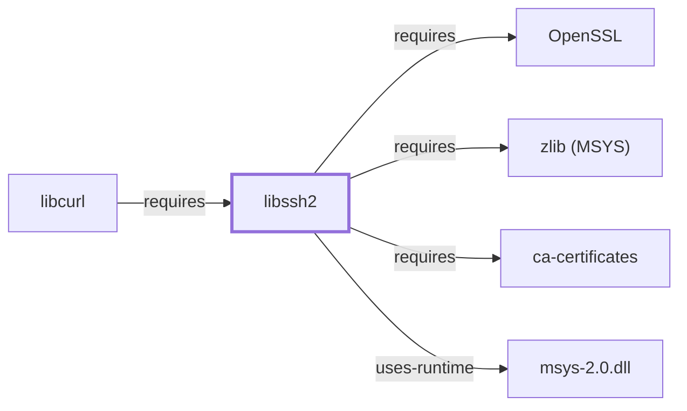

# libssh2

## Purpose

libssh2 is a client-side C library implementing the SSH2 protocol. This
page documents its architectural role as a directly-declared dependency
of [libcurl](LIBCURL.md), which uses it to back the `sftp://` and
`scp://` URL schemes, already noted as an unmodeled sub-dependency on
[LIBCURL.md](LIBCURL.md#dependencies) before this page existed. See the
[official libssh2 project site](https://libssh2.org/) for the full
reference.

## Architectural Classification

`library:libssh2:libssh2` is packaged in the MSYS environment as
`package:msys2:libssh2` (version `1.11.1-1` in the current catalog
snapshot). This is the package [libcurl](LIBCURL.md#dependencies)
actually depends on for `sftp://`/`scp://` support.

## Responsibilities

- Implementing the client-side SSH2 protocol, consumed by
  [libcurl](LIBCURL.md) to back its `sftp://` and `scp://` URL schemes
  (file transfer over SSH), a separate transport path from
  [curl's](CURL.md) HTTP(S) transfers.

## Boundaries

libssh2 provides a library implementation of the SSH2 protocol
specifically for programmatic use by libcurl and similar consumers; it
is architecturally distinct from [OpenSSH](OPENSSH.md), the full
interactive SSH client/server suite documented in Volume 5 — the two
are independent implementations, not a shared codebase, and libssh2's
role here is narrowly scoped to backing libcurl's own `sftp://`/`scp://`
support rather than interactive SSH sessions.

## Interfaces

- A C API (`libssh2_session_init`, `libssh2_sftp_open`, and related
  functions) for SSH2 session establishment and SFTP/SCP file transfer,
  per the documentation.

## Dependencies

The catalog snapshot records dependencies for `package:msys2:libssh2`.
Three are already-modeled MSYS sibling entities, so this page adds
explicit `requires` edges for them: [zlib (MSYS)](ZLIB-MSYS.md)
(optional zlib-based transport compression,
`relationship:foundation-libraries:libssh2-requires-zlib-msys`),
[ca-certificates](CA-CERTIFICATES.md) (trusted root certificate
verification,
`relationship:foundation-libraries:libssh2-requires-ca-certificates`),
and [OpenSSL](OPENSSL.md) (SSH2's own cryptographic primitives — key
exchange, ciphers, MACs,
`relationship:foundation-libraries:libssh2-requires-openssl`). All
three were added 2026-07-30, closing sub-dependencies this page had
previously left unenumerated; this page's scope otherwise remains
limited to confirming and documenting the [libcurl](LIBCURL.md)
dependency relationship.

## Reverse Dependencies

The catalog snapshot records 6 relationships targeting
`package:msys2:libssh2`. One is already modeled in this knowledge base:
`package:msys2:libcurl`
(`relationship:foundation-libraries:libcurl-requires-libssh2` in this
knowledge base's graph). The remaining 5 recorded dependents
(`cargo-c`, `libgit2`, its own `-devel` subpackage, `mc`, `rust`) are
not individually modeled in this knowledge base; see the
[reverse dependency impact analysis](REVERSE-DEPENDENCY-IMPACT-ANALYSIS.md)
for the current full list.

## Configuration

libssh2 has no persistent configuration file of its own; SSH session
parameters (host keys, authentication method) are set entirely through
its C API by the calling program.

## Initialization and Execution Flow

As a library, libssh2 has no independent process lifecycle: it
initializes and executes within the process of whatever program links
against it — [libcurl](LIBCURL.md) in this dependency chain, at the
start of an `sftp://`/`scp://` transfer. As an MSYS-dependent library,
this is adapted from POSIX semantics onto Windows process primitives by
`msys-2.0.dll` per
[MSYS Runtime Initialization](MSYS-RUNTIME-INITIALIZATION.md).

## Runtime Behavior

libssh2's SSH2 session establishment and file-transfer logic is
exercised only when a curl/libcurl-based transfer targets an
`sftp://`/`scp://` URL; it plays no role in HTTP(S) transfers.

## Compatibility and Variants

A UCRT64-native libssh2 build does exist in this catalog snapshot,
documented on [libssh2 (UCRT64)](LIBSSH2-UCRT64.md); whether CLANG64 or
i686 also package it separately remains an open item.

## Security Considerations

libssh2 handles SSH host-key verification and authentication for
`sftp://`/`scp://` transfers, a security-relevant surface distinct from
libcurl's own TLS/HTTPS trust decisions ([OpenSSL](OPENSSL.md),
[ca-certificates](CA-CERTIFICATES.md)). See
[Threat Model and Supply Chain](THREAT-MODEL-AND-SUPPLY-CHAIN.md) for the
project's general supply-chain posture; no version-qualified CVE review
has been performed for the recorded `1.11.1-1` version.

## Failure Modes and Diagnostics

An `sftp://`/`scp://` transfer failure in curl should be checked against
SSH-specific causes (host-key mismatch, authentication failure) before
being treated as a general curl transfer defect.

## Evidence, Assumptions, and Open Questions

SSH2 client protocol implementation scope is backed by the official
libssh2 project site (`evidence:libssh2:manual-2026-07-30`), matching
the `project_url` already recorded for `package:msys2:libssh2` in the
catalog. Package identity, version, and the recorded dependency and
dependent edges are backed by the pacman catalog snapshot
(`evidence:catalog:current`).
Open: whether CLANG64 or i686 also package libssh2 separately was not
confirmed. Also explicitly out of scope for this page: header-level
API surface / PE import/export-level evidence, per the
[Library Family Classification](LIBRARY-FAMILY-CLASSIFICATION.md)
methodology.

<!-- BEGIN GENERATED dependency-subgraph -->

## Dependency Diagram

Dependencies and dependents of `library:libssh2:libssh2` in the composed graph: 1 dependent and 4 dependencies.

Generated from the composed model by `tools/build_object_diagrams.py`.
Edits between the surrounding markers are overwritten on the next build.

<!-- END GENERATED dependency-subgraph -->

## Related Objects

- [MSYS2 Library Architecture](LIBRARIES-ARCHITECTURE.md)
- [libcurl](LIBCURL.md)
- [OpenSSH](OPENSSH.md)
- [libssh2 (UCRT64)](LIBSSH2-UCRT64.md)
- [zlib (MSYS)](ZLIB-MSYS.md)
- [ca-certificates](CA-CERTIFICATES.md)
- [OpenSSL](OPENSSL.md)
- [libssh2 (CLANG64)](LIBSSH2-CLANG64.md)
