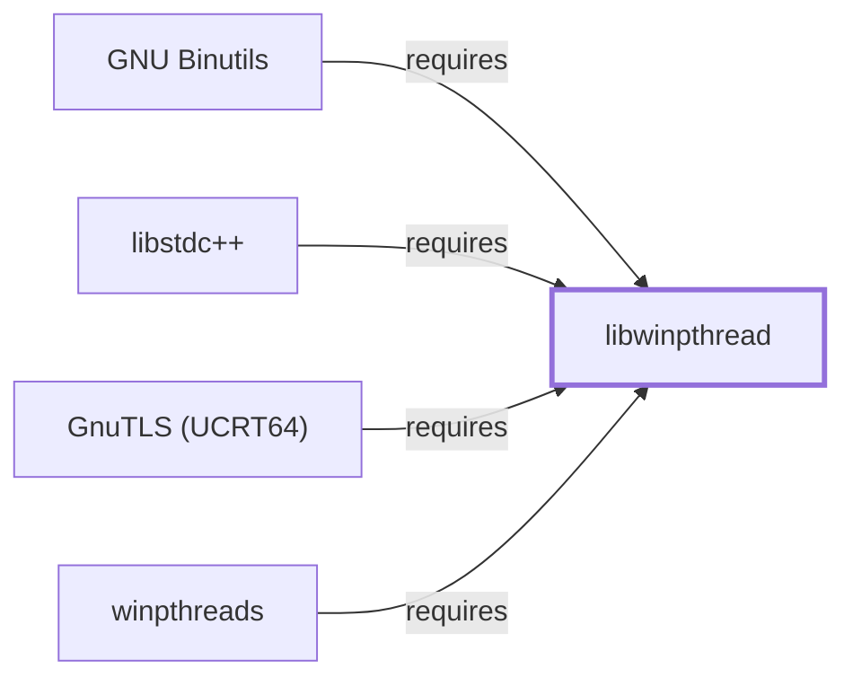

# libwinpthread

<!-- BEGIN GENERATED object-facts -->

| Model fact | Value |
| --- | --- |
| Object | `library:mingw-w64:libwinpthread` |
| Kind | `library` |
| Status | `partial` |
| Confidence | `high` |
| Authority | MinGW-w64 project |
| Environments | `ucrt64` |
| Upstream | <https://www.mingw-w64.org/> |
| Packaged as | `package:msys2:mingw-w64-ucrt-x86_64-libwinpthread` |
| Version (observed) | 14.0.0.r220.gd999af622-1 |
| License (observed) | spdx:MIT AND BSD-3-Clause-Clear |
| Architecture (observed) | any |
| Installed size (observed) | 66.0 KB |

**Evidence on this object**

- `evidence:catalog:current` — MSYS2 pacman package catalog (`observed`, retrieved 2026-07-29)
- `evidence:mingw-w64:libwinpthread-manual-2026-07-30` — MinGW-w64 (official project site) (`primary`, retrieved 2026-07-30)

Generated from the composed model by `tools/build_object_facts.py`. Observed values come from the catalog snapshot and change when it is refreshed.
Edits between the surrounding markers are overwritten on the next build.

<!-- END GENERATED object-facts -->

## Purpose

Libwinpthread implements POSIX-threads-style threading (`pthread_create`,
mutexes, condition variables) on top of Windows' native threading
primitives, and — per this snapshot — it is the third most-depended-upon
package among the components and libraries this knowledge base actually
models, not the full generated catalog view (see
[zlib](ZLIB.md#reverse-dependencies)'s 2026-07-30 correction for why
that distinction matters). This page documents
its architectural centrality; see the
[official MinGW-w64 project site](https://www.mingw-w64.org/) for the
project overview.

## Architectural Classification

`library:mingw-w64:libwinpthread` is packaged per native environment:
this page cites the UCRT64 build,
`package:msys2:mingw-w64-ucrt-x86_64-libwinpthread` (version
`14.0.0.r220.gd999af622-1` in the current catalog snapshot, license
`MIT AND BSD-3-Clause-Clear`), part of the MinGW-w64 project.

## Responsibilities

- Providing the POSIX threading API (`pthread_*`) on Windows, letting
  code written against POSIX threading conventions build and run in this
  native MinGW-w64 environment without a separate Windows-native
  threading rewrite. Already cited as a dependency of
  [GCC](GNU-GCC.md#dependencies) itself, which produces winpthreads-linked
  programs by default in this environment.

## Boundaries

Libwinpthread implements the POSIX threading model atop Windows
primitives; it is distinct from GCC's own OpenMP runtime (`libgomp`,
bundled inside [gcc-libs](LIBSTDCXX.md#dependencies)), which handles a
different, higher-level parallelism model.

## Interfaces

- The POSIX `pthread_*` C API (thread creation, mutexes, condition
  variables, thread-local storage), per the MinGW-w64 project
  documentation.

## Dependencies

The catalog snapshot records no `runtime-depends-on` edges for
`package:msys2:mingw-w64-ucrt-x86_64-libwinpthread` beyond its
membership in the UCRT64 repository and environment — a minimal
dependency footprint for a library implementing threading directly atop
the Windows kernel.

## Reverse Dependencies

The snapshot records **152** relationships targeting
`package:msys2:mingw-w64-ucrt-x86_64-libwinpthread` — the third-largest
reverse-dependency count among this knowledge base's modeled components
and libraries, behind only
[zlib](ZLIB.md#reverse-dependencies)'s 299 and
[gcc-libs](LIBSTDCXX.md#reverse-dependencies)'s 167 (`generated/reverse-dependency-impact.json`'s
full catalog view records higher, undocumented counts, e.g. glib2 at 186
and Qt6-base at 181 — see [zlib](ZLIB.md#reverse-dependencies)'s own
2026-07-30 correction). This reflects that
nearly any multithreaded program built in this environment links against
it. Two are now modeled in this knowledge base:
[GNU Binutils](GNU-BINUTILS.md#dependencies)
(`relationship:toolchain:binutils-requires-libwinpthread`, added
2026-07-30 to close a gap in
[Binutils' own dependency table](GNU-BINUTILS.md#dependencies), which
had cited this package by name without a corresponding graph edge) and
[libstdc++](LIBSTDCXX.md#dependencies)
(`relationship:foundation-libraries:libstdcxx-requires-libwinpthread`,
added the same day for the same reason). See
the
[reverse dependency impact analysis](REVERSE-DEPENDENCY-IMPACT-ANALYSIS.md)
for the current full list.

## Configuration

Libwinpthread has no persistent configuration file or environment
variables; thread behavior is controlled entirely through the calling
program's `pthread_*` API usage.

## Initialization and Execution Flow

As a library, libwinpthread has no independent process lifecycle: it
initializes and executes within the process of whatever program links
against it, the same model documented for
[zlib](ZLIB.md#initialization-and-execution-flow), managing that
program's threads for its lifetime.

## Runtime Behavior

Threads created through libwinpthread are, under the hood, Windows
threads; the library's role is presenting a POSIX-compatible API surface
over that underlying Windows threading implementation, not replacing it.

## Compatibility and Variants

`winpthreads` (see [its own page](WINPTHREADS.md)) is a separate,
version-pinned companion package to this one; the two should not be
conflated as interchangeable despite the near-identical naming.

## Security Considerations

Given its 152 recorded dependents, a defect here would have a wide blast
radius across multithreaded programs in this environment — a
risk-concentration observation consistent with the other high-dependent
libraries already flagged in this volume
([zlib](ZLIB.md#security-considerations),
[gcc-libs](LIBSTDCXX.md#security-considerations)). See
[Threat Model and Supply Chain](THREAT-MODEL-AND-SUPPLY-CHAIN.md) for the
project's general supply-chain posture; no version-qualified CVE review
has been performed for the recorded `14.0.0.r220.gd999af622-1` version.

## Failure Modes and Diagnostics

Threading-related failures (deadlocks, races) in a dependent program are
overwhelmingly a property of that program's own thread-synchronization
logic rather than this library, per the general nature of a threading
primitives library; this page does not attempt a general diagnostic guide.

## Evidence, Assumptions, and Open Questions

The threading-implementation role is backed by the official MinGW-w64
project site (`evidence:mingw-w64:libwinpthread-manual-2026-07-30`),
matching the `project_url` already recorded for
`package:msys2:mingw-w64-ucrt-x86_64-libwinpthread` in the catalog.
Package identity, version, license, and reverse-dependency count are
backed by the pacman catalog snapshot (`evidence:catalog:current`). Open,
and explicitly out of scope for this page: header-level API surface and
PE import/export-level evidence, per the
[Library Family Classification](LIBRARY-FAMILY-CLASSIFICATION.md)
methodology.

<!-- BEGIN GENERATED dependency-subgraph -->

## Dependency Diagram

Dependencies and dependents of `library:mingw-w64:libwinpthread` in the composed graph: 4 dependents and 0 dependencies.

Generated from the composed model by `tools/build_object_diagrams.py`.
Edits between the surrounding markers are overwritten on the next build.

<!-- END GENERATED dependency-subgraph -->

## Related Objects

- [MSYS2 Library Architecture](LIBRARIES-ARCHITECTURE.md)
- [winpthreads](WINPTHREADS.md)
- [GCC](GNU-GCC.md)
- [GNU Binutils](GNU-BINUTILS.md)
- [libstdc++](LIBSTDCXX.md)
- [GnuTLS (UCRT64)](GNUTLS-UCRT64.md)
