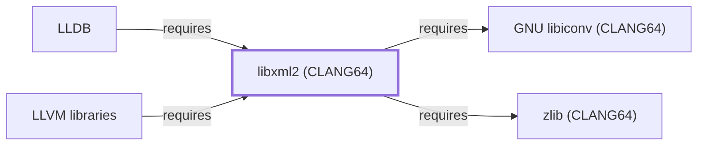

# libxml2 (CLANG64)

<!-- BEGIN GENERATED object-facts -->

| Model fact | Value |
| --- | --- |
| Object | `library:gnome:libxml2@clang64` |
| Kind | `library` |
| Status | `partial` |
| Confidence | `high` |
| Authority | Daniel Veillard / GNOME project |
| Environments | `clang64` |
| Upstream | <https://gitlab.gnome.org/GNOME/libxml2/-/wikis/home> |
| Packaged as | `package:msys2:mingw-w64-clang-x86_64-libxml2` |
| Version (observed) | 2.15.3-1 |
| License (observed) | spdx:MIT |
| Architecture (observed) | any |
| Installed size (observed) | 5.1 MB |

**Evidence on this object**

- `evidence:catalog:current` — MSYS2 pacman package catalog (`observed`, retrieved 2026-07-29)
- `evidence:gnome:libxml2-manual-2026-07-30` — libxml2 (official project wiki) (`primary`, retrieved 2026-07-30)

Generated from the composed model by `tools/build_object_facts.py`. Observed values come from the catalog snapshot and change when it is refreshed.
Edits between the surrounding markers are overwritten on the next build.

<!-- END GENERATED object-facts -->

## Purpose

This page documents the **CLANG64-environment** libxml2 package
specifically — a full-featured XML parsing and toolkit library —
depended on by [LLDB](LLDB.md) for XML-format target descriptions and
remote-protocol data. **Correction, 2026-07-30**: this page closes an
item [libxml2 (UCRT64)](LIBXML2.md) originally left as a false claim —
that page had stated LLDB was a direct dependent, when LLDB actually
depends on this separate, previously-unmodeled CLANG64-packaged
sibling. See the
[official libxml2 project wiki](https://gitlab.gnome.org/GNOME/libxml2/-/wikis/home)
for the full reference.

## Architectural Classification

`library:gnome:libxml2@clang64` is packaged in the CLANG64 environment
as `package:msys2:mingw-w64-clang-x86_64-libxml2` (version `2.15.3-1`
in the current catalog snapshot, license `MIT`) — a separately built,
separate catalog entity from [libxml2 (UCRT64)](LIBXML2.md)'s
`mingw-w64-ucrt-x86_64-libxml2` package and from
[libxml2 (MSYS)](LIBXML2-MSYS.md)'s `libxml2` package. This is the
package [LLDB](LLDB.md) — a CLANG64-native component itself — actually
depends on, the third distinct libxml2-named catalog entity in this
knowledge base alongside [libxml2 (UCRT64)](LIBXML2.md) and
[libxml2 (MSYS)](LIBXML2-MSYS.md).

## Responsibilities

- Providing XML parsing and toolkit functionality, consumed by
  [LLDB](LLDB.md#dependencies) for XML-format target descriptions and
  remote-protocol data, the same functional role
  [Expat](EXPAT.md#responsibilities) documents for GDB with a different
  XML library.

## Boundaries

This page's package serves CLANG64-environment consumers specifically;
[GDB](GNU-GDB.md) instead depends on [Expat](EXPAT.md) for the
equivalent role, and [GNU Emacs](GNU-EMACS.md) depends on
[libxml2 (MSYS)](LIBXML2-MSYS.md) — the three are not interchangeable,
matching the same distinction already made throughout this volume for
MSYS/UCRT64/CLANG64 sibling groups.

## Interfaces

- The libxml2 C API (`xmlParseFile`, `xmlReadMemory`, and related
  functions), the same interface [libxml2 (UCRT64)](LIBXML2.md#interfaces)
  documents, per the documentation.

## Dependencies

The CLANG64 `package:msys2:mingw-w64-clang-x86_64-libxml2` declares
dependencies on [GNU libiconv (CLANG64)](GNU-LIBICONV-CLANG64.md)
(`relationship:foundation-libraries:libxml2-clang64-requires-libiconv-clang64`,
added 2026-08-02 — **correction**: this section had previously left
this edge unmodeled since libiconv (CLANG64) did not yet have a page
of its own) and [zlib (CLANG64)](ZLIB-CLANG64.md)
(`relationship:foundation-libraries:libxml2-clang64-requires-zlib-clang64`,
added 2026-07-30 — **correction**: this section had previously grouped
this edge with the then-unmodeled libiconv sub-dependency, but
zlib (CLANG64) was in fact already modeled elsewhere in this knowledge
base).

## Reverse Dependencies

The catalog snapshot records 126 relationships targeting
`package:msys2:mingw-w64-clang-x86_64-libxml2` — the widest
reverse-dependency footprint of any library added in this batch. Two
are now modeled in this knowledge base: [LLDB](LLDB.md)
(`relationship:foundation-libraries:lldb-requires-libxml2-clang64`) and
[LLVM libraries](LLVM-LIBS.md)
(`relationship:foundation-libraries:llvm-libs-requires-libxml2-clang64`,
correcting that page's own prior incorrect no-dependencies claim). The
remaining ~124 recorded dependents (a broad mix of CLANG64 packages
including `libarchive`, `gdal`, and `imagemagick`) are not individually
modeled in this knowledge base; see the
[reverse dependency impact analysis](REVERSE-DEPENDENCY-IMPACT-ANALYSIS.md)
for the current full list.

## Configuration

libxml2 has no persistent configuration file; parsing behavior is set
entirely through its C API by the calling program.

## Initialization and Execution Flow

As a library, libxml2 has no independent process lifecycle: it
initializes and executes within the process of whatever program links
against it — [LLDB](LLDB.md) in this dependency chain. As a native
MinGW-w64 library, this process model is Windows-facing directly rather
than mediated by `msys-2.0.dll`.

## Runtime Behavior

Identical functional behavior to [libxml2 (UCRT64)](LIBXML2.md); see
that page for detail not specific to the CLANG64/UCRT64 packaging
distinction.

## Compatibility and Variants

The CLANG64, UCRT64, and MSYS libxml2 packages are three separately
versioned catalog entities (see Architectural Classification); code
built against one is not automatically compatible with another without
matching the correct package/environment.

## Security Considerations

Parsing untrusted XML input is a documented general source of parser
vulnerabilities (XXE, entity expansion); this page does not assert this
specific package version's mitigation status. See
[Threat Model and Supply Chain](THREAT-MODEL-AND-SUPPLY-CHAIN.md) for
the project's general supply-chain posture; no version-qualified CVE
review has been performed for the recorded `2.15.3-1` version.

## Failure Modes and Diagnostics

An LLDB failure parsing target-description or remote-protocol XML
should be checked against the actual XML data's well-formedness before
being treated as an LLDB defect.

## Evidence, Assumptions, and Open Questions

XML parsing library scope is backed by the official libxml2 project
wiki (`evidence:gnome:libxml2-manual-2026-07-30`), the same evidence
record [libxml2 (UCRT64)](LIBXML2.md) cites. Package identity, version,
license, and the recorded dependency and dependent edges are backed by
the pacman catalog snapshot (`evidence:catalog:current`). Open, and
explicitly out of scope for this page: the ~125 remaining recorded
dependents not individually modeled, and header-level API surface / PE
import/export-level evidence, per the
[Library Family Classification](LIBRARY-FAMILY-CLASSIFICATION.md)
methodology.

<!-- BEGIN GENERATED dependency-subgraph -->

## Dependency Diagram

Dependencies and dependents of `library:gnome:libxml2@clang64` in the composed graph: 2 dependents and 2 dependencies.

Generated from the composed model by `tools/build_object_diagrams.py`.
Edits between the surrounding markers are overwritten on the next build.

<!-- END GENERATED dependency-subgraph -->

## Related Objects

- [MSYS2 Library Architecture](LIBRARIES-ARCHITECTURE.md)
- [libxml2 (UCRT64)](LIBXML2.md)
- [libxml2 (MSYS)](LIBXML2-MSYS.md)
- [LLDB](LLDB.md)
- [LLVM libraries](LLVM-LIBS.md)
- [zlib (CLANG64)](ZLIB-CLANG64.md)
- [GNU libiconv (CLANG64)](GNU-LIBICONV-CLANG64.md)
