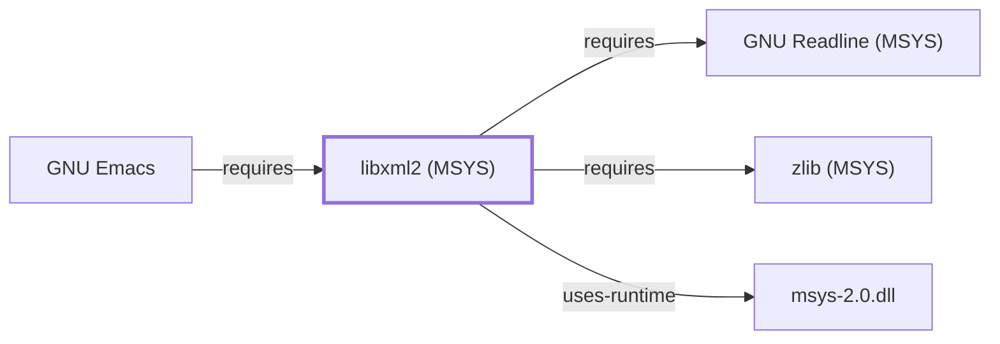

# libxml2 (MSYS)

## Purpose

This page documents the **MSYS-environment** libxml2 package
specifically — the GNOME project's XML parsing library — depended on by
[GNU Emacs](GNU-EMACS.md) for its built-in libxml2-based parsing, used
by features such as the `eww` web browser, already cited by package name
on [GNU-EMACS.md](GNU-EMACS.md#dependencies) before this page existed.
See the
[official libxml2 project page](https://gitlab.gnome.org/GNOME/libxml2/-/wikis/home)
for the full reference.

## Architectural Classification

`library:gnome:libxml2@msys` is packaged in the MSYS environment as
`package:msys2:libxml2` (version `2.15.3-1` in the current catalog
snapshot) — the same version number as the UCRT64 sibling documented on
[libxml2 (UCRT64)](LIBXML2.md), but a separately built, separate
catalog entity. This is the package [GNU Emacs](GNU-EMACS.md) — an
MSYS-environment component itself — actually depends on.

## Responsibilities

- Providing XML parsing and manipulation, consumed by
  [GNU Emacs's](GNU-EMACS.md) built-in libxml2-based parsing support,
  used internally by features such as the `eww` web browser and
  `libxml-parse-html-region`.

## Boundaries

This page's package serves MSYS-environment consumers specifically;
this knowledge base's other libxml2 dependents instead link
[libxml2 (UCRT64)](LIBXML2.md#reverse-dependencies) — the two are not
interchangeable, matching the same distinction already made throughout
this volume for MSYS/UCRT64 sibling pairs.

## Interfaces

- The libxml2 C API (`xmlParseDoc`, `xmlParseFile`, DOM/SAX-style
  parsing interfaces), the same interface
  [libxml2 (UCRT64)](LIBXML2.md#interfaces) documents, per the
  documentation.

## Dependencies

The catalog snapshot records dependencies for `package:msys2:libxml2`.
Two are already-modeled MSYS sibling libraries, so this page adds
explicit `requires` edges for them: [GNU Readline (MSYS)](GNU-READLINE-MSYS.md)
(interactive shell mode, `xmllint --shell`,
`relationship:foundation-libraries:libxml2-msys-requires-readline-msys`)
and [zlib (MSYS)](ZLIB-MSYS.md) (built-in support for reading
gzip-compressed XML files,
`relationship:foundation-libraries:libxml2-msys-requires-zlib-msys`).
Both were added 2026-07-30, closing sub-dependencies this page had
previously left unenumerated; this page's scope otherwise remains
limited to confirming and documenting the [GNU Emacs](GNU-EMACS.md)
dependency relationship.

## Reverse Dependencies

The catalog snapshot records 12 relationships targeting
`package:msys2:libxml2`. One is already modeled in this knowledge base:
`package:msys2:emacs`
(`relationship:gnu-userland:emacs-requires-libxml2-msys`). The
remaining ~11 recorded dependents (`autogen`, `ctags`,
`docbook-mathml`, `docbook-xml`, `docbook-xsl`, and others) are not
individually modeled in this knowledge base; see the
[reverse dependency impact analysis](REVERSE-DEPENDENCY-IMPACT-ANALYSIS.md)
for the current full list.

## Configuration

libxml2 has no persistent configuration file; parsing behavior is
controlled entirely through its C API by the calling program.

## Initialization and Execution Flow

As a library, libxml2 has no independent process lifecycle: it
initializes and executes within the process of whatever program links
against it — [GNU Emacs](GNU-EMACS.md) in this dependency chain,
specifically when `eww` or `libxml-parse-html-region` is invoked. As an
MSYS-dependent library, this is adapted from POSIX semantics onto
Windows process primitives by `msys-2.0.dll` per
[MSYS Runtime Initialization](MSYS-RUNTIME-INITIALIZATION.md).

## Runtime Behavior

Identical functional behavior to [libxml2 (UCRT64)](LIBXML2.md); see
that page for detail not specific to the MSYS/UCRT64 packaging
distinction. This package's role in Emacs is exercised only when a
libxml2-dependent feature (such as `eww`) is actually used, not during
ordinary text editing.

## Compatibility and Variants

The MSYS and native (UCRT64/CLANG64/i686) libxml2 packages are
separately versioned catalog entities (see Architectural Classification);
code built against one is not automatically compatible with the other
without matching the correct environment.

## Security Considerations

XML parsing of untrusted input (such as web content fetched by `eww`) is
a documented general source of parser vulnerabilities; this page does
not assert this specific package version's mitigation status. See
[Threat Model and Supply Chain](THREAT-MODEL-AND-SUPPLY-CHAIN.md) for the
project's general supply-chain posture; no version-qualified CVE review
has been performed for the recorded `2.15.3-1` version.

## Failure Modes and Diagnostics

An `eww` or HTML/XML-parsing failure in Emacs should be checked against
the actual input's well-formedness before being treated as an
Emacs-specific defect.

## Evidence, Assumptions, and Open Questions

XML parsing scope is backed by the official libxml2 project page
(`evidence:gnome:libxml2-manual-2026-07-30`), the same evidence record
[libxml2 (UCRT64)](LIBXML2.md) cites. Package identity, version, and
the recorded dependency and dependent edges are backed by the pacman
catalog snapshot (`evidence:catalog:current`). Open, and explicitly
out of scope for this page: the ~11 remaining
recorded dependents not individually modeled, and header-level API
surface / PE import/export-level evidence, per the
[Library Family Classification](LIBRARY-FAMILY-CLASSIFICATION.md)
methodology.

<!-- BEGIN GENERATED dependency-subgraph -->

## Dependency Diagram

Dependencies and dependents of `library:gnome:libxml2@msys` in the composed graph: 1 dependent and 3 dependencies.

Generated from the composed model by `tools/build_object_diagrams.py`.
Edits between the surrounding markers are overwritten on the next build.

<!-- END GENERATED dependency-subgraph -->

## Related Objects

- [MSYS2 Library Architecture](LIBRARIES-ARCHITECTURE.md)
- [libxml2 (UCRT64)](LIBXML2.md)
- [GNU Emacs](GNU-EMACS.md)
- [GNU Readline (MSYS)](GNU-READLINE-MSYS.md)
- [zlib (MSYS)](ZLIB-MSYS.md)
