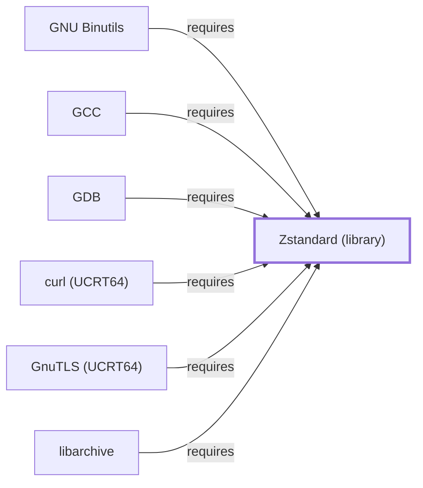

# Zstandard (library)

<!-- BEGIN GENERATED object-facts -->

| Model fact | Value |
| --- | --- |
| Object | `library:facebook:zstd` |
| Kind | `library` |
| Status | `partial` |
| Confidence | `high` |
| Authority | Meta (Facebook) |
| Environments | `ucrt64` |
| Upstream | <https://facebook.github.io/zstd/> |
| Packaged as | `package:msys2:mingw-w64-ucrt-x86_64-zstd` |
| Version (observed) | 1.5.7-2 |
| License (observed) | spdx:BSD-3-Clause OR GPL-2.0-or-later |
| Architecture (observed) | any |
| Installed size (observed) | 3.6 MB |

**Evidence on this object**

- `evidence:catalog:current` — MSYS2 pacman package catalog (`observed`, retrieved 2026-07-29)
- `evidence:facebook:zstd-manual-2026-07-30` — Zstandard (official project site) (`primary`, retrieved 2026-07-30)

Generated from the composed model by `tools/build_object_facts.py`. Observed values come from the catalog snapshot and change when it is refreshed.
Edits between the surrounding markers are overwritten on the next build.

<!-- END GENERATED object-facts -->

## Purpose

Zstandard (zstd) is a fast lossless compression library, and this page
documents the **UCRT64**-packaged library form specifically, distinct
from the MSYS-environment `zstd` command-line tool documented in
[Volume 5](ZSTD.md). It backs compressed debug-section support in both
[GCC](GNU-GCC.md) and [GNU Binutils](GNU-BINUTILS.md), already cited by
package name on both pages' dependency tables before this page existed;
with 94 recorded reverse dependents in this environment, it has the
widest reverse-dependency footprint of any library added in this batch.
See the [official Zstandard project site](https://facebook.github.io/zstd/)
for the full reference.

## Architectural Classification

`library:facebook:zstd` is packaged per native environment: this page
cites the UCRT64 build,
`package:msys2:mingw-w64-ucrt-x86_64-zstd` (version `1.5.7-2` in the
current catalog snapshot), authored by Meta (Facebook). This is a
separate catalog entity from
[the MSYS zstd CLI tool](ZSTD.md#architectural-classification) documented
in Volume 5 (`package:msys2:zstd`) — the two share an upstream project
but serve different roles: the Volume 5 page documents a directly
invoked command-line compression utility, while this page documents the
UCRT64 library form other native toolchain components link against.

## Responsibilities

- Providing Zstandard compression/decompression as a linked library,
  consumed by [GCC](GNU-GCC.md) and [GNU Binutils](GNU-BINUTILS.md) to
  back `--compress-debug-sections=zstd` and equivalent compressed
  debug-information support.

## Boundaries

This page documents the compression library specifically; it is
architecturally distinct from the directly invoked `zstd` command-line
tool [Volume 5's ZSTD.md](ZSTD.md) documents, even though both trace to
the same upstream project and share the same version number in this
snapshot.

## Interfaces

- A C API (`ZSTD_compress`, `ZSTD_decompress`, and streaming variants)
  for Zstandard compression and decompression, per the documentation.

## Dependencies

The UCRT64 `package:msys2:mingw-w64-ucrt-x86_64-zstd` declares no
`runtime-depends-on` edges beyond standard toolchain runtime support.

## Reverse Dependencies

The catalog snapshot records 94 relationships targeting
`package:msys2:mingw-w64-ucrt-x86_64-zstd` — the widest
reverse-dependency footprint of any library added in this batch,
reflecting Zstandard's status as a broadly-adopted general-purpose
compression library across the UCRT64 package ecosystem. Five are
already modeled in this knowledge base: `package:msys2:mingw-w64-ucrt-x86_64-gcc`
(`relationship:toolchain:gcc-requires-zstd`),
`package:msys2:mingw-w64-ucrt-x86_64-binutils`
(`relationship:toolchain:binutils-requires-zstd`),
`package:msys2:mingw-w64-ucrt-x86_64-gdb`
(`relationship:toolchain:gdb-requires-zstd`),
`package:msys2:mingw-w64-ucrt-x86_64-libarchive`
(`relationship:toolchain:libarchive-requires-zstd`, added 2026-07-30 to
close a gap in [libarchive's own dependency table](LIBARCHIVE.md#dependencies)),
and `package:msys2:mingw-w64-ucrt-x86_64-curl`
(`relationship:foundation-libraries:curl-ucrt64-requires-zstd`,
documented fully in [curl (UCRT64)](CURL-UCRT64.md)).
The remaining ~89
recorded dependents (a broad mix of UCRT64 packages such as `blender`,
`arrow`, and numerous cross-compilation toolchains) are not individually
modeled in this knowledge base; see the
[reverse dependency impact analysis](REVERSE-DEPENDENCY-IMPACT-ANALYSIS.md)
for the current full list.

## Configuration

Zstandard has no persistent configuration file as a library; compression
level and parameters are set entirely through its C API by the calling
program.

## Initialization and Execution Flow

As a library, Zstandard has no independent process lifecycle: it
initializes and executes within the process of whatever program links
against it — [GCC](GNU-GCC.md) or [Binutils](GNU-BINUTILS.md) tools, when
compressed debug sections are requested. As a native MinGW-w64 library,
this process model is Windows-facing directly rather than mediated by
`msys-2.0.dll`.

## Runtime Behavior

Compressed debug-section support is exercised only when a build
explicitly requests `--compress-debug-sections=zstd`; it plays no role
in ordinary compilation or linking without that flag.

## Compatibility and Variants

Native environments other than UCRT64 in this catalog also package
Zstandard separately; the CLANG64 build, a dependency of
[LLD](LLD.md) specifically (not LLDB, which depends on zlib and xz but
not zstd), is documented on [Zstandard (CLANG64)](LIBZSTD-CLANG64.md) —
a distinct catalog entity from this UCRT64 package.

## Security Considerations

Zstandard is not itself a security-sensitive component in the usual
sense; decompressing untrusted compressed debug data carries the general
trust considerations of any decompression library. See
[Threat Model and Supply Chain](THREAT-MODEL-AND-SUPPLY-CHAIN.md) for the
project's general supply-chain posture; no version-qualified CVE review
has been performed for the recorded `1.5.7-2` version.

## Failure Modes and Diagnostics

A `--compress-debug-sections=zstd` failure most commonly indicates a
version mismatch between the compressing and decompressing tools'
Zstandard support rather than a defect in this library itself.

## Evidence, Assumptions, and Open Questions

Zstandard compression library scope is backed by the official Zstandard
project site (`evidence:facebook:zstd-manual-2026-07-30`), matching the
`project_url` already recorded for
`package:msys2:mingw-w64-ucrt-x86_64-zstd` in the catalog. Package
identity, version, and the two modeled dependent edges are backed by the
pacman catalog snapshot (`evidence:catalog:current`). Open, and
explicitly out of scope for this page: the ~92 remaining recorded
dependents not individually modeled, the separate CLANG64-packaged zstd
library ([LLD](LLD.md)/[LLDB](LLDB.md) dependency), and header-level API
surface / PE import/export-level evidence, per the
[Library Family Classification](LIBRARY-FAMILY-CLASSIFICATION.md)
methodology.

<!-- BEGIN GENERATED dependency-subgraph -->

## Dependency Diagram

Dependencies and dependents of `library:facebook:zstd` in the composed graph: 6 dependents and 0 dependencies.

Generated from the composed model by `tools/build_object_diagrams.py`.
Edits between the surrounding markers are overwritten on the next build.

<!-- END GENERATED dependency-subgraph -->

## Related Objects

- [MSYS2 Library Architecture](LIBRARIES-ARCHITECTURE.md)
- [Zstandard (MSYS CLI tool)](ZSTD.md)
- [GNU GCC](GNU-GCC.md)
- [GNU Binutils](GNU-BINUTILS.md)
- [GDB](GNU-GDB.md)
- [zlib](ZLIB.md)
- [Zstandard (CLANG64)](LIBZSTD-CLANG64.md)
- [Zstandard (MSYS library)](LIBZSTD-MSYS.md)
- [libarchive](LIBARCHIVE.md)
- [curl (UCRT64)](CURL-UCRT64.md)
