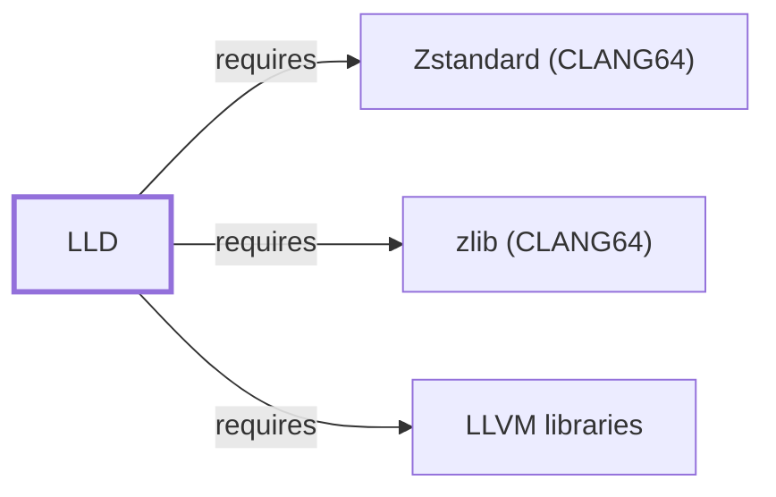

# LLD

<!-- BEGIN GENERATED object-facts -->

| Model fact | Value |
| --- | --- |
| Object | `component:llvm:lld` |
| Kind | `component` |
| Status | `partial` |
| Confidence | `high` |
| Authority | LLVM Project |
| Environments | `clang64` |
| Upstream | <https://lld.llvm.org/> |
| Packaged as | `package:msys2:mingw-w64-clang-x86_64-lld` |
| Version (observed) | 22.1.8-2 |
| License (observed) | spdx:Apache-2.0 WITH LLVM-exception |
| Architecture (observed) | any |
| Installed size (observed) | 50.8 MB |

**Evidence on this object**

- `evidence:catalog:current` — MSYS2 pacman package catalog (`observed`, retrieved 2026-07-29)
- `evidence:llvm:lld-manual-2026-07-30` — LLD (official project site) (`primary`, retrieved 2026-07-30)

**Claims about this object**

- `claim:component:lld:provides-binutils-capability` (`fact`, `verified`) — The MSYS2 lld package declares that it provides the binutils virtual capability in the CLANG64 environment, letting packages that depend on a generic binutils-like toolchain resolve against LLD instead of GNU Binutils.

Generated from the composed model by `tools/build_object_facts.py`. Observed values come from the catalog snapshot and change when it is refreshed.
Edits between the surrounding markers are overwritten on the next build.

<!-- END GENERATED object-facts -->

## Purpose

LLD is the LLVM project's linker, invoked by [Clang](CLANG.md) as its
default backend in LLVM-oriented environments. This page documents its
architectural role and its declared substitutability for
[GNU Binutils](GNU-BINUTILS.md) in this environment's packaging; see the
[official LLD project site](https://lld.llvm.org/) for the full option
reference.

## Architectural Classification

`component:llvm:lld` is packaged per native environment: this page cites
the CLANG64 build, `package:msys2:mingw-w64-clang-x86_64-lld` (version
`22.1.8-2` in the current catalog snapshot, license
`Apache-2.0 WITH LLVM-exception`). Per the
[MSYS2 Toolchain Role Model](TOOLCHAIN-ROLE-MODEL.md), it is the
LLVM-oriented linker counterpart to [GNU Binutils](GNU-BINUTILS.md)'s role
in GCC-oriented environments.

## Responsibilities

- Linking object files and libraries into executables and DLLs for
  [Clang](CLANG.md)'s output, as an invoked backend rather than typically
  run standalone.

## Boundaries

LLD performs linking only; it does not compile (that is
[Clang](CLANG.md)'s role) and, like Clang, does **not** depend on
`msys-2.0.dll` as a native MinGW-w64 package, per the
[MSYS2 and MinGW-w64 role model](MSYS2-AND-MINGW-W64-ROLE-MODEL.md).

## Interfaces

- `ld.lld` (and this package's declared `mingw-w64-clang-x86_64-binutils`
  capability — see Compatibility and Variants), invoked by Clang's driver
  rather than typically called directly, per the documentation.

## Dependencies

The catalog snapshot records three `runtime-depends-on` edges for
`package:msys2:mingw-w64-clang-x86_64-lld`:

| Dependency | Package | Architectural reason |
| --- | --- | --- |
| LLVM's shared libraries | `mingw-w64-clang-x86_64-llvm-libs` | LLD is built on LLVM's object-file and code-generation infrastructure libraries. Documented fully in [LLVM libraries](LLVM-LIBS.md). |
| Compressed debug sections | `mingw-w64-clang-x86_64-zlib`, `mingw-w64-clang-x86_64-zstd` | Back compressed debug-section support, the same rationale documented for [GNU Binutils](GNU-BINUTILS.md#dependencies). Documented fully in [zlib (CLANG64)](ZLIB-CLANG64.md) and [Zstandard (CLANG64)](LIBZSTD-CLANG64.md). |

## Reverse Dependencies

The snapshot records 5 relationships targeting
`package:msys2:mingw-w64-clang-x86_64-lld`, including
[Clang](CLANG.md)'s invocation dependency
(`relationship:toolchain:clang-invokes-lld`). See the
[reverse dependency impact analysis](REVERSE-DEPENDENCY-IMPACT-ANALYSIS.md)
for the current full list.

## Configuration

LLD is configured entirely through command-line flags, ordinarily passed
through from [Clang](CLANG.md)'s driver rather than set directly; there is
no persistent configuration file.

## Initialization and Execution Flow

LLD is ordinarily invoked as [Clang](CLANG.md)'s backend subprocess
(`relationship:toolchain:clang-invokes-lld`) rather than run standalone. As
a native MinGW-w64 program, its process model is Windows-facing directly
rather than mediated by `msys-2.0.dll`, per the Boundaries section above.

## Runtime Behavior

As with [GNU Binutils](GNU-BINUTILS.md#runtime-behavior), the linker's
output format, entry point, and import/export table construction determine
the resulting PE's runtime loading behavior; this is documented at the
toolchain-role level rather than restated here.

## Compatibility and Variants

The MSYS2 `lld` package declares (via `provides`) that it satisfies the
`mingw-w64-clang-x86_64-binutils` virtual capability in this environment
(`claim:component:lld:provides-binutils-capability`), modeled here as
`relationship:toolchain:lld-compatible-with-binutils`. This is a
packaging-level substitutability declaration — it lets other CLANG64
packages that depend on "a binutils-like toolchain" resolve against LLD —
not a guarantee that every linker feature or output byte matches
[GNU Binutils](GNU-BINUTILS.md)'s `ld`, per the
[Toolchain Role Model](TOOLCHAIN-ROLE-MODEL.md#decision-rules)'s explicit
caution that "linker features and output behavior are target-specific."

## Security Considerations

LLD processes untrusted object/archive files during linking, the same
general malformed-input risk class already noted for
[GNU Binutils](GNU-BINUTILS.md#security-considerations). See
[Threat Model and Supply Chain](THREAT-MODEL-AND-SUPPLY-CHAIN.md) for the
project's general supply-chain posture; no version-qualified CVE review has
been performed for the recorded `22.1.8-2` version.

## Failure Modes and Diagnostics

Undefined-reference and duplicate-symbol linker errors are the most common
failures this tool surfaces, the same class of failure documented for
[GNU Binutils](GNU-BINUTILS.md#failure-modes-and-diagnostics); LLD's error
messages are designed to closely mirror GNU `ld`'s where practical, per the
project documentation, though exact wording differs.

## Evidence, Assumptions, and Open Questions

Linker responsibilities and the binutils-compatibility positioning are
backed by the official LLD project site
(`evidence:llvm:lld-manual-2026-07-30`), matching the `project_url` already
recorded for `package:msys2:mingw-w64-clang-x86_64-lld` in the catalog.
Package identity, version, license, and all recorded dependency edges are
backed by the pacman catalog snapshot (`evidence:catalog:current`) via
`claim:component:lld:provides-binutils-capability`. No open items beyond
the general version-qualified security review noted above.

<!-- BEGIN GENERATED dependency-subgraph -->

## Dependency Diagram

Dependencies and dependents of `component:llvm:lld` in the composed graph: 0 dependents and 3 dependencies.

Generated from the composed model by `tools/build_object_diagrams.py`.
Edits between the surrounding markers are overwritten on the next build.

<!-- END GENERATED dependency-subgraph -->

## Related Objects

- [MSYS2 Toolchain Role Model](TOOLCHAIN-ROLE-MODEL.md)
- [Clang](CLANG.md)
- [LLDB](LLDB.md)
- [GNU Binutils](GNU-BINUTILS.md)
- [LLVM libraries](LLVM-LIBS.md)
- [zlib (CLANG64)](ZLIB-CLANG64.md)
- [Zstandard (CLANG64)](LIBZSTD-CLANG64.md)
