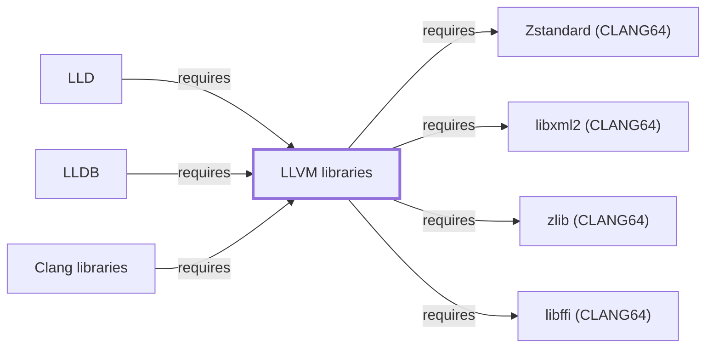

# LLVM libraries

## Purpose

The LLVM libraries package provides LLVM's shared object-file and
code-generation infrastructure as reusable libraries, underpinning both
[LLD](LLD.md) and [LLDB](LLDB.md), which are each built on this shared
infrastructure rather than duplicating it. Both already cite this
package by name on their own dependency tables
([LLD.md](LLD.md#dependencies), [LLDB.md](LLDB.md#dependencies)) before
this page existed. See the
[official LLVM project site](https://llvm.org/) for the full reference.

## Architectural Classification

`library:llvm:llvm-libs` is packaged per native environment: this page
cites the CLANG64 build,
`package:msys2:mingw-w64-clang-x86_64-llvm-libs` (version `22.1.8-2` in
the current catalog snapshot, the same release version as the
[LLD](LLD.md) and [LLDB](LLDB.md) tools built against it in this
snapshot). It belongs to the CLANG64 environment and, like the rest of
this volume's native toolchain libraries, does not depend on
`msys-2.0.dll`, per the
[MSYS2 and MinGW-w64 role model](MSYS2-AND-MINGW-W64-ROLE-MODEL.md).

## Responsibilities

- Providing LLVM's object-file parsing/writing, intermediate
  representation, and code-generation infrastructure as a shared library,
  consumed by [LLD](LLD.md) (linking) and [LLDB](LLDB.md) (debugging).

## Boundaries

This package provides LLVM's core infrastructure specifically; it is
distinct from [Clang libraries](CLANG-LIBS.md), which provide the
C/C++/Objective-C front-end (parsing, semantic analysis) built on top of
this infrastructure — [LLDB](LLDB.md#dependencies) depends on both
packages for different reasons (LLVM infrastructure generally, Clang's
front-end specifically for expression evaluation).

## Interfaces

- LLVM's C++ library API (IR construction, object-file readers/writers,
  target code generation), consumed internally by LLVM-based tools
  rather than typically used directly by application code outside the
  LLVM ecosystem.

## Dependencies

**Correction, 2026-07-30**: this section originally stated no
`runtime-depends-on` edges existed for this package beyond standard
toolchain support — that claim was false. The catalog snapshot in fact
records four:

| Dependency | Package | Architectural reason |
| --- | --- | --- |
| Foreign function interface | `mingw-w64-clang-x86_64-libffi` | Backs a runtime call-signature dispatch need somewhere in LLVM's own infrastructure; the exact internal subsystem consuming it was not directly confirmed. Documented fully in [libffi (CLANG64)](LIBFFI-CLANG64.md). |
| XML parsing | `mingw-w64-clang-x86_64-libxml2` | Backs an XML-format need somewhere in LLVM's own infrastructure; the exact internal subsystem consuming it was not directly confirmed. Documented fully in [libxml2 (CLANG64)](LIBXML2-CLANG64.md). |
| Compression | `mingw-w64-clang-x86_64-zlib`, `mingw-w64-clang-x86_64-zstd` | Back compressed section support, the same rationale documented for [LLD](LLD.md#dependencies) and [LLDB](LLDB.md#dependencies). Documented fully in [zlib (CLANG64)](ZLIB-CLANG64.md) and [Zstandard (CLANG64)](LIBZSTD-CLANG64.md). |

## Reverse Dependencies

The catalog snapshot records 22 relationships targeting
`package:msys2:mingw-w64-clang-x86_64-llvm-libs`: `package:msys2:mingw-w64-clang-x86_64-lld`
(`relationship:toolchain:lld-requires-llvm-libs` in this knowledge
base's graph), `package:msys2:mingw-w64-clang-x86_64-lldb`
(`relationship:toolchain:lldb-requires-llvm-libs`),
`package:msys2:mingw-w64-clang-x86_64-clang-libs` (documented separately
on [Clang libraries](CLANG-LIBS.md)), and a further ~19 packages (such as
`arrow`, `castxml`, `crystal`, and various LLVM-based compiler/tooling
projects) not individually modeled in this knowledge base.

## Configuration

LLVM libraries have no persistent configuration file; behavior is
controlled entirely through the consuming program's own use of the LLVM
C++ API.

## Initialization and Execution Flow

As a library, LLVM's infrastructure has no independent process
lifecycle: it initializes and executes within the process of whatever
program links against it — [LLD](LLD.md) or [LLDB](LLDB.md) in this
dependency chain. As a native MinGW-w64 library, this process model is
Windows-facing directly rather than mediated by `msys-2.0.dll`.

## Runtime Behavior

Which specific LLVM subsystems (target backends, IR passes, object-file
formats) a given consumer actually exercises depends entirely on that
consumer's own code path; this page does not characterize LLD's or
LLDB's specific usage beyond the dependency relationship itself.

## Compatibility and Variants

Native environments other than CLANG64 in this catalog (UCRT64, i686)
may package LLVM libraries separately for their own LLVM-based tooling;
this page documents the CLANG64 build specifically, matching this
knowledge base's existing [LLD](LLD.md) and [LLDB](LLDB.md) coverage.

## Security Considerations

LLVM libraries are not themselves a security-sensitive component in the
usual sense; their role is compiler/debugger infrastructure rather than
network exposure or authentication. See
[Threat Model and Supply Chain](THREAT-MODEL-AND-SUPPLY-CHAIN.md) for the
project's general supply-chain posture; no version-qualified CVE review
has been performed for the recorded `22.1.8-2` version.

## Failure Modes and Diagnostics

An LLD or LLDB defect traceable to LLVM's own infrastructure (rather
than LLD's or LLDB's own code) should be checked against the matching
LLVM release's own issue tracker, given the shared version alignment
noted in Architectural Classification.

## Evidence, Assumptions, and Open Questions

LLVM infrastructure scope is backed by the official LLVM project site
(`evidence:llvm:llvm-libs-manual-2026-07-30`), matching the `project_url`
already recorded for `package:msys2:mingw-w64-clang-x86_64-llvm-libs` in
the catalog. Package identity, version, and the recorded dependency and
dependent edges (including the 2026-07-30 correction of this page's own
Dependencies section) are backed by the pacman catalog snapshot
(`evidence:catalog:current`). Open: the exact internal LLVM subsystem
consuming libffi and libxml2 was not directly confirmed. Also explicitly
out of scope for this page: the ~19 remaining recorded reverse
dependents not individually modeled, and header-level API surface / PE
import/export-level evidence, per the
[Library Family Classification](LIBRARY-FAMILY-CLASSIFICATION.md)
methodology.

<!-- BEGIN GENERATED dependency-subgraph -->

## Dependency Diagram

Dependencies and dependents of `library:llvm:llvm-libs` in the composed graph: 3 dependents and 4 dependencies.

Generated from the composed model by `tools/build_object_diagrams.py`.
Edits between the surrounding markers are overwritten on the next build.

<!-- END GENERATED dependency-subgraph -->

## Related Objects

- [MSYS2 Library Architecture](LIBRARIES-ARCHITECTURE.md)
- [LLD](LLD.md)
- [LLDB](LLDB.md)
- [Clang libraries](CLANG-LIBS.md)
- [libffi (CLANG64)](LIBFFI-CLANG64.md)
- [libxml2 (CLANG64)](LIBXML2-CLANG64.md)
- [zlib (CLANG64)](ZLIB-CLANG64.md)
- [Zstandard (CLANG64)](LIBZSTD-CLANG64.md)
