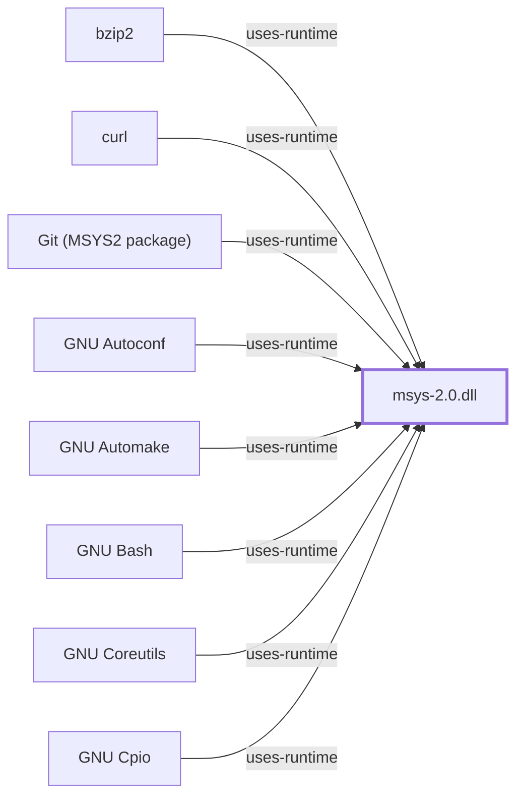

# msys-2.0.dll

## Purpose

`msys-2.0.dll` is the POSIX compatibility runtime that makes MSYS2's
POSIX-oriented environment possible. It is the single most architecturally
significant object in this knowledge base: it is what distinguishes the
[MSYS environment](ENVIRONMENT-MSYS.md) from the five native ones, and its
presence or absence in a binary's imports is the definitive test of which
side of that boundary a program sits on.

Until 2026-08-02 no page in this knowledge base was titled for it, despite
173 pages referencing it in `uses-runtime` boilerplate.

## Architectural Classification

`runtime:msys2:msys-2.0.dll` is a `runtime` entity, the only one in the
model. It is a fork of the Cygwin runtime, carrying Cygwin's POSIX-emulation
design with MSYS2-specific changes concentrated in path translation and
mount behavior.

The MSYS runtime reported itself as version `3.6.10` through `uname` during
the 2026-07-30 bounded observation.

## Responsibilities

The runtime decomposes into eight documented subsystems, each with its own
page:

| Subsystem | Responsibility |
| --- | --- |
| [Process Manager](MSYS-PROCESS-MANAGER.md) | Process creation, `fork` emulation, `exec`, process table |
| [Signal Manager](MSYS-SIGNAL-MANAGER.md) | POSIX signal generation, delivery, disposition |
| [Path Conversion](MSYS-PATH-CONVERSION.md) | POSIX↔Win32 path translation at the process boundary |
| [Mount Manager](MSYS-MOUNT-MANAGER.md) | Virtual mount table mapping POSIX prefixes to Windows locations |
| [Filesystem Layer](MSYS-FILESYSTEM-LAYER.md) | POSIX file semantics and symlink representation over NTFS |
| [PTY and Console](MSYS-PTY-AND-CONSOLE.md) | Pseudo-terminals and the terminal-device namespace |
| [Environment Manager](MSYS-ENVIRONMENT-MANAGER.md) | Environment storage and boundary conversion |
| [POSIX API Surface](MSYS-POSIX-API.md) | The exported POSIX C API and where it becomes Win32 |

These are documented responsibilities, not observed module boundaries inside
the binary. No symbol-level or PE-section analysis of `msys-2.0.dll` has been
performed for this knowledge base.

## Boundaries

The runtime serves MSYS-linked processes only. Native UCRT64, CLANG64,
CLANGARM64, MINGW64, and MINGW32 programs reach Windows APIs directly and do
not load it unless they explicitly choose to.

It is an emulation layer, not a kernel personality: it cannot provide
semantics the Windows kernel does not expose, and where POSIX and Win32
disagree the runtime approximates rather than guarantees. Every behavioral
statement about MSYS must be qualified by runtime version, because the
approximations change.

## Interfaces

- The POSIX C API surface, documented on [POSIX API Surface](MSYS-POSIX-API.md).
- The `MSYS` and `MSYS2_ARG_CONV_EXCL` environment variables, which alter
  path-conversion behavior at the boundary.
- `/etc/fstab` and the mount table, read at runtime initialization.

## Dependencies

The runtime depends on Windows platform services — process, thread, memory,
filesystem, and console subsystems — described in
[Windows platform boundaries](WINDOWS-PLATFORM-BOUNDARIES.md). Volume 2 is
itself thin, so those dependencies are named rather than characterized.

## Reverse Dependencies

Every MSYS-environment package links it. 173 pages in this knowledge base
reference it, almost all through `uses-runtime` rows on component and library
pages rather than through analysis of the runtime itself.

## Configuration

Mount behavior comes from `/etc/fstab`; argument-conversion behavior from
`MSYS2_ARG_CONV_EXCL`; several other behaviors from `MSYS`. This page does
not enumerate the full variable set, and no controlled observation of
variable effects exists.

## Initialization and Execution Flow

The runtime initializes at image load, before `main`, establishing the
process table, mount table, and signal machinery.
[MSYS runtime initialization](MSYS-RUNTIME-INITIALIZATION.md) documents the
sequence and carries the controlled observations for it.

## Runtime Behavior

Five bounded probes were run on 2026-07-30 against MSYS 3.6.10 on x86_64.
They establish exact command outcomes, not parity:

| Probe | Outcome |
| --- | --- |
| Process lifecycle | Background child existed and exited with status 0 |
| Shell `exec` | Replaced shell emitted `exec-ok`, status 0 |
| Signal delivery | Shell `USR1` trap emitted `signal=USR1`, status 0 |
| Filesystem symlink | `ln -s` succeeded and the target was readable, but `test -L` returned non-zero |
| Terminal-device namespace | `/dev` and `/dev/tty` existed |

The symlink result is the most informative of the five, and is discussed on
[Filesystem Layer](MSYS-FILESYSTEM-LAYER.md#runtime-behavior).

## Compatibility and Variants

The runtime is MSYS-only. Its Cygwin ancestry means Cygwin documentation
describes the derived design, but MSYS2 diverges in path translation and
mount handling specifically — the areas most likely to be assumed
interchangeable.

## Security Considerations

Every MSYS process inherits this runtime as a trust dependency in addition to
the Windows platform. A defect here has the widest blast radius of any single
object in the MSYS environment. See
[Threat model and supply chain](THREAT-MODEL-AND-SUPPLY-CHAIN.md); no
version-qualified CVE review has been performed for `3.6.10`.

## Failure Modes and Diagnostics

A binary that runs under the MSYS shell but fails from `cmd.exe` or Explorer
is the signature failure: the runtime is not on the search path. Silent
argument rewriting by path conversion is the second class, and is the harder
one because the program receives plausible but wrong input rather than an
error.

## Evidence, Assumptions, and Open Questions

Design and POSIX-adaptation behavior are attributed to the
[Cygwin User's Guide](https://cygwin.com/cygwin-ug-net/cygwin-ug-net.html)
(`evidence:cygwin:user-guide-2026-08-02`), which documents the runtime this
one is derived from — not MSYS2-specific parity. Runtime version and the five
probe outcomes are from the bounded 2026-07-30 collector
(`evidence:msys2:runtime-behavior-probes-2026-07-30`).

Open, and substantial: no source-revision analysis, no symbol or PE-section
inspection, no fork-emulation cost measurement, and no MSYS2-specific
upstream documentation reference. The eight subsystems are a documented
decomposition, not an observed one.

<!-- BEGIN GENERATED dependency-subgraph -->

## Dependency Diagram

Dependencies and dependents of `runtime:msys2:msys-2.0.dll` in the composed graph: 72 dependents and 0 dependencies, of which 64 are omitted here for legibility.

Generated from the composed model by `tools/build_object_diagrams.py`.
Edits between the surrounding markers are overwritten on the next build.

<!-- END GENERATED dependency-subgraph -->

## Related Objects

- [MSYS environment](ENVIRONMENT-MSYS.md)
- [MSYS runtime initialization](MSYS-RUNTIME-INITIALIZATION.md)
- [MSYS runtime behavior map](MSYS-RUNTIME-BEHAVIOR-MAP.md)
- [Windows platform boundaries](WINDOWS-PLATFORM-BOUNDARIES.md)
- [Runtime observation contract](RUNTIME-OBSERVATION-CONTRACT.md)
