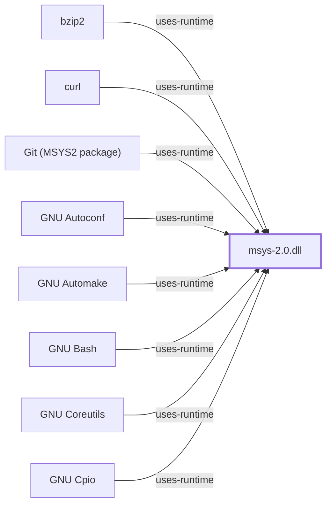

# MSYS Runtime Behavior Architecture Map

<!-- BEGIN GENERATED object-facts -->

| Model fact | Value |
| --- | --- |
| Object | `runtime:msys2:msys-2.0.dll` |
| Kind | `runtime` |
| Status | `partial` |
| Confidence | `verified` |
| Authority | MSYS2 |
| Environments | `msys` |

Generated from the composed model by `tools/build_object_facts.py`. Observed values come from the catalog snapshot and change when it is refreshed.
Edits between the surrounding markers are overwritten on the next build.

<!-- END GENERATED object-facts -->

The [Level 2 subsystem diagram](../diagrams/level-2.svg)
is the navigation companion to this map. It distinguishes MSYS-dependent
execution from native environment execution before drilling into individual
adaptation concerns.

**Update, 2026-08-02**: each row below now has its own subsystem page, and
the runtime itself has one at [msys-2.0.dll](MSYS-2-0-DLL.md). The rows
remain the responsibility summary; the pages carry the architecture and the
per-subsystem evidence boundary.

| Concern | Subsystem page | MSYS runtime responsibility | Windows-facing boundary | Required deep evidence |
| --- | --- | --- | --- | --- |
| Process creation | [Process Manager](MSYS-PROCESS-MANAGER.md) | Present POSIX process semantics where supported | Windows process creation and handles | Runtime source and controlled probes |
| `fork()` / `exec()` | [Process Manager](MSYS-PROCESS-MANAGER.md) | Adapt POSIX lifecycle expectations | Process image, inheritance, loader | Version-qualified implementation analysis |
| Signals | [Signal Manager](MSYS-SIGNAL-MANAGER.md) | Map POSIX signal behavior to available host mechanisms | Threads, processes, console control | Behavioral test matrix |
| Paths and mounts | [Path Conversion](MSYS-PATH-CONVERSION.md), [Mount Manager](MSYS-MOUNT-MANAGER.md) | Translate MSYS paths and virtual mount rules | Drive/UNC/filesystem namespaces | Mount table and path-conversion observations |
| Filesystem and symlinks | [Filesystem Layer](MSYS-FILESYSTEM-LAYER.md) | Present POSIX-like file operations | NTFS/ReFS/Win32 semantics | Filesystem probes by host/version |
| PTY and console | [PTY and Console](MSYS-PTY-AND-CONSOLE.md) | Provide terminal-facing abstractions | Console, ConPTY, pipes | Terminal integration tests |
| Environment | [Environment Manager](MSYS-ENVIRONMENT-MANAGER.md) | Store and convert environment variables at the boundary | Windows process environment block | Conversion observations |
| POSIX API | [POSIX API Surface](MSYS-POSIX-API.md) | Export the POSIX C API and translate to Win32 | Win32 API | Exported-symbol and header inventory |

## Boundary Rule

These services apply to MSYS-dependent processes. Native UCRT64, CLANG64, and
MinGW programs use Windows-facing runtime behavior directly unless they
explicitly load the MSYS runtime.

## Evidence Gaps

This is a responsibility map, not a claim of exact implementation ordering or
feature parity. Each row requires source revision, Windows version, and
reproducible observation evidence before being elevated beyond `partial`.

## Controlled local observation

On 2026-07-30, the bounded `--behavior` collector ran through the isolated
MSYS x86_64 shell (MSYS runtime reported by `uname` as `3.6.10`). Its raw
output is retained locally rather than committed. The following are exact
command outcomes, not general compatibility claims:

| Probe | Observed outcome | Boundary |
| --- | --- | --- |
| Process lifecycle | Background child existed and exited with status 0 | A shell child/process-management observation only |
| Shell `exec` | Replaced shell emitted `exec-ok` with status 0 | Does not characterize loader behavior |
| Signal delivery | A shell `USR1` trap emitted `signal=USR1` with status 0 | Does not establish the complete signal mapping |
| Filesystem symlink | `ln -s` succeeded and the target was readable, but `test -L` returned non-zero | The collector preserves this classification discrepancy; it does not claim POSIX symlink parity |
| Terminal-device namespace | `/dev` and `/dev/tty` existed | This is not a PTY allocation or ConPTY integration test |

The collector has a five-second bound per probe and creates/removes only a
fresh temporary directory for the symlink check. See the
[runtime observation contract](RUNTIME-OBSERVATION-CONTRACT.md) for the
command and retention boundary.

## Comparative observation: Git for Windows' bundled MSYS runtime

On 2026-07-30, the same probe battery was run manually against a second,
distinct MSYS distribution on the same host: Git for Windows' own bundled
`msys-2.0.dll` (`C:\Program Files\Git\usr\bin\msys-2.0.dll`, 3,368,543
bytes). `uname -a` reported runtime `3.6.9-b4195d69.x86_64` — a different
version from the isolated MSYS2 installation's `3.6.10` above, confirming
these are genuinely separate MSYS runtime deployments, not the same
binary observed twice.

| Probe | Observed outcome | Compared to the isolated installation above |
| --- | --- | --- |
| Process lifecycle | Background child ran; `wait` exit status 0 | Same outcome |
| Shell `exec` | Replaced shell emitted `exec-ok`, status 0 | Same outcome |
| Signal delivery | A `USR1` trap fired, status 0 | Same outcome |
| Filesystem symlink | `ln -s` exited 0, but `stat` reported a **regular file** containing a full copy of the target's bytes, not a symlink; confirmed at the Windows API level (`Attributes=Archive`, no `ReparsePoint` flag, no `LinkType`) | **Diverges**: a full-content-copy fallback, not merely the isolated installation's narrower "`test -L` false while still readable through it" discrepancy |

Both `MSYS` and `CYGWIN` environment variables were unset (default) for
this probe. The symlink divergence is a concrete instance of this page's
own Evidence Gaps caveat: MSYS symlink fallback behavior is
installation/configuration-dependent (see the `winsymlinks` mode family),
so neither observation generalizes to "MSYS symlinks behave as X" without
naming the specific distribution, version, and environment configuration.
This is also consistent with
[Windows platform boundaries](WINDOWS-PLATFORM-BOUNDARIES.md#controlled-local-host-observation)'s
finding that native symlink creation requires elevation in this same
non-elevated session — the runtime's fallback path, not a defect.

## Cross-installation toolchain execution observation

A 2026-07-31 session installed a genuinely new, third MSYS2 distribution
on this host (`C:\msys64`, via `winget install MSYS2.MSYS2`) — distinct
from both installations above. `uname -a` reported the identical version
string as Git for Windows' bundled runtime,
`3.6.9-b4195d69.x86_64`, but the two `msys-2.0.dll` files are
confirmed **not** byte-identical: `C:\msys64\usr\bin\msys-2.0.dll` is
3,366,529 bytes (SHA-256
`80817f159a33b8f641e6a15de73d1efcc9af3a7557a69121e4798c99930152f1`)
versus Git for Windows' 3,368,543 bytes (SHA-256
`2ea49553e4c03055dcf1c4a2bef54668081a07663fba283f4b34cf70f2157191`) — the
same nominal upstream version tag does not imply the same build.

Separately, a native UCRT64 `gcc.exe` built by this new installation's
own toolchain was run as a child process of Git for Windows' bash (this
session's ordinary shell) and reproducibly failed with `Cannot create
temporary file in C:\Windows\: Permission denied`; the identical
command succeeded when run as a child of `C:\msys64`'s own
`bash.exe` instead. This is concrete evidence that a native toolchain
binary's environment-variable expectations (here, temp-directory
resolution) are tied to the specific MSYS runtime instance that spawned
it, not portable across any msys-2.0.dll-providing shell on the same
host — a distinct divergence from the symlink-fallback one above, in a
different subsystem (process/environment setup rather than filesystem).
See [Build artifact and flow mappings](BUILD-ARTIFACT-FLOW-MAPPINGS.md#worked-example-zlib-a-second-attempt-reaching-compile-link-and-execution)
for the full build exercise this was found during.

## Controlled fork() emulation observation

On 2026-07-31, a targeted probe closed part of this page's previously
open `fork()` emulation gap. In Git for Windows' bundled bash, a
backgrounded subshell (`( ... ) &`) reported the *same* `$$` value as
its parent — expected, standard POSIX shell semantics where `$$`
identifies the originating shell rather than the literal subshell
process — but a *different* `$BASHPID` value (parent `1648`, subshell
`1650`), and a follow-up `ps -ef` confirmed the subshell's children
carried `PPID 1648`, correctly chaining back to the parent shell. This
is direct evidence that this MSYS runtime performs a real OS-level
process fork for a subshell, not a simulated/single-process emulation
of one. Separately, the top-level bash process itself reported its own
`PPID` as `1` — the well-known MSYS/Cygwin convention for a parent
process that isn't itself a POSIX-tracked MSYS process (here, the
launching Windows/Claude Code host process), not evidence of an actual
orphaned or init-owned process. This is single-installation,
single-session evidence for Git for Windows' bundled runtime
specifically; it does not establish `fork()` emulation behavior for the
isolated MSYS2 installation's runtime or for `vfork()`/`posix_spawn()`
code paths not exercised by this probe.

## Partial console/terminal-device observation

The same 2026-07-31 session found `MSYSTEM=MINGW64` (this shell was
launched selecting the MINGW64 environment, not the MSYS default) and
`TERM=xterm-256color`. `[ -t 1 ]` (stdout) reported false — stdout is
not attached to a console device in this specific automated harness
invocation — while `[ -t 0 ]`/`tty` behavior on stdin indicated it was
still console-attached at shell start. This is a narrow, honest partial
observation of this one process's console-device plumbing; it is not a
ConPTY allocation test, does not exercise interactive terminal
resizing/signal (`SIGWINCH`) behavior, and does not close the "Terminal
integration tests" evidence this row's Concern column still calls for.

## Related Views

- [Runtime initialization](MSYS-RUNTIME-INITIALIZATION.md)
- [Runtime environments](RUNTIME-ENVIRONMENTS.md)

<!-- BEGIN GENERATED dependency-subgraph -->

## Dependency Diagram

Dependencies and dependents of `runtime:msys2:msys-2.0.dll` in the composed graph: 72 dependents and 0 dependencies, of which 64 are omitted here for legibility.

Generated from the composed model by `tools/build_object_diagrams.py`.
Edits between the surrounding markers are overwritten on the next build.

<!-- END GENERATED dependency-subgraph -->
