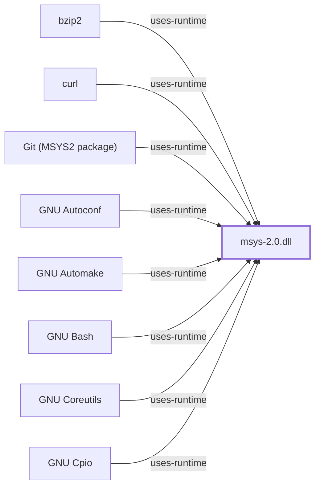

# MSYS Runtime Behavior Architecture Map

The [Level 2 subsystem diagram](../diagrams/level-2.svg)
is the navigation companion to this map. It distinguishes MSYS-dependent
execution from native environment execution before drilling into individual
adaptation concerns.

| Concern | MSYS runtime responsibility | Windows-facing boundary | Required deep evidence |
| --- | --- | --- | --- |
| Process creation | Present POSIX process semantics where supported | Windows process creation and handles | Runtime source and controlled probes |
| `fork()` / `exec()` | Adapt POSIX lifecycle expectations | Process image, inheritance, loader | Version-qualified implementation analysis |
| Signals | Map POSIX signal behavior to available host mechanisms | Threads, processes, console control | Behavioral test matrix |
| Paths and mounts | Translate MSYS paths and virtual mount rules | Drive/UNC/filesystem namespaces | Mount table and path-conversion observations |
| Filesystem and symlinks | Present POSIX-like file operations | NTFS/ReFS/Win32 semantics | Filesystem probes by host/version |
| PTY and console | Provide terminal-facing abstractions | Console, ConPTY, pipes | Terminal integration tests |

## Boundary Rule

These services apply to MSYS-dependent processes. Native UCRT64, CLANG64, and
MinGW programs use Windows-facing runtime behavior directly unless they
explicitly load the MSYS runtime.

## Evidence Gaps

This is a responsibility map, not a claim of exact implementation ordering or
feature parity. Each row requires source revision, Windows version, and
reproducible observation evidence before being elevated beyond `partial`.

## Controlled local observation

On 2026-07-30, the bounded `--behavior` collector ran through the isolated
MSYS x86_64 shell (MSYS runtime reported by `uname` as `3.6.10`). Its raw
output is retained locally rather than committed. The following are exact
command outcomes, not general compatibility claims:

| Probe | Observed outcome | Boundary |
| --- | --- | --- |
| Process lifecycle | Background child existed and exited with status 0 | A shell child/process-management observation only |
| Shell `exec` | Replaced shell emitted `exec-ok` with status 0 | Does not characterize loader behavior |
| Signal delivery | A shell `USR1` trap emitted `signal=USR1` with status 0 | Does not establish the complete signal mapping |
| Filesystem symlink | `ln -s` succeeded and the target was readable, but `test -L` returned non-zero | The collector preserves this classification discrepancy; it does not claim POSIX symlink parity |
| Terminal-device namespace | `/dev` and `/dev/tty` existed | This is not a PTY allocation or ConPTY integration test |

The collector has a five-second bound per probe and creates/removes only a
fresh temporary directory for the symlink check. See the
[runtime observation contract](RUNTIME-OBSERVATION-CONTRACT.md) for the
command and retention boundary.

## Related Views

- [Runtime initialization](MSYS-RUNTIME-INITIALIZATION.md)
- [Runtime environments](RUNTIME-ENVIRONMENTS.md)

<!-- BEGIN GENERATED dependency-subgraph -->

## Dependency Diagram

Dependencies and dependents of `runtime:msys2:msys-2.0.dll` in the composed graph: 70 dependents and 0 dependencies, of which 62 are omitted here for legibility.

Generated from the composed model by `tools/build_object_diagrams.py`.
Edits between the surrounding markers are overwritten on the next build.

<!-- END GENERATED dependency-subgraph -->
