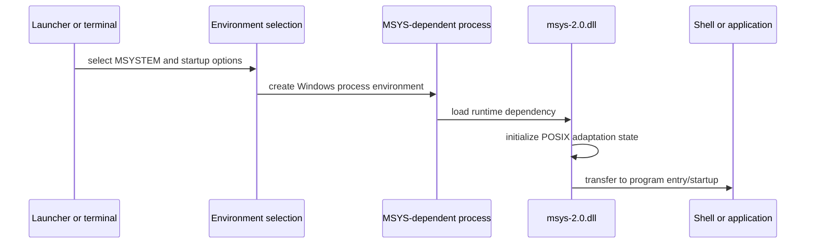
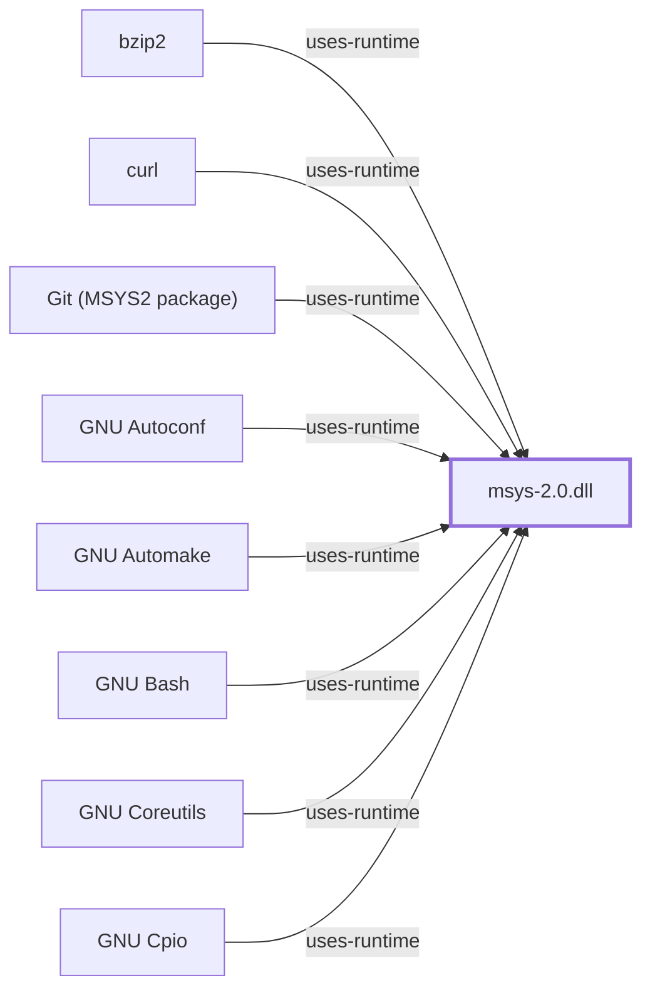

# MSYS Runtime Initialization Model

<!-- BEGIN GENERATED object-facts -->

| Model fact | Value |
| --- | --- |
| Object | `runtime:msys2:msys-2.0.dll` |
| Kind | `runtime` |
| Status | `partial` |
| Confidence | `verified` |
| Authority | MSYS2 |
| Environments | `msys` |

Generated from the composed model by `tools/build_object_facts.py`. Observed values come from the catalog snapshot and change when it is refreshed.
Edits between the surrounding markers are overwritten on the next build.

<!-- END GENERATED object-facts -->

## Purpose

This model describes the observable startup boundary for an MSYS-dependent
program. It distinguishes launcher/shell configuration from runtime DLL
initialization and from later application behavior.

## Responsibilities and Boundaries

- Launchers establish environment selection; they do not prove a program’s
  runtime dependency.
- `msys-2.0.dll` supplies the MSYS POSIX-compatibility boundary for programs
  that link to it.
- Native environment executables are outside that runtime dependency boundary.
- Shell profile processing is application-level behavior, not a substitute for
  runtime initialization analysis.

## Verification Gaps

Detailed ordering for mount setup, path conversion tables, signal machinery,
fork emulation, and pseudo-terminal setup requires version-qualified runtime
source analysis and controlled observations. Those are tracked as follow-on
runtime-model work rather than inferred here.

A 2026-07-30 observation confirmed `msys-2.0.dll` is not a single
knowledge-base-wide constant: the isolated MSYS2 installation's copy
reports runtime `3.6.10`, while Git for Windows ships its own, separately
versioned `3.6.9-b4195d69.x86_64` copy at
`C:\Program Files\Git\usr\bin\msys-2.0.dll` (hash-recorded). "A program
depends on `msys-2.0.dll`" is therefore an incomplete claim on its own;
see the
[behavior map's comparative observation](MSYS-RUNTIME-BEHAVIOR-MAP.md#comparative-observation-git-for-windows-bundled-msys-runtime)
for which specific copy a given process resolves and what measurably
differs between them.

## Related Views

- [Ecosystem context](ECOSYSTEM-CONTEXT.md)
- [Runtime environments](RUNTIME-ENVIRONMENTS.md)
- [Eight-layer architecture](EIGHT-LAYER-ARCHITECTURE.md)

<!-- BEGIN GENERATED dependency-subgraph -->

## Dependency Diagram

Dependencies and dependents of `runtime:msys2:msys-2.0.dll` in the composed graph: 72 dependents and 0 dependencies, of which 64 are omitted here for legibility.

Generated from the composed model by `tools/build_object_diagrams.py`.
Edits between the surrounding markers are overwritten on the next build.

<!-- END GENERATED dependency-subgraph -->
