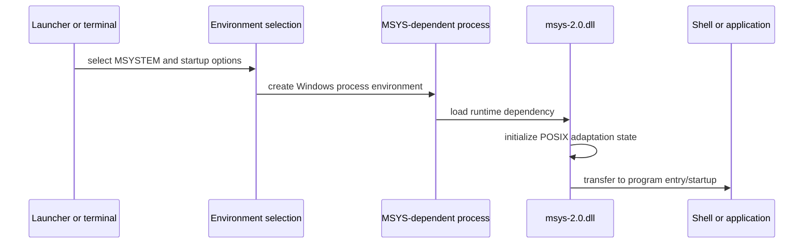

# MSYS Runtime Initialization Model

## Purpose

This model describes the observable startup boundary for an MSYS-dependent
program. It distinguishes launcher/shell configuration from runtime DLL
initialization and from later application behavior.

## Responsibilities and Boundaries

- Launchers establish environment selection; they do not prove a program’s
  runtime dependency.
- `msys-2.0.dll` supplies the MSYS POSIX-compatibility boundary for programs
  that link to it.
- Native environment executables are outside that runtime dependency boundary.
- Shell profile processing is application-level behavior, not a substitute for
  runtime initialization analysis.

## Verification Gaps

Detailed ordering for mount setup, path conversion tables, signal machinery,
fork emulation, and pseudo-terminal setup requires version-qualified runtime
source analysis and controlled observations. Those are tracked as follow-on
runtime-model work rather than inferred here.

## Related Views

- [Ecosystem context](ECOSYSTEM-CONTEXT.md)
- [Runtime environments](RUNTIME-ENVIRONMENTS.md)
- [Eight-layer architecture](EIGHT-LAYER-ARCHITECTURE.md)
