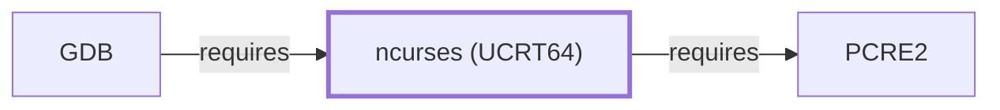

# ncurses (UCRT64)

<!-- BEGIN GENERATED object-facts -->

| Model fact | Value |
| --- | --- |
| Object | `library:gnu:ncurses@ucrt64` |
| Kind | `library` |
| Status | `partial` |
| Confidence | `high` |
| Authority | Free Software Foundation |
| Environments | `ucrt64` |
| Upstream | <https://www.gnu.org/software/ncurses/> |
| Packaged as | `package:msys2:mingw-w64-ucrt-x86_64-ncurses` |
| Version (observed) | 6.6-4 |
| License (observed) | spdx:MIT |
| Architecture (observed) | any |
| Installed size (observed) | 15510.63 KiB |

**Evidence on this object**

- `evidence:catalog:current` — MSYS2 pacman package catalog (`observed`, retrieved 2026-08-05)
- `evidence:gnu:ncurses-manual-2026-07-30` — GNU Ncurses (official project site) (`primary`, retrieved 2026-07-30)

Generated from the composed model by `tools/build_object_facts.py`. Observed values come from the catalog snapshot and change when it is refreshed.
Edits between the surrounding markers are overwritten on the next build.

<!-- END GENERATED object-facts -->

## Purpose

This page documents the **UCRT64-environment** ncurses package
specifically — the terminal-capability and screen-handling library —
depended on by [GDB](GNU-GDB.md) to back its TUI (text user interface)
mode, already cited by package name on
[GNU-GDB.md's dependency table](GNU-GDB.md#dependencies) before this
page existed. See the
[official GNU Ncurses project site](https://www.gnu.org/software/ncurses/)
for the API and terminfo reference.

## Architectural Classification

`library:gnu:ncurses@ucrt64` is packaged in the UCRT64 environment as
`package:msys2:mingw-w64-ucrt-x86_64-ncurses` (version `6.6-4` in the
current catalog snapshot, license `MIT`) — a separately built, separate
catalog entity from [ncurses (MSYS)](NCURSES.md)'s `ncurses` package,
even though the two share the same upstream project and license. This
is the package [GDB](GNU-GDB.md) — a UCRT64-native component itself —
actually depends on, following the same MSYS-vs-native distinction
applied consistently throughout this volume.

## Responsibilities

- Providing a portable API for cursor positioning, screen updates,
  color, and keyboard input across different terminal types, consumed
  by [GDB's](GNU-GDB.md#dependencies) TUI mode, the same functional
  role [ncurses (MSYS)](NCURSES.md#responsibilities) documents for its
  own, much wider set of MSYS-environment consumers.

## Boundaries

This page's package serves UCRT64-environment consumers specifically;
the broad MSYS-environment consumer base (GNU Emacs, Vim, and dozens of
other interactive text-mode programs) instead links
[ncurses (MSYS)](NCURSES.md#reverse-dependencies) — the two are not
interchangeable, matching the same distinction already made throughout
this volume for MSYS/native sibling pairs.

## Interfaces

- The ncurses C API (cursor positioning, screen updates, color, and
  keyboard input functions), the same interface
  [ncurses (MSYS)](NCURSES.md#interfaces) documents, per the
  documentation.

## Dependencies

The UCRT64 `package:msys2:mingw-w64-ucrt-x86_64-ncurses` declares
dependencies on `mingw-w64-ucrt-x86_64-cc-libs`,
[PCRE2 (UCRT64)](PCRE2.md) (regular-expression support,
`relationship:toolchain:ncurses-ucrt64-requires-pcre2`, added
2026-07-30), and `mingw-w64-ucrt-x86_64-libsystre` — the latter not
individually modeled as a separate dependency edge from this entity in
this knowledge base.

## Reverse Dependencies

**Correction, 2026-07-30**: this page previously stated 11 relationships;
the catalog snapshot actually records **13** targeting
`package:msys2:mingw-w64-ucrt-x86_64-ncurses` — dramatically fewer than
[ncurses (MSYS)](NCURSES.md#reverse-dependencies)'s 40, reflecting that
most UCRT64-native programs are GUI-oriented rather than terminal-UI
programs, unlike the broad MSYS-environment interactive-tool ecosystem.
One is now modeled in this knowledge base: [GDB](GNU-GDB.md)
(`relationship:toolchain:gdb-requires-ncurses-ucrt64`). The remaining
~12 recorded dependents (`avrdude`, `bitwise`, `global`, `gnucobol`,
`notcurses`, `python`, and others) are not individually modeled in this
knowledge base; see the
[reverse dependency impact analysis](REVERSE-DEPENDENCY-IMPACT-ANALYSIS.md)
for the current full list.

## Configuration

ncurses has no persistent configuration file; behavior is controlled
through terminfo capability databases and the calling program's own API
usage, identical to [ncurses (MSYS)](NCURSES.md#configuration).

## Initialization and Execution Flow

As a library, ncurses has no independent process lifecycle: it
initializes and executes within the process of whatever program links
against it — [GDB](GNU-GDB.md) in this dependency chain, only when TUI
mode is actually invoked. As a native MinGW-w64 library, this process
model is Windows-facing directly rather than mediated by
`msys-2.0.dll`.

## Runtime Behavior

Identical functional behavior to [ncurses (MSYS)](NCURSES.md#runtime-behavior);
see that page for detail not specific to the UCRT64/MSYS packaging
distinction.

## Compatibility and Variants

The UCRT64 and MSYS ncurses packages are separately versioned catalog
entities (see Architectural Classification); code built against one is
not automatically compatible with the other without matching the
correct package/environment.

## Security Considerations

No ncurses-specific vulnerability review has been performed for this
volume; see [Threat Model and Supply Chain](THREAT-MODEL-AND-SUPPLY-CHAIN.md)
for the project's general supply-chain posture. No version-qualified
CVE review has been performed for the recorded `6.6-4` version.

## Failure Modes and Diagnostics

A GDB TUI-mode rendering failure should be checked against the
terminal's own terminfo entry before being treated as a GDB or ncurses
defect, the same triage order applicable to any ncurses-based program.

## Evidence, Assumptions, and Open Questions

Terminal-capability library scope is backed by the official GNU Ncurses
project site (`evidence:gnu:ncurses-manual-2026-07-30`), the same
evidence record [ncurses (MSYS)](NCURSES.md) cites. Package identity,
version, license, and the recorded dependency and dependent edges are
backed by the pacman catalog snapshot (`evidence:catalog:current`).
Open, and explicitly out of scope for this page: the ~10 remaining
recorded dependents not individually modeled, this package's own
cc-libs/libsystre sub-dependencies, and header-level API surface
/ PE import/export-level evidence, per the
[Library Family Classification](LIBRARY-FAMILY-CLASSIFICATION.md)
methodology.

<!-- BEGIN GENERATED dependency-subgraph -->

## Dependency Diagram

Dependencies and dependents of `library:gnu:ncurses@ucrt64` in the composed graph: 1 dependent and 1 dependency.

Generated from the composed model by `tools/build_object_diagrams.py`.
Edits between the surrounding markers are overwritten on the next build.

<!-- END GENERATED dependency-subgraph -->

## Related Objects

- [MSYS2 Library Architecture](LIBRARIES-ARCHITECTURE.md)
- [ncurses (MSYS)](NCURSES.md)
- [ncurses (CLANG64)](NCURSES-CLANG64.md)
- [GDB](GNU-GDB.md)
- [PCRE2](PCRE2.md)
