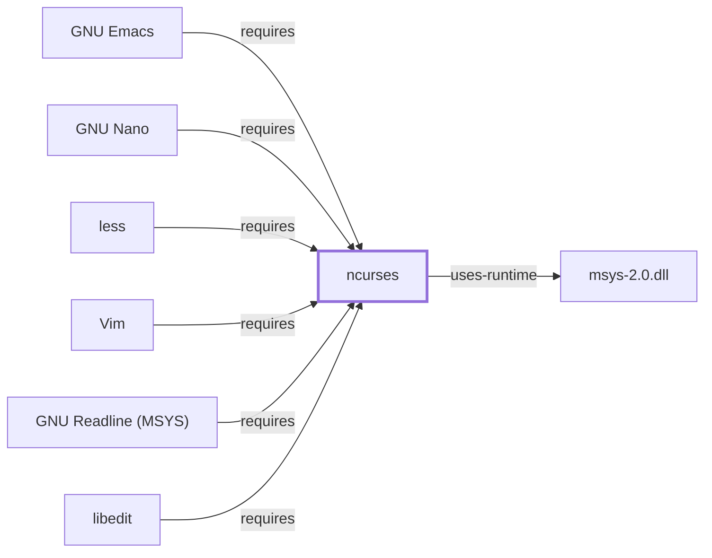

# ncurses

<!-- BEGIN GENERATED object-facts -->

| Model fact | Value |
| --- | --- |
| Object | `component:gnu:ncurses` |
| Kind | `component` |
| Status | `partial` |
| Confidence | `high` |
| Authority | Free Software Foundation |
| Environments | `msys` |
| Upstream | <https://www.gnu.org/software/ncurses/> |
| Packaged as | `package:msys2:ncurses` |
| Version (observed) | 6.6-2 |
| License (observed) | spdx:MIT |
| Architecture (observed) | x86_64 |
| Installed size (observed) | 10.8 MB |

**Evidence on this object**

- `evidence:catalog:current` — MSYS2 pacman package catalog (`observed`, retrieved 2026-07-29)
- `evidence:gnu:ncurses-manual-2026-07-30` — GNU Ncurses (official project site) (`primary`, retrieved 2026-07-30)

**Claims about this object**

- `claim:component:ncurses:hub` (`observation`, `verified`) — ncurses is the most-depended-upon package observed in this catalog snapshot among the tools modeled in this knowledge base, reflecting its role as the shared terminal-capability library underlying nearly every interactive text-mode program.

Generated from the composed model by `tools/build_object_facts.py`. Observed values come from the catalog snapshot and change when it is refreshed.
Edits between the surrounding markers are overwritten on the next build.

<!-- END GENERATED object-facts -->

## Purpose

Ncurses is the terminal-capability and screen-handling library that lets a
text-mode program draw, move the cursor, and read keys portably across
terminal types, without hardcoding escape sequences. This page documents
its architectural role as the shared foundation for this batch's other
tools; see the
[official GNU Ncurses project site](https://www.gnu.org/software/ncurses/)
for the API and terminfo reference.

## Architectural Classification

`component:gnu:ncurses` is packaged as `package:msys2:ncurses` (version
`6.6-2` in the current catalog snapshot). It is hosted as a GNU package
(`project_url` under `gnu.org`) but, unusually for that categorization, is
distributed under the permissive `MIT` license rather than the GPL family
used by most of the other GNU-attributed components in this volume — a
distinction worth noting explicitly rather than assuming GNU implies GPL.
It belongs to the MSYS environment.

## Responsibilities

- Providing a portable API for cursor positioning, screen updates, color,
  and keyboard input across different terminal types, using terminfo
  capability databases rather than per-terminal hardcoded logic.
- Serving as the shared terminal-UI foundation for [GNU Emacs](GNU-EMACS.md),
  [less](LESS.md), [GNU Nano](GNU-NANO.md), and [Vim](VIM.md), each of which
  declares a direct dependency on it (`claim:component:ncurses:hub`).

## Boundaries

Ncurses is a library, not a standalone program; it has no command-line
interface of its own beyond a small set of development/testing utilities
bundled with most distributions. It does not provide terminal emulation
itself — that is [mintty](MINTTY.md)'s role — only the API a program inside
a terminal uses to draw to it.

## Interfaces

- A C API for window/screen management (`initscr`, `refresh`, `move`,
  `addch`, color-pair management) and terminfo-based capability lookup,
  consumed by the programs in this batch rather than invoked directly by
  end users.

## Dependencies

The catalog snapshot records one `runtime-depends-on` edge for
`package:msys2:ncurses`: `package:msys2:gcc-libs`, the standard
GCC-toolchain runtime libraries (`libgcc`/`libstdc++`) for a package built
with GCC in this environment.

## Reverse Dependencies

The snapshot records 40 relationships targeting `package:msys2:ncurses` —
by a wide margin the largest reverse-dependency count of any component
documented across this volume so far, including bash's 46 at the package
level for a different reason (bash is depended on broadly as the `sh`
provider across the whole distribution, while ncurses is depended on
specifically by interactive text-mode programs). This is the
directly observed basis for `claim:component:ncurses:hub`. Among these,
[libedit](LIBEDIT.md) is now individually modeled
(`relationship:foundation-libraries:libedit-requires-ncurses`, added
2026-08-02). See the
[reverse dependency impact analysis](REVERSE-DEPENDENCY-IMPACT-ANALYSIS.md)
for the current full list.

## Configuration

Ncurses behavior is driven by the `TERM` environment variable, which
selects the terminfo entry describing the current terminal's capabilities;
there is no other persistent configuration file for the library itself.

## Initialization and Execution Flow

Ncurses is a library linked into a calling program's process, not a
separate process itself; its "initialization" is the calling program's
`initscr()`-style setup call, which queries the terminfo database for the
terminal named in `TERM`.

## Runtime Behavior

Because ncurses mediates all screen drawing for its dependent programs, its
correctness depends on an accurate terminfo entry for the actual terminal in
use. In this environment, that terminal is most often [mintty](MINTTY.md);
whether mintty's terminfo entry as installed here is complete and accurate
has not been directly observed as a controlled test and is open work.

## Compatibility and Variants

Ncurses is a specific, actively maintained implementation of the historical
curses API; programs written against strict/legacy curses assumptions are
not always identical in behavior to ncurses-specific extensions (such as
extended color support or wide-character/`ncursesw` builds). Which variant
(narrow or wide-character) this package provides has not been confirmed
against a file-level inventory.

## Security Considerations

No ncurses-specific vulnerability review has been performed for this
volume; see [Threat Model and Supply Chain](THREAT-MODEL-AND-SUPPLY-CHAIN.md)
for the project's general supply-chain posture. Given its role as a
dependency of 40 other packages in this snapshot, a defect here would have
unusually broad blast radius relative to most other components documented
in this volume — a risk-concentration observation worth carrying into any
future security review prioritization, not an assertion of an actual
defect.

## Failure Modes and Diagnostics

Garbled screen drawing or incorrect key handling in a dependent program
(such as [Vim](VIM.md) or [less](LESS.md)) should first be checked against
the active `TERM` value and terminfo entry before being treated as a defect
in the dependent program itself.

## Evidence, Assumptions, and Open Questions

The library's role and API model are backed by the official GNU Ncurses
project site (`evidence:gnu:ncurses-manual-2026-07-30`), matching the
`project_url` already recorded for `package:msys2:ncurses` in the catalog.
Package identity, version, license, dependency edges, and the
hub-dependency observation are backed by the pacman catalog snapshot
(`evidence:catalog:current`) via `claim:component:ncurses:hub`. Open:
whether this build is the narrow or wide-character variant, and whether
mintty's terminfo entry is accurate in this environment, are both
unconfirmed.

<!-- BEGIN GENERATED dependency-subgraph -->

## Dependency Diagram

Dependencies and dependents of `component:gnu:ncurses` in the composed graph: 6 dependents and 1 dependency.

Generated from the composed model by `tools/build_object_diagrams.py`.
Edits between the surrounding markers are overwritten on the next build.

<!-- END GENERATED dependency-subgraph -->

## Related Objects

- [GNU Userland Role Model](GNU-USERLAND-ROLE-MODEL.md)
- [GNU Emacs](GNU-EMACS.md)
- [less](LESS.md)
- [GNU Nano](GNU-NANO.md)
- [Vim](VIM.md)
- [mintty](MINTTY.md)
- [ncurses (UCRT64)](NCURSES-UCRT64.md)
- [ncurses (CLANG64)](NCURSES-CLANG64.md)
- [libedit](LIBEDIT.md)
