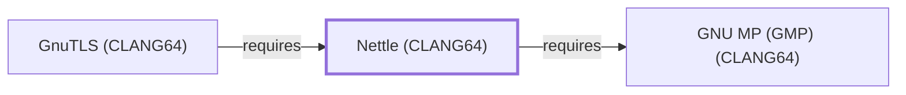

# Nettle (CLANG64)

## Purpose

This page documents `package:msys2:mingw-w64-clang-x86_64-nettle`, the
CLANG64-environment build of Nettle — a low-level cryptographic
library, one of the concrete future-batch candidates
[GMP (CLANG64)'s](GNU-GMP-CLANG64.md) own page flagged before this
page existed. As with the other Nettle-named packages documented in
this volume (see [Nettle](NETTLE.md#purpose) for the full UCRT64/MSYS
naming history), this CLANG64 package is a separately versioned
catalog entity that should not be conflated with the others. See the
[official Nettle project site](https://www.lysator.liu.se/~nisse/nettle)
for the API reference.

## Architectural Classification

`library:nettle:nettle@clang64` is packaged as
`package:msys2:mingw-w64-clang-x86_64-nettle` (version `4.0-1` in the
current catalog snapshot, license `GPL-2.0-or-later;LGPL-3.0-or-later`),
authored by Niels Möller — the same version number as
[Nettle (UCRT64)](NETTLE.md)'s package, but a separately built,
separate catalog entity. It belongs to the CLANG64 environment. Its
sole recorded non-boilerplate runtime dependency,
[GMP (CLANG64)](GNU-GMP-CLANG64.md), was already a modeled entity in
this knowledge base (added earlier in this same session), letting this
addition close its full dependency footprint in a single pass.

## Responsibilities

- Providing low-level cryptographic primitives (block ciphers, hash
  functions, public-key algorithms) for CLANG64-native consumers, the
  same role [Nettle (UCRT64)](NETTLE.md#responsibilities) documents for
  its own environment.

## Boundaries

This page's package serves CLANG64-environment consumers specifically;
none of the UCRT64/MSYS Nettle-family packages documented on
[Nettle (UCRT64)](NETTLE.md#purpose) are interchangeable with it,
matching the same distinction already drawn throughout this volume for
MSYS/UCRT64/CLANG64 sibling packages.

## Interfaces

- A C API organized around individual cryptographic primitives (AES,
  SHA-family hashes, RSA), the same interface
  [Nettle (UCRT64)](NETTLE.md#interfaces) documents, per the
  documentation.

## Dependencies

The catalog snapshot records two `runtime-depends-on` edges for
`package:msys2:mingw-w64-clang-x86_64-nettle`; the `cc-libs` C/C++
runtime row is excluded per this volume's boilerplate-dependency
policy, and the remaining one is modeled in this knowledge base:

| Dependency | Package | Architectural reason |
| --- | --- | --- |
| [GMP (CLANG64)](GNU-GMP-CLANG64.md) | `package:msys2:mingw-w64-clang-x86_64-gmp` | Nettle uses GMP's arbitrary-precision arithmetic for its public-key cryptography primitives (RSA, DSA). |

## Reverse Dependencies

The catalog snapshot records 10 relationships targeting
`package:msys2:mingw-w64-clang-x86_64-nettle`:
`mingw-w64-clang-x86_64-fzssh`, `mingw-w64-clang-x86_64-gnutls` (the
CLANG64 sibling of [GnuTLS](GNUTLS.md), not yet modeled),
`mingw-w64-clang-x86_64-gst-plugins-bad`,
`mingw-w64-clang-x86_64-libfilezilla`,
`mingw-w64-clang-x86_64-libzip`, `mingw-w64-clang-x86_64-qemu`,
`mingw-w64-clang-x86_64-qemu-image-util`,
`mingw-w64-clang-x86_64-rtmpdump`, `mingw-w64-clang-x86_64-stoken`,
and `mingw-w64-clang-x86_64-tigervnc`. None of these ten are currently
modeled as entities in this knowledge base; see the
[reverse dependency impact analysis](REVERSE-DEPENDENCY-IMPACT-ANALYSIS.md)
for the current full list.

## Configuration

Nettle has no persistent configuration file; algorithm selection is
made through its C API at the point of use, the same model documented
for [Nettle (UCRT64)](NETTLE.md#configuration).

## Initialization and Execution Flow

As a library, Nettle has no independent process lifecycle: it
initializes and executes within the process of whatever program links
against it. As a native MinGW-w64 library, this process model is
Windows-facing directly rather than mediated by `msys-2.0.dll`.

## Runtime Behavior

Identical functional behavior to [Nettle (UCRT64)](NETTLE.md); see
that page for detail not specific to the CLANG64/UCRT64 packaging
distinction.

## Compatibility and Variants

The CLANG64 and UCRT64 Nettle packages are separately versioned
catalog entities (see Architectural Classification); code built
against one is not automatically compatible with the other without
matching the correct environment.

## Security Considerations

As a cryptographic primitives library, Nettle sits in a
security-relevant position for whatever program links against this
specific CLANG64 build. See
[Threat Model and Supply Chain](THREAT-MODEL-AND-SUPPLY-CHAIN.md) for
the project's general supply-chain posture; no version-qualified CVE
review has been performed for the recorded `4.0-1` version.

## Failure Modes and Diagnostics

Nettle itself has no user-facing CLI; cryptographic-operation failures
in a dependent should be triaged against that dependent's own
documentation before assuming a Nettle defect, the same guidance
already given for [Nettle (UCRT64)](NETTLE.md#failure-modes-and-diagnostics).

## Evidence, Assumptions, and Open Questions

The low-level cryptographic-primitives role is backed by the official
Nettle project site (`evidence:nettle:manual-2026-07-30`), the same
evidence record [Nettle (UCRT64)](NETTLE.md) cites. Package identity,
version, license, and the recorded dependency edge are backed by the
pacman catalog snapshot (`evidence:catalog:current`). Open: the ten
recorded reverse dependents are not individually modeled in this
knowledge base, though `gnutls` (CLANG64) is a candidate for a future
batch, per this volume's ongoing gap-closing methodology.

<!-- BEGIN GENERATED dependency-subgraph -->

## Dependency Diagram

Dependencies and dependents of `library:nettle:nettle@clang64` in the composed graph: 1 dependent and 1 dependency.

Generated from the composed model by `tools/build_object_diagrams.py`.
Edits between the surrounding markers are overwritten on the next build.

<!-- END GENERATED dependency-subgraph -->

## Related Objects

- [MSYS2 Library Architecture](LIBRARIES-ARCHITECTURE.md)
- [Nettle (UCRT64)](NETTLE.md)
- [Nettle (MSYS)](NETTLE-MSYS.md)
- [GMP (CLANG64)](GNU-GMP-CLANG64.md)
- [GnuTLS (CLANG64)](GNUTLS-CLANG64.md)
