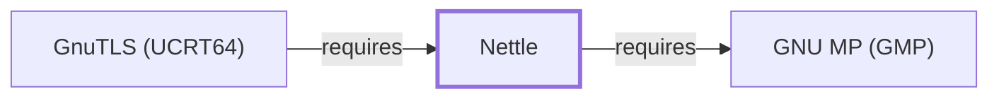

# Nettle

<!-- BEGIN GENERATED object-facts -->

| Model fact | Value |
| --- | --- |
| Object | `library:nettle:nettle` |
| Kind | `library` |
| Status | `partial` |
| Confidence | `high` |
| Authority | Niels Möller |
| Environments | `ucrt64` |
| Upstream | <https://www.lysator.liu.se/~nisse/nettle> |
| Packaged as | `package:msys2:mingw-w64-ucrt-x86_64-nettle` |
| Version (observed) | 4.0-1 |
| License (observed) | spdx:GPL-2.0-or-later;spdx:LGPL-3.0-or-later |
| Architecture (observed) | any |
| Installed size (observed) | 2.8 MB |

**Evidence on this object**

- `evidence:catalog:current` — MSYS2 pacman package catalog (`observed`, retrieved 2026-07-29)
- `evidence:nettle:manual-2026-07-30` — Nettle (official project site) (`primary`, retrieved 2026-07-30)

Generated from the composed model by `tools/build_object_facts.py`. Observed values come from the catalog snapshot and change when it is refreshed.
Edits between the surrounding markers are overwritten on the next build.

<!-- END GENERATED object-facts -->

## Purpose

Nettle is a low-level cryptographic library. This page documents the
**UCRT64**-packaged build specifically; [GnuPG's](GNUPG.md) own
MSYS-packaged direct dependency on a package literally named `nettle` is
a separately versioned MSYS sibling package, documented 2026-07-30 on
[Nettle (MSYS)](NETTLE-MSYS.md), not this UCRT64 package. GnuTLS's own
Nettle use (backing both GnuPG's `dirmngr` TLS connections and GNU
Emacs' Network Security Manager transitively) is via yet a third,
differently named MSYS package, `libnettle`
(`package:msys2:libnettle`), which [GnuTLS's own page](GNUTLS.md#dependencies)
already declines to model as a formal graph edge for the same reason —
none of this knowledge base's three Nettle-named entities
(`library:nettle:nettle`, `library:nettle:nettle@msys`, and the
unmodeled `libnettle`) should be conflated. See the
[official Nettle project site](https://www.lysator.liu.se/~nisse/nettle)
for the API reference shared by all three packages.

## Architectural Classification

`library:nettle:nettle` is packaged per native environment: this page
cites the UCRT64 build, `package:msys2:mingw-w64-ucrt-x86_64-nettle`
(version `4.0-1` in the current catalog snapshot, license
`GPL-2.0-or-later;LGPL-3.0-or-later`), authored by Niels Möller.

## Responsibilities

- Providing low-level cryptographic primitives (block ciphers, hash
  functions, public-key algorithms) designed to be used as a backend by
  higher-level libraries such as GnuTLS, rather than typically consumed
  directly by application code.

## Boundaries

Nettle provides cryptographic primitives at a lower level than
[libgcrypt](LIBGCRYPT.md); both exist in this environment for different
consumers ([GnuPG](GNUPG.md) itself uses libgcrypt directly and Nettle
transitively via GnuTLS for `dirmngr`), and this page does not claim they
are interchangeable or that one supersedes the other.

## Interfaces

- A C API organized around individual cryptographic primitives (AES,
  SHA-family hashes, RSA), deliberately low-level and without the
  higher-level protocol logic (such as TLS handshaking) that a library
  like GnuTLS builds on top of it, per the documentation.

## Dependencies

The catalog snapshot records two `runtime-depends-on` edges for
`package:msys2:mingw-w64-ucrt-x86_64-nettle`:
`mingw-w64-ucrt-x86_64-cc-libs` (low-level compiler runtime support) and
`mingw-w64-ucrt-x86_64-gmp` (arbitrary-precision arithmetic for
public-key algorithms, documented fully in [GNU MP](GNU-GMP.md)).

## Reverse Dependencies

The snapshot records 10 relationships targeting
`package:msys2:mingw-w64-ucrt-x86_64-nettle`. [GnuPG](GNUPG.md) is
**not** among them — that was a pre-2026-07-30 modeling error, corrected
in favor of [Nettle (MSYS)](NETTLE-MSYS.md#reverse-dependencies), which
GnuPG's own MSYS-packaged catalog dependency actually targets. GNU
Emacs' transitive path through GnuTLS also does not target this UCRT64
package (see Purpose). See the
[reverse dependency impact analysis](REVERSE-DEPENDENCY-IMPACT-ANALYSIS.md)
for the current full list of this UCRT64 package's actual dependents.

## Configuration

Nettle has no persistent configuration file; algorithm selection is made
through its C API at the point of use.

## Initialization and Execution Flow

As a library, Nettle has no independent process lifecycle: it initializes
and executes within the process of whatever program links against it
(directly or transitively through GnuTLS), the same general
library-linkage model documented for
[GNU MP](GNU-GMP.md#initialization-and-execution-flow).

## Runtime Behavior

Nettle's primitives are exercised whenever a consumer (directly, or
transitively via GnuTLS) performs a cryptographic operation; this page
does not characterize specific algorithm performance.

## Compatibility and Variants

Nettle's API has evolved across major versions with documented
compatibility notes in its own release history; this page does not
enumerate them.

## Security Considerations

As a cryptographic primitives library in the Nettle family (see Purpose
for the three distinct MSYS/UCRT64 packages sharing this name), Nettle
sits in a security-relevant position for whatever program links against
this specific UCRT64 build. See
[Threat Model and Supply Chain](THREAT-MODEL-AND-SUPPLY-CHAIN.md) for the
project's general supply-chain posture; no version-qualified CVE review
has been performed for the recorded `4.0-1` version.

## Failure Modes and Diagnostics

Nettle itself has no user-facing CLI; cryptographic-operation failures in
a dependent should be triaged against that dependent's own documentation
before assuming a Nettle defect.

## Evidence, Assumptions, and Open Questions

The low-level cryptographic-primitives role is backed by the official
Nettle project site (`evidence:nettle:manual-2026-07-30`), matching the
`project_url` already recorded for
`package:msys2:mingw-w64-ucrt-x86_64-nettle` in the catalog. Package
identity, version, license, and the GMP dependency edge are backed by the
pacman catalog snapshot (`evidence:catalog:current`). Correction
(2026-07-30): this page previously claimed a direct
`component:gnupg:gnupg` dependency and cited
`relationship:ssh-curl-git:gnupg-requires-nettle` as evidence; that
relationship's target has since been corrected to
[Nettle (MSYS)](NETTLE-MSYS.md), since `package:msys2:gnupg` is an
MSYS-environment package and this page's UCRT64 package was never its
actual catalog-recorded dependency. The GNU Emacs transitive-via-GnuTLS
claim was also removed: GnuTLS's actual Nettle dependency is a third,
unmodeled MSYS package (`libnettle`), distinct from both this page's
UCRT64 package and [Nettle (MSYS)](NETTLE-MSYS.md)'s `nettle` package.
Open, and explicitly out of scope for this page: header-level API
surface and PE import/export-level evidence, per the
[Library Family Classification](LIBRARY-FAMILY-CLASSIFICATION.md)
methodology.

<!-- BEGIN GENERATED dependency-subgraph -->

## Dependency Diagram

Dependencies and dependents of `library:nettle:nettle` in the composed graph: 1 dependent and 1 dependency.

Generated from the composed model by `tools/build_object_diagrams.py`.
Edits between the surrounding markers are overwritten on the next build.

<!-- END GENERATED dependency-subgraph -->

## Related Objects

- [MSYS2 Library Architecture](LIBRARIES-ARCHITECTURE.md)
- [GNU MP (GMP)](GNU-GMP.md)
- [Nettle (MSYS)](NETTLE-MSYS.md)
- [GnuPG](GNUPG.md)
- [GnuTLS (UCRT64)](GNUTLS-UCRT64.md)
- [Nettle (CLANG64)](NETTLE-CLANG64.md)
