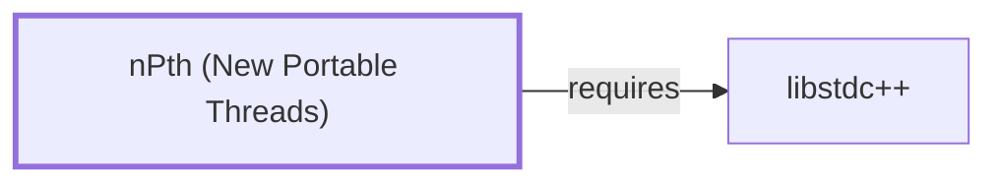

# nPth (New Portable Threads)

<!-- BEGIN GENERATED object-facts -->

| Model fact | Value |
| --- | --- |
| Object | `library:gnupg:npth` |
| Kind | `library` |
| Status | `partial` |
| Confidence | `high` |
| Authority | GnuPG project |
| Environments | `ucrt64` |
| Upstream | <https://gnupg.org/> |
| Packaged as | `package:msys2:mingw-w64-ucrt-x86_64-npth` |
| Version (observed) | 1.8-1 |
| License (observed) | LGPL |
| Architecture (observed) | any |
| Installed size (observed) | 88.13 KiB |

**Evidence on this object**

- `evidence:catalog:current` — MSYS2 pacman package catalog (`observed`, retrieved 2026-08-05)
- `evidence:gnupg:npth-manual-2026-07-30` — GnuPG project site (nPth) (`primary`, retrieved 2026-07-30)

Generated from the composed model by `tools/build_object_facts.py`. Observed values come from the catalog snapshot and change when it is refreshed.
Edits between the surrounding markers are overwritten on the next build.

<!-- END GENERATED object-facts -->

## Purpose

nPth is GnuPG's own portable threading library, used internally for
GnuPG-family concurrent operations — a separate, project-owned
alternative to depending on the platform's native threading library or a
general-purpose one like [libwinpthread](LIBWINPTHREAD.md). This page
documents the **UCRT64**-packaged build specifically; the MSYS-packaged
`package:msys2:gnupg` component GnuPG.md documents actually depends on a
differently named MSYS sibling package (`libnpth`), corrected 2026-07-30
and documented on [nPth (MSYS)](NPTH-MSYS.md) — this page no longer
claims a direct GnuPG dependency for that reason. See the
[GnuPG project site](https://gnupg.org/) for background shared by both
packages.

## Architectural Classification

`library:gnupg:npth` is packaged per native environment: this page cites
the UCRT64 build, `package:msys2:mingw-w64-ucrt-x86_64-npth` (version
`1.8-1` in the current catalog snapshot, license `LGPL`).

## Responsibilities

- Providing GnuPG's internal threading primitives, used for concurrent
  operations within GnuPG's components rather than the general-purpose
  threading role [libwinpthread](LIBWINPTHREAD.md) or
  [GNU Readline](GNU-READLINE.md)-adjacent tools rely on.

## Boundaries

nPth is scoped to GnuPG's own internal use; it is not the general-purpose
threading library other native MinGW-w64 programs in this environment
link against — that role belongs to
[libwinpthread](LIBWINPTHREAD.md#responsibilities), which this library
does not replace or depend on.

## Interfaces

- A C API providing threading primitives GnuPG's own components use
  internally, per the project's general documentation; this page does not
  claim a stable, independently documented public API surface beyond
  GnuPG's own use.

## Dependencies

The catalog snapshot records one `runtime-depends-on` edge for
`package:msys2:mingw-w64-ucrt-x86_64-npth`:
`mingw-w64-ucrt-x86_64-gcc-libs`, the standard GCC-toolchain runtime
libraries documented as the hub of
[libstdc++'s dependents](LIBSTDCXX.md#reverse-dependencies). This edge
is now modeled in this knowledge base
(`relationship:foundation-libraries:npth-requires-libstdcxx`, added
2026-07-30 — this page's own prose had named it without a corresponding
graph edge).

## Reverse Dependencies

The snapshot records 2 relationships targeting
`package:msys2:mingw-w64-ucrt-x86_64-npth` (its own `-devel` subpackage
and one other). [GnuPG](GNUPG.md) is **not** among them — that was a
pre-2026-07-30 modeling error, corrected in favor of
[nPth (MSYS)](NPTH-MSYS.md#reverse-dependencies), which GnuPG's own
MSYS-packaged catalog dependency actually targets. See the
[reverse dependency impact analysis](REVERSE-DEPENDENCY-IMPACT-ANALYSIS.md)
for the current full list of this UCRT64 package's actual dependents.

## Configuration

nPth has no persistent configuration file; its behavior is entirely
determined by the calling GnuPG component's own use of its threading API.

## Initialization and Execution Flow

As a library, nPth has no independent process lifecycle: it initializes
and executes within the process that uses it for concurrent operations,
the same general library-linkage model documented for
[libgpg-error](LIBGPG-ERROR.md#initialization-and-execution-flow).
[GnuPG's](GNUPG.md) own MSYS-packaged build links against
[nPth (MSYS)](NPTH-MSYS.md) instead of this UCRT64 package.

## Runtime Behavior

Given its narrow, GnuPG-family-internal scope, this page does not
characterize nPth's runtime behavior beyond noting it backs
GnuPG-family concurrency needs generally.

## Compatibility and Variants

nPth is a GnuPG-project-specific library; this page does not claim
interchangeability with other threading libraries in this volume, given
its narrower intended audience.

## Security Considerations

No nPth-specific vulnerability review has been performed for this volume;
see [Threat Model and Supply Chain](THREAT-MODEL-AND-SUPPLY-CHAIN.md) for
the project's general supply-chain posture. No version-qualified CVE
review has been performed for the recorded `1.8-1` version.

## Failure Modes and Diagnostics

nPth itself has no user-facing CLI; concurrency-related issues should be
diagnosed against the linking program's own behavior first, given this
library's narrow internal role.

## Evidence, Assumptions, and Open Questions

The internal-threading role is backed by the official GnuPG project site
(`evidence:gnupg:npth-manual-2026-07-30`), matching the `project_url`
already recorded for `package:msys2:mingw-w64-ucrt-x86_64-npth` in the
catalog. Package identity, version, license, and the dependency edge are
backed by the pacman catalog snapshot (`evidence:catalog:current`).
Correction (2026-07-30): this page previously claimed a direct
`component:gnupg:gnupg` dependency and cited
`relationship:ssh-curl-git:gnupg-requires-npth` as evidence; that
relationship's target has since been corrected to
[nPth (MSYS)](NPTH-MSYS.md), since `package:msys2:gnupg` is an
MSYS-environment package and this page's UCRT64 package was never its
actual catalog-recorded dependency. Open, and explicitly out of scope for
this page: header-level API surface and PE import/export-level evidence,
per the [Library Family Classification](LIBRARY-FAMILY-CLASSIFICATION.md)
methodology.

<!-- BEGIN GENERATED dependency-subgraph -->

## Dependency Diagram

Dependencies and dependents of `library:gnupg:npth` in the composed graph: 0 dependents and 1 dependency.

Generated from the composed model by `tools/build_object_diagrams.py`.
Edits between the surrounding markers are overwritten on the next build.

<!-- END GENERATED dependency-subgraph -->

## Related Objects

- [MSYS2 Library Architecture](LIBRARIES-ARCHITECTURE.md)
- [nPth (MSYS)](NPTH-MSYS.md)
- [libwinpthread](LIBWINPTHREAD.md)
