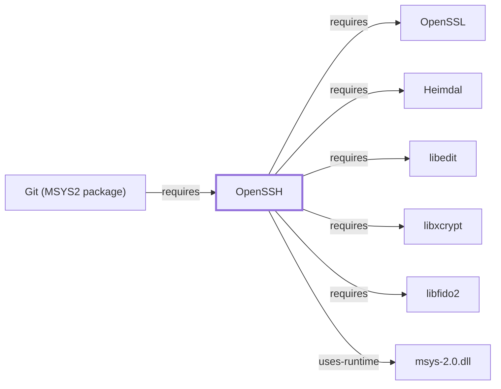

# OpenSSH

<!-- BEGIN GENERATED object-facts -->

| Model fact | Value |
| --- | --- |
| Object | `component:openssh:openssh` |
| Kind | `component` |
| Status | `partial` |
| Confidence | `high` |
| Authority | OpenBSD Project |
| Environments | `msys` |
| Upstream | <https://www.openssh.com/portable.html> |
| Packaged as | `package:msys2:openssh` |
| Version (observed) | 10.4p1-1 |
| License (observed) | spdx:LicenseRef-OpenSSH |
| Architecture (observed) | x86_64 |
| Installed size (observed) | 7.4 MB |

**Evidence on this object**

- `evidence:catalog:current` — MSYS2 pacman package catalog (`observed`, retrieved 2026-07-29)
- `evidence:openssh:project-site-2026-07-30` — OpenSSH (official project site) (`primary`, retrieved 2026-07-30)

Generated from the composed model by `tools/build_object_facts.py`. Observed values come from the catalog snapshot and change when it is refreshed.
Edits between the surrounding markers are overwritten on the next build.

<!-- END GENERATED object-facts -->

## Purpose

OpenSSH implements the SSH protocol suite for secure remote login, command
execution, and file transfer, and it is the transport backing
[Git](GIT-MSYS-PACKAGE.md)'s SSH remote URLs. This page documents its
architectural role and dependency footprint; see the
[official OpenSSH project site](https://www.openssh.com/portable.html) for
the full command and configuration reference.

## Architectural Classification

`component:openssh:openssh` is packaged as `package:msys2:openssh` (version
`10.4p1-1` in the current catalog snapshot, license
`LicenseRef-OpenSSH`, a project-specific license rather than a common OSI
template), authored by the OpenBSD Project. It belongs to the MSYS
environment.

## Responsibilities

- Client (`ssh`) and server (`sshd`) implementations of the SSH protocol,
  plus file-transfer tools (`scp`, `sftp`) built on the same transport.
- Backing [Git](GIT-MSYS-PACKAGE.md)'s `git+ssh://`/`user@host:path`-style
  remote URLs (`relationship:ssh-curl-git:git-requires-openssh`).

## Boundaries

OpenSSH implements the SSH protocol itself; it delegates the underlying
cryptographic primitives to [OpenSSL](OPENSSL.md) rather than implementing
them independently.

## Interfaces

- `ssh` (interactive/command-execution client), `sshd` (server daemon),
  `scp`/`sftp` (file transfer), `ssh-keygen` (key management), per the
  project documentation.

## Dependencies

The catalog snapshot records five `runtime-depends-on` edges for
`package:msys2:openssh`:

| Dependency | Package | Architectural reason |
| --- | --- | --- |
| Cryptographic primitives | `package:msys2:openssl` | Backs the underlying encryption, key exchange, and hashing OpenSSH uses rather than implementing independently (`relationship:ssh-curl-git:openssh-requires-openssl`). |
| Kerberos/GSSAPI authentication | `package:msys2:heimdal` | Backs optional GSSAPI-based authentication (Kerberos single sign-on), a documented OpenSSH authentication method beyond password/public-key. Documented fully in [Heimdal](HEIMDAL.md). |
| Line editing | `package:msys2:libedit` | Backs interactive line editing in tools such as `sftp`'s command prompt. Documented fully in [libedit](LIBEDIT.md). |
| Password/crypt hashing | `package:msys2:libxcrypt` | Backs local password-based authentication checks, the same `crypt()`-family hashing rationale documented for [Vim](VIM.md#dependencies)'s encryption feature. Documented fully in [libxcrypt](LIBXCRYPT.md). |
| Hardware security keys | `package:msys2:libfido2` | Backs FIDO2/U2F hardware security key support for public-key authentication, a modern OpenSSH authentication method. Documented fully in [libfido2](LIBFIDO2.md). |

## Reverse Dependencies

The snapshot records 8 relationships targeting `package:msys2:openssh`. See
the [reverse dependency impact analysis](REVERSE-DEPENDENCY-IMPACT-ANALYSIS.md)
for the current full list.

## Configuration

`~/.ssh/config` (client) and `/etc/ssh/sshd_config` (server) are genuine
standing configuration files, together with `~/.ssh/known_hosts` and key
files — a materially more security-sensitive configuration surface than
most other tools documented in this volume.

## Initialization and Execution Flow

The `ssh` client is an invoke-run-exit process per connection; `sshd` is a
longer-lived server process, similar in lifecycle shape to
[mintty](MINTTY.md#initialization-and-execution-flow) but serving inbound
connections rather than hosting a local interactive session. Both are
adapted from POSIX semantics onto Windows process primitives by
`msys-2.0.dll` per [MSYS Runtime Initialization](MSYS-RUNTIME-INITIALIZATION.md).

## Runtime Behavior

Authentication method negotiation (public-key, password, GSSAPI, FIDO2) at
connection time determines which of the dependencies above are actually
exercised for a given session; not every dependency is used on every
connection.

## Compatibility and Variants

OpenSSH's protocol and cipher-suite support evolves across versions; older
clients or servers may fail to negotiate a connection with this recorded
`10.4p1-1` version if they only support protocols or ciphers this version
has deprecated, per the project's own release notes practice of
periodically removing weak algorithms.

## Security Considerations

SSH is itself a security-critical transport; host-key verification
(`known_hosts` trust-on-first-use behavior) and authentication-method
configuration are the primary security-relevant surfaces, and FIDO2/GSSAPI
support (via `libfido2`/`heimdal`) extends authentication options beyond
passwords. See [Threat Model and Supply Chain](THREAT-MODEL-AND-SUPPLY-CHAIN.md)
for the project's general supply-chain posture; no version-qualified CVE
review has been performed for the recorded `10.4p1-1` version.

## Failure Modes and Diagnostics

Host-key mismatch errors are a deliberate security control, not a defect;
`-v`/`-vv`/`-vvv` verbose flags are the documented diagnostic path for
authentication and negotiation failures.

## Evidence, Assumptions, and Open Questions

Protocol and command semantics are backed by the official OpenSSH project
site (`evidence:openssh:project-site-2026-07-30`), matching the
`project_url` already recorded for `package:msys2:openssh` in the catalog.
Package identity, version, license, and all five dependency edges are
backed by the pacman catalog snapshot (`evidence:catalog:current`). No open
items beyond the general version-qualified security review noted above.

<!-- BEGIN GENERATED dependency-subgraph -->

## Dependency Diagram

Dependencies and dependents of `component:openssh:openssh` in the composed graph: 1 dependent and 6 dependencies.

Generated from the composed model by `tools/build_object_diagrams.py`.
Edits between the surrounding markers are overwritten on the next build.

<!-- END GENERATED dependency-subgraph -->

## Related Objects

- [GNU Userland Role Model](GNU-USERLAND-ROLE-MODEL.md)
- [OpenSSL](OPENSSL.md)
- [Git (MSYS2 package)](GIT-MSYS-PACKAGE.md)
- [curl](CURL.md)
- [libedit](LIBEDIT.md)
- [libxcrypt](LIBXCRYPT.md)
- [libfido2](LIBFIDO2.md)
- [Heimdal](HEIMDAL.md)
