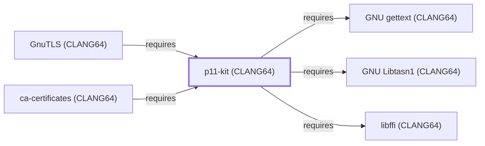

# p11-kit (CLANG64)

## Purpose

This page documents `package:msys2:mingw-w64-clang-x86_64-p11-kit`,
the CLANG64-environment build of p11-kit — a PKCS#11 module discovery
and coordination library — depended on by
[ca-certificates (CLANG64)](CA-CERTIFICATES-CLANG64.md), the last
entity in this batch's dependency chain. See the
[official p11-kit project page](https://p11-glue.github.io/p11-glue/p11-kit.html)
for the full reference.

## Architectural Classification

`library:p11-glue:p11-kit@clang64` is packaged as
`package:msys2:mingw-w64-clang-x86_64-p11-kit` (version `0.26.4-1` in
the current catalog snapshot, license `BSD-3-Clause`) — a separately
built, separate catalog entity from
[p11-kit (UCRT64)](P11-KIT-UCRT64.md) and [p11-kit (MSYS)](P11-KIT.md).
It belongs to the CLANG64 environment. All three of its own recorded
runtime dependencies were modeled earlier in this same batch, letting
this addition close its full dependency footprint in a single pass.

## Responsibilities

- Coordinating the discovery, configuration, and loading of PKCS#11
  cryptographic modules, consumed by
  [ca-certificates (CLANG64)](CA-CERTIFICATES-CLANG64.md#dependencies),
  the same functional role
  [p11-kit (UCRT64)](P11-KIT-UCRT64.md#responsibilities) documents for
  its own environment.

## Boundaries

This page's package serves CLANG64-environment consumers specifically;
[GnuTLS (UCRT64)](GNUTLS-UCRT64.md) instead depends on
[p11-kit (UCRT64)](P11-KIT-UCRT64.md#reverse-dependencies) — the two
are not interchangeable, matching the same distinction already drawn
throughout this volume for MSYS/UCRT64/CLANG64 sibling packages.
p11-kit coordinates PKCS#11 module discovery specifically; it does not
itself implement TLS or cryptographic algorithms.

## Interfaces

- A C API for PKCS#11 module discovery, loading, and coordination
  (`p11_kit_registered_modules` and related functions), the same
  interface [p11-kit (UCRT64)](P11-KIT-UCRT64.md#interfaces) documents,
  per the documentation.

## Dependencies

The catalog snapshot records three `runtime-depends-on` edges for
`package:msys2:mingw-w64-clang-x86_64-p11-kit`, all now modeled in
this knowledge base:

| Dependency | Package | Architectural reason |
| --- | --- | --- |
| [GNU gettext (CLANG64)](GNU-GETTEXT-CLANG64.md) | `package:msys2:mingw-w64-clang-x86_64-gettext-runtime` | Backs gettext-based message translation (NLS) for p11-kit's own diagnostic output. |
| [libffi (CLANG64)](LIBFFI-CLANG64.md) | `package:msys2:mingw-w64-clang-x86_64-libffi` | Backs p11-kit's dynamic PKCS#11 module loading and calling-convention bridging. |
| [GNU Libtasn1 (CLANG64)](GNU-LIBTASN1-CLANG64.md) | `package:msys2:mingw-w64-clang-x86_64-libtasn1` | Backs ASN.1-encoded structure parsing for PKCS#11 module coordination. |

## Reverse Dependencies

The catalog snapshot records 5 relationships targeting
`package:msys2:mingw-w64-clang-x86_64-p11-kit`. One is now modeled in
this knowledge base:
[ca-certificates (CLANG64)](CA-CERTIFICATES-CLANG64.md)
(`relationship:foundation-libraries:ca-certificates-clang64-requires-p11-kit-clang64`,
added 2026-08-02). The remaining recorded dependents (`gnutls`,
`libp11`, `qemu`, `qemu-image-util`) are not individually modeled in
this knowledge base; see the
[reverse dependency impact analysis](REVERSE-DEPENDENCY-IMPACT-ANALYSIS.md)
for the current full list.

## Configuration

p11-kit reads a system-wide module configuration directory
(conventionally listing which PKCS#11 modules to load), the same
convention documented for
[p11-kit (UCRT64)](P11-KIT-UCRT64.md#configuration).

## Initialization and Execution Flow

As a library, p11-kit has no independent process lifecycle: it
initializes and executes within the process of whatever program links
against it — [ca-certificates (CLANG64)](CA-CERTIFICATES-CLANG64.md)
in this dependency chain. As a native MinGW-w64 library, this process
model is Windows-facing directly rather than mediated by
`msys-2.0.dll`.

## Runtime Behavior

Identical functional behavior to
[p11-kit (UCRT64)](P11-KIT-UCRT64.md#runtime-behavior); see that page
for detail not specific to the CLANG64/UCRT64 packaging distinction.

## Compatibility and Variants

The CLANG64, UCRT64, and MSYS p11-kit packages are three separately
versioned catalog entities (see Architectural Classification); code
built against one is not automatically compatible with another without
matching the correct package/environment.

## Security Considerations

p11-kit mediates loading of dynamically-selected PKCS#11 cryptographic
modules, a security-sensitive role by nature; this page does not
assert this specific package version's robustness. See
[Threat Model and Supply Chain](THREAT-MODEL-AND-SUPPLY-CHAIN.md) for
the project's general supply-chain posture; no version-qualified CVE
review has been performed for the recorded `0.26.4-1` version.

## Failure Modes and Diagnostics

A ca-certificates (CLANG64) failure to locate or load a PKCS#11 module
should be checked against p11-kit's own module configuration before
being treated as a defect in the calling program.

## Evidence, Assumptions, and Open Questions

PKCS#11 coordination scope is backed by the official p11-kit project
page (`evidence:p11-glue:p11-kit-manual-2026-07-30`), the same evidence
record [p11-kit (UCRT64)](P11-KIT-UCRT64.md) cites. Package identity,
version, license, and all recorded dependency/dependent edges are
backed by the pacman catalog snapshot (`evidence:catalog:current`).
Open: the remaining recorded dependents not individually modeled.

<!-- BEGIN GENERATED dependency-subgraph -->

## Dependency Diagram

Dependencies and dependents of `library:p11-glue:p11-kit@clang64` in the composed graph: 2 dependents and 3 dependencies.

Generated from the composed model by `tools/build_object_diagrams.py`.
Edits between the surrounding markers are overwritten on the next build.

<!-- END GENERATED dependency-subgraph -->

## Related Objects

- [MSYS2 Library Architecture](LIBRARIES-ARCHITECTURE.md)
- [p11-kit (UCRT64)](P11-KIT-UCRT64.md)
- [p11-kit (MSYS)](P11-KIT.md)
- [ca-certificates (CLANG64)](CA-CERTIFICATES-CLANG64.md)
- [GNU gettext (CLANG64)](GNU-GETTEXT-CLANG64.md)
- [libffi (CLANG64)](LIBFFI-CLANG64.md)
- [GNU Libtasn1 (CLANG64)](GNU-LIBTASN1-CLANG64.md)
- [GnuTLS (CLANG64)](GNUTLS-CLANG64.md)
