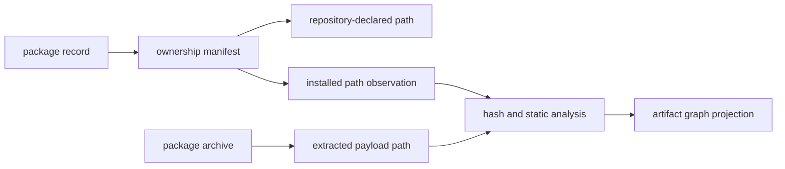
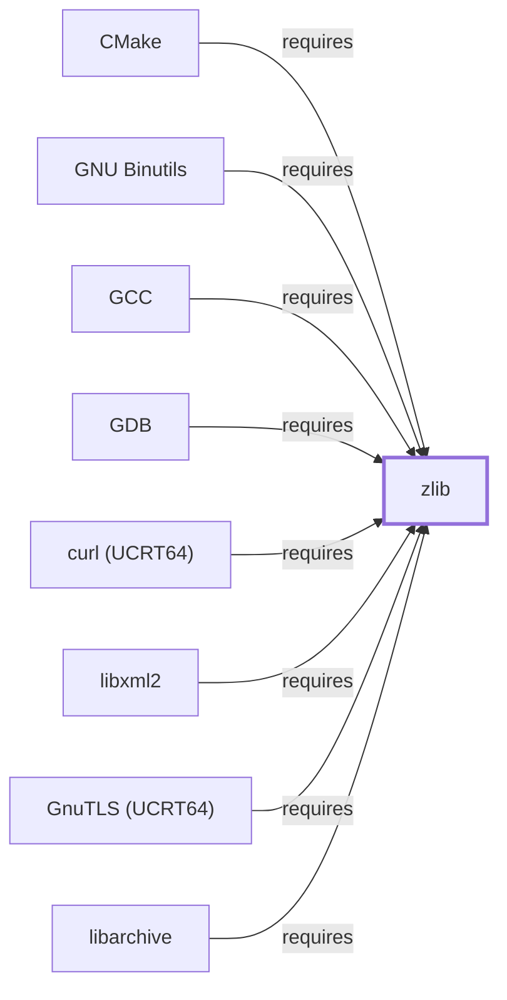

# Package-to-File Inventory Model

<!-- BEGIN GENERATED object-facts -->

| Model fact | Value |
| --- | --- |
| Object | `library:gnu:zlib` |
| Kind | `library` |
| Status | `partial` |
| Confidence | `high` |
| Authority | Jean-loup Gailly and Mark Adler |
| Environments | `ucrt64` |
| Upstream | <https://www.zlib.net/> |
| Packaged as | `package:msys2:mingw-w64-ucrt-x86_64-zlib` |
| Version (observed) | 1.3.2-2 |
| License (observed) | spdx:Zlib |
| Architecture (observed) | any |
| Installed size (observed) | 427.78 KiB |

**Evidence on this object**

- `evidence:catalog:current` — MSYS2 pacman package catalog (`observed`, retrieved 2026-08-05)
- `evidence:zlib:manual-2026-07-30` — zlib Manual (`primary`, retrieved 2026-07-30)

**Claims about this object**

- `claim:library:zlib:hub` (`observation`, `verified`) — zlib is the most-depended-upon package observed in this catalog snapshot among all components and libraries modeled in this knowledge base, with 299 recorded reverse dependents, exceeding gcc-libs' 167.

Generated from the composed model by `tools/build_object_facts.py`. Observed values come from the catalog snapshot and change when it is refreshed.
Edits between the surrounding markers are overwritten on the next build.

<!-- END GENERATED object-facts -->


The package-to-file inventory maps a package record to package-owned paths
within a verified inventory snapshot. It deliberately separates a declared
repository file manifest, a file found under a local installation root, and
bytes extracted from a package archive.



| Evidence scope | What it establishes | Required fields | It does not establish |
| --- | --- | --- | --- |
| Repository file database | A package declares a path in that repository snapshot | Repository, package identity, normalized path, snapshot ID | Local presence, payload bytes, or current mirror availability |
| Installed-file observation | A package-owned path was observed beneath a specified MSYS2 root | Package identity, path, presence, observation time, snapshot ID | That every package file is locally present or unmodified |
| Archive payload observation | A path and bytes were extracted from a named archive | Archive digest, entry path, size/hash, extraction method | That the archive was installed by a transaction |
| Static artifact analysis | Observed properties of locally available bytes | Artifact hash, parser version, analysis result/warnings | Package ownership absent an independently resolved owner |

## Identity and Ownership Rules

1. Normalize package paths as MSYS-style absolute paths before creating the
   package `--installs-->` artifact relationship.
2. Qualify every ownership edge with the inventory snapshot. Ownership can
   change across package versions and repository snapshots.
3. Preserve `present: false` repository records without byte-derived fields;
   absence of local bytes is a collection fact, not a malformed artifact.
4. Do not collapse paths that share a basename. DLL identity, filesystem path,
   logical library identity, and package ownership are distinct objects.
5. Retain unresolved or ambiguous owners as reconciliation records rather than
   assigning a file to a plausible package.

## Inventory Sequence

1. Collect package file manifests for the selected installed or repository
   scope.
2. Validate JSONL stream hashes and record counts against the manifest.
3. Resolve package ownership and emit normalized artifact entities.
4. Analyze bytes only where local or archive extraction evidence makes them
   available; preserve warnings without fabricating metadata.
5. Atomically replace the current projection only after complete validation,
   retaining raw snapshots for reproducibility and diffing.

For broad, byte-free package-file coverage, import official pacman `.files`
databases and then run the deep-inventory importer. These records establish
package ownership only; their `present` property remains `false` and they do
not imply binary, export, or ABI observations.

```powershell
py -3 tools/import_repository_file_db.py C:\cache\msys.files `
    --repository msys --output work\files-inventory
py -3 tools/import_deep_inventory.py work\files-inventory --accumulate
```

## Worked examples: archive payload observation beyond the installed subset

Two package archives (not the isolated installed subset) were statically
analyzed with `tools/analyze_package_archive.py` on 2026-07-29, each a
concrete instance of the "Archive payload observation" and "Static
artifact analysis" rows above:

- **zlib (UCRT64)**, `ucrt-zlib.pkg.tar.zst` — 11 owned artifacts (headers,
  pkg-config module, static/import libraries, and the runtime DLL), 114 PE
  exports, 9 PE-imported system DLLs; the full family-classification
  worked example on [zlib](ZLIB.md#family-classification).
- **curl (MSYS)**, `curl.pkg.tar.zst` — 532 owned artifacts (`/usr/bin/curl.exe`
  plus 531 documentation/support files, no `-devel` headers or static
  library in this base package), 0 PE exports (it is an executable, not
  a DLL), and 4 PE-imported DLLs: `kernel32.dll` (one symbol),
  `msys-2.0.dll` (79 symbols — confirming this build is MSYS-dependent,
  not native), `msys-curl-4.dll` (58 symbols — the split transfer
  library [libcurl](LIBCURL.md) documents), and `msys-z.dll` (`inflate`,
  `inflateEnd`, `inflateInit2_` — the MSYS build of
  [zlib](ZLIB.md), confirming a real, byte-level DEFLATE dependency
  distinct from the package-level `requires` edges elsewhere in this
  knowledge base).

A third package archive was downloaded and statically analyzed the same
way on 2026-07-31:

- **zstd (UCRT64)**,
  `mingw-w64-ucrt-x86_64-zstd-1.5.7-2-any.pkg.tar.zst` (retrieved from
  `https://mirror.msys2.org/mingw/ucrt64/`, SHA-256
  `dbdb8427280046a2b41697780aa4c52983b708082b0da4755951dc3bea96ca89`) —
  18 owned artifacts: headers (`zstd.h`, `zdict.h`, `zstd_errors.h`), a
  CMake package config set, a pkg-config module, both the static
  (`libzstd.a`) and import (`libzstd.dll.a`) libraries, the runtime
  `libzstd.dll` (598 PE exports, 11 imported system `api-ms-win-crt-*`
  DLLs plus `kernel32.dll`), and two executables, `zstd.exe` and
  `pzstd.exe`. Both executables' own PE imports list `libzstd.dll` by
  name — direct byte-level confirmation that the CLI tools link the
  package's own shared library dynamically rather than statically, a
  fact not otherwise recorded in this knowledge base's package-level
  `requires` edges. `pzstd.exe` additionally imports `libgcc_s_seh-1.dll`,
  `libstdc++-6.dll`, and `libwinpthread-1.dll` (it is the C++,
  multi-threaded parallel-Zstandard variant); `zstd.exe` does not.

All three are local-only per
[Local-Only Evidence Retention](LOCAL-EVIDENCE-RETENTION.md), not staged
as raw artifacts, and reproducible by re-running the collector against
the same archives. This is byte-level PE-import evidence for three
packages beyond the isolated installed subset; it does not establish
family-classification-level detail for curl (no `-devel` archive was
analyzed) or extend beyond these three packages.

## Related Views

- [Repository-to-package inventory](REPOSITORY-PACKAGE-INVENTORY.md)
- [Deep inventory evidence contract](DEEP-INVENTORY-CONTRACT.md)
- [Build artifact and flow mappings](BUILD-ARTIFACT-FLOW-MAPPINGS.md)

<!-- BEGIN GENERATED dependency-subgraph -->

## Dependency Diagram



Dependencies and dependents of `library:gnu:zlib` in the composed graph: 13 dependents and 0 dependencies, of which 5 are omitted here for legibility.

Generated from the composed model by `tools/build_object_diagrams.py`.
Edits between the surrounding markers are overwritten on the next build.

<!-- END GENERATED dependency-subgraph -->
