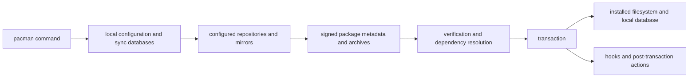

# Pacman Architecture and Transaction Model

The linked [Level 4 package diagram](../diagrams/level-4.svg)
separates the repository and payload evidence path from runtime behavior.

| Boundary | Responsibility | AKB evidence treatment |
| --- | --- | --- |
| Configuration | Enabled repositories, mirrors, keyring/trust settings | Observed snapshot; version-qualified |
| Sync databases | Repository package metadata and dependencies | Collector input with hashes/counts |
| Packages | Signed archives, file manifests, dependency metadata | Archive/installed evidence; never inferred bytes |
| Transaction | Resolution, install/remove/upgrade and local database update | Operational behavior requiring controlled observation |
| Hooks/cache | Policy actions and retained package payloads | Configuration and filesystem evidence |

## Trust and Recovery Rules

Repository metadata, mirrors, archives, and local databases are inputs with
separate provenance. A failed AKB import must not replace the prior generated
projection. Package ownership metadata does not establish binary behavior when
payload bytes are absent. Upgrade, repair, and rollback procedures remain
operations-guide work and must be tested against a version-qualified install.

## Controlled local state observation

On 2026-07-30, a read-only query of the isolated MSYS installation reported
pacman `6.1.0-25` with `msys2-keyring 1~20260214-1`. Its configured repository
order was CLANGARM64, MINGW32, MINGW64, UCRT64, CLANG64, and MSYS. The local
state contained 175 package-database directories and 170 cache archives; the
standard hook directory contained no hook files at that instant.

This is configuration and retained-state evidence only. It does not establish
mirror availability, signature verification outcomes, transaction behavior, or
the behavior of absent/custom hooks.

## Related Views

- [Self-updating knowledge base](SELF-UPDATING-KNOWLEDGE-BASE.md)
- [Domain decomposition](DOMAIN-DECOMPOSITION.md)

<!-- BEGIN GENERATED dependency-subgraph -->

## Dependency Diagram

Dependencies and dependents of `ecosystem:msys2:msys2` in the composed graph: 0 dependents and 1 dependency.

Generated from the composed model by `tools/build_object_diagrams.py`.
Edits between the surrounding markers are overwritten on the next build.

<!-- END GENERATED dependency-subgraph -->
