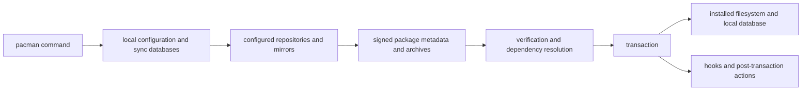

# Pacman Architecture and Transaction Model

The linked [Level 2 runtime and package flow](../diagrams/level-2-runtime-package-flow.svg)
separates the repository and payload evidence path from runtime behavior.

| Boundary | Responsibility | AKB evidence treatment |
| --- | --- | --- |
| Configuration | Enabled repositories, mirrors, keyring/trust settings | Observed snapshot; version-qualified |
| Sync databases | Repository package metadata and dependencies | Collector input with hashes/counts |
| Packages | Signed archives, file manifests, dependency metadata | Archive/installed evidence; never inferred bytes |
| Transaction | Resolution, install/remove/upgrade and local database update | Operational behavior requiring controlled observation |
| Hooks/cache | Policy actions and retained package payloads | Configuration and filesystem evidence |

## Trust and Recovery Rules

Repository metadata, mirrors, archives, and local databases are inputs with
separate provenance. A failed AKB import must not replace the prior generated
projection. Package ownership metadata does not establish binary behavior when
payload bytes are absent. Upgrade, repair, and rollback procedures remain
operations-guide work and must be tested against a version-qualified install.

## Controlled local state observation

On 2026-07-30, a read-only query of the isolated MSYS installation reported
pacman `6.1.0-25` with `msys2-keyring 1~20260214-1`. Its configured repository
order was CLANGARM64, MINGW32, MINGW64, UCRT64, CLANG64, and MSYS. The local
state contained 175 package-database directories and 170 cache archives; the
standard hook directory contained no hook files at that instant.

This is configuration and retained-state evidence only. It does not establish
mirror availability, signature verification outcomes, transaction behavior, or
the behavior of absent/custom hooks.

## Sync database hash evidence

`evidence:catalog:current`'s own manifest records the exact SHA-256 of each
of the six retrieved repository databases (`msys.db`, `ucrt64.db`,
`clang64.db`, `clangarm64.db`, `mingw64.db`, `mingw32.db`) at the retrieval
time this page's `evidence_refs` already cite — the "Sync databases" row's
"hash the exact database bytes" evidence, not previously cross-linked from
here. The same manifest records `pacman_version` as an empty string: the
collector did not capture the pacman version that produced these databases,
an honest, already-flagged gap rather than an inferred value.

## Controlled transaction, hook, and cache observation

On 2026-07-31, a genuinely new MSYS2 installation (`C:\msys64`, via
`winget install MSYS2.MSYS2`) — distinct from the "isolated MSYS
installation" referenced above, which is not present on this host in
this session — provided real, version-qualified evidence for three rows
this page's table had marked "Operational behavior requiring controlled
observation" without a worked example:

- **Transaction**: `C:\msys64\var\log\pacman.log` records real
  `[ALPM] transaction started`/`installed <pkg> (<version>)`/
  `transaction completed` entries for two controlled transactions this
  session actually ran: installing `mingw-w64-ucrt-x86_64-gcc` (17
  packages, including its full dependency chain — `binutils`, `crt`,
  `headers`, `gmp`, `isl`, `mpfr`, `mpc`, `winpthreads`, and others —
  completing in 8 seconds) and `make` (1 package). The log also
  retains the original installer's own initial `base` group transaction
  from 2026-06-11 (91 packages).
- **Hooks**: the same log shows a real ALPM hook actually firing —
  `running 'texinfo-install.hook'...` — immediately after the `make`
  installation's `transaction completed` line, direct evidence of the
  post-transaction hook mechanism executing, not just a hook file's
  static presence.
- **Cache**: `C:\msys64\var\cache\pacman\pkg\` contains 36 real
  retained files (package archives plus their `.sig` signatures) for
  71.68 MiB total, spanning build dates from 2023-09-15 through
  2026-07-31 — direct evidence the cache retains historical package
  versions, not only the most recently installed ones.
- **Local database**: `pacman -Qi make` reports `Install Reason:
  Explicitly installed`, `Install Date: Fri Jul 31 18:51:18 2026`, and
  `Validated By: Signature` — the same signature-validation mechanism
  independently exercised via `gpg` in
  [Pacman repository and trust model](PACMAN-REPOSITORY-TRUST-MODEL.md#controlled-local-signature-verification),
  now also confirmed as pacman's own recorded verification outcome for
  a real local transaction.
- **`pacman_version`**: this installation's own `pacman --version`
  reports `Pacman v6.1.0`, directly answering what the
  `evidence:catalog:current` manifest's own empty `pacman_version`
  field left uncaptured — though that specific tracked manifest was
  produced by an earlier collection run against a different
  installation and has not itself been regenerated from this one: a full
  `tools/catalog-msys2-packages.ps1` run against this installation's
  complete ~15,700-package `pacman -Si` dump hit a reproducible
  parameter-binding failure specific to this automated harness
  (confirmed unrelated to pacman or the data itself — a debug check
  immediately before the failing call verified a valid, fully-populated
  result array), not a pacman defect.

This is single-host, single-session evidence for this one installation
and these two specific transactions; it does not establish upgrade,
rollback, or repair behavior, which remain untested.

## Related Views

- [Self-updating knowledge base](SELF-UPDATING-KNOWLEDGE-BASE.md)
- [Domain decomposition](DOMAIN-DECOMPOSITION.md)
