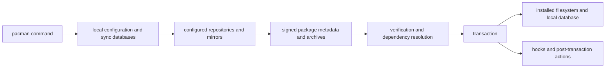

# Pacman Architecture and Transaction Model

| Boundary | Responsibility | AKB evidence treatment |
| --- | --- | --- |
| Configuration | Enabled repositories, mirrors, keyring/trust settings | Observed snapshot; version-qualified |
| Sync databases | Repository package metadata and dependencies | Collector input with hashes/counts |
| Packages | Signed archives, file manifests, dependency metadata | Archive/installed evidence; never inferred bytes |
| Transaction | Resolution, install/remove/upgrade and local database update | Operational behavior requiring controlled observation |
| Hooks/cache | Policy actions and retained package payloads | Configuration and filesystem evidence |

## Trust and Recovery Rules

Repository metadata, mirrors, archives, and local databases are inputs with
separate provenance. A failed AKB import must not replace the prior generated
projection. Package ownership metadata does not establish binary behavior when
payload bytes are absent. Upgrade, repair, and rollback procedures remain
operations-guide work and must be tested against a version-qualified install.

## Related Views

- [Self-updating knowledge base](SELF-UPDATING-KNOWLEDGE-BASE.md)
- [Domain decomposition](DOMAIN-DECOMPOSITION.md)
