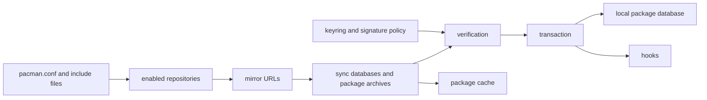

# Pacman Repository, Mirror, and Trust Model

Pacman combines local policy, repository metadata, mirror delivery, signature
verification, and retained local state. These boundaries must be recorded
separately: successful download from a mirror is not evidence of repository
trust, and a local cache is not proof that a package remains available upstream.

| Boundary | Responsibility | AKB collection rule |
| --- | --- | --- |
| Repository configuration | Selects repository names, order, and policy inputs | Snapshot effective configuration and included files with redaction where required |
| Mirrors | Deliver repository databases and archives | Record selected URL and retrieval time; do not treat availability as authority |
| Keyring and signatures | Bind trusted keys and policy to signed metadata/artifacts | Capture keyring package/version and verification result, never private key material |
| Sync databases | Provide the package universe used by dependency resolution | Hash the exact database bytes and record repository/mirror provenance |
| Package cache | Retains previously fetched package archives locally | Inventory cached bytes separately from enabled repositories |
| Hooks | Run configured pre/post-transaction actions | Capture hook definitions and execution outcome as version-qualified operational evidence |
| Local database | Records installed-package state and ownership metadata | Snapshot before/after a controlled transaction; do not infer payload behavior |

## Trust and Recovery Rules

1. Repository authority, mirror transport, signature verification, and package
   payload integrity are distinct claims requiring distinct evidence.
2. A refresh may update only a staging snapshot. Promote it only after hashes,
   schema validation, and generation checks pass; preserve the prior projection
   on failure.
3. Record package cache retention and cleanup policy before relying on an
   archive for rollback or binary analysis.
4. Model hooks as executable policy with their own provenance and failure
   handling; a completed transaction does not by itself prove every hook's
   intended effect.
5. Repair, keyring reset, and rollback steps must remain version- and
   environment-qualified procedures, not generic assertions in the graph.

## Diagnostic Sequence

1. Capture effective repository and mirror configuration.
2. Identify the retrieved sync database and package archive bytes.
3. Record the signature/keyring verification outcome.
4. Observe local database, cache, and hooks before and after a controlled
   transaction.

## Related Views

- [Pacman architecture and transaction model](PACMAN-ARCHITECTURE.md)
- [Deep inventory evidence contract](DEEP-INVENTORY-CONTRACT.md)
- [Self-updating knowledge base](SELF-UPDATING-KNOWLEDGE-BASE.md)
