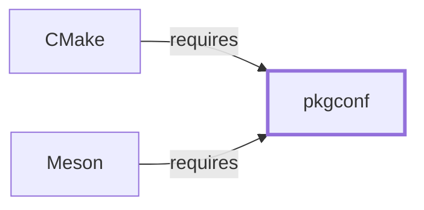

# pkgconf

## Purpose

Pkgconf answers "what compiler and linker flags does library X need" by
reading `.pc` metadata files, and both [CMake](CMAKE.md) and
[Meson](MESON.md) depend on it for this exact purpose. This page documents
its architectural role and its packaging as a substitute for the original
pkg-config; see the
[official pkgconf project repository](https://github.com/pkgconf/pkgconf)
for the `.pc` file format and command reference.

## Architectural Classification

`component:pkgconf:pkgconf` is packaged per native environment: this page
cites the UCRT64 build, `package:msys2:mingw-w64-ucrt-x86_64-pkgconf`
(version `1~3.0.4-1` in the current catalog snapshot, license `ISC`). It
belongs to the UCRT64 environment and, like the rest of this volume's
toolchain components, does **not** depend on `msys-2.0.dll`, per the
[MSYS2 and MinGW-w64 role model](MSYS2-AND-MINGW-W64-ROLE-MODEL.md).

## Responsibilities

- Querying `.pc` metadata files installed alongside libraries to report the
  compiler flags (`--cflags`), linker flags (`--libs`), and version
  information a consuming build needs, without the consumer having to
  hardcode library paths.

## Boundaries

Pkgconf answers metadata queries; it does not build or install libraries
itself, and it does not generate build files (that is
[CMake](CMAKE.md)'s or [Meson](MESON.md)'s role, both of which invoke it as
a dependency-discovery mechanism).

## Interfaces

- `pkgconf`/`pkg-config` command-line invocation (`--cflags`, `--libs`,
  `--modversion`, `--exists`), reading `.pc` files from a configured search
  path (`PKG_CONFIG_PATH`), per the project documentation.

## Dependencies

The catalog snapshot records no `runtime-depends-on` edges for
`package:msys2:mingw-w64-ucrt-x86_64-pkgconf` beyond its membership in the
`clang64`/`ucrt64`-family toolchain group and environment — a minimal
dependency footprint consistent with [Ninja](NINJA.md)'s and reflecting
pkgconf's narrowly scoped, single-purpose design.

## Reverse Dependencies

The snapshot records 7 relationships targeting
`package:msys2:mingw-w64-ucrt-x86_64-pkgconf`, including both
[CMake](CMAKE.md)'s and [Meson](MESON.md)'s dependency-discovery
requirements (`relationship:toolchain:cmake-requires-pkgconf`,
`relationship:toolchain:meson-requires-pkgconf`). See the
[reverse dependency impact analysis](REVERSE-DEPENDENCY-IMPACT-ANALYSIS.md)
for the current full list.

## Configuration

`PKG_CONFIG_PATH` (and related environment variables) sets the `.pc` file
search path; there is no persistent configuration file for pkgconf itself.

## Initialization and Execution Flow

Pkgconf is an invoke-run-exit process per query, ordinarily invoked as a
subprocess by a build system's dependency-discovery step
(`relationship:toolchain:cmake-requires-pkgconf`,
`relationship:toolchain:meson-requires-pkgconf`) rather than run manually
in typical workflows. As a native MinGW-w64 program, its process model is
Windows-facing directly rather than mediated by `msys-2.0.dll`.

## Runtime Behavior

Query results depend entirely on which `.pc` files are present on the
active search path; a missing or misconfigured `.pc` file for an otherwise
correctly installed library is indistinguishable to pkgconf from the
library genuinely not being present.

## Compatibility and Variants

The MSYS2 `pkgconf` package `provides`, `conflicts` with, and `replaces`
`pkg-config` in this environment
(`claim:component:pkgconf:pkg-config-substitute`) — the packaging-level
substitution pattern already documented for [LLD](LLD.md#compatibility-and-variants)'s
relationship to [GNU Binutils](GNU-BINUTILS.md). Pkgconf is designed as a
largely command-line-compatible reimplementation of the original
freedesktop.org pkg-config, but this page does not claim byte-identical
output in every edge case.

## Security Considerations

Pkgconf parses `.pc` files that may originate from third-party packages;
malformed or adversarial `.pc` file handling is a general parser-robustness
risk class rather than a documented specific vulnerability. See
[Threat Model and Supply Chain](THREAT-MODEL-AND-SUPPLY-CHAIN.md) for the
project's general supply-chain posture; no version-qualified CVE review has
been performed for the recorded `1~3.0.4-1` version.

## Failure Modes and Diagnostics

A build failing to find an installed library's flags should first be
checked against `PKG_CONFIG_PATH` and the presence of the expected `.pc`
file before being treated as a build-system defect in
[CMake](CMAKE.md) or [Meson](MESON.md).

## Evidence, Assumptions, and Open Questions

Query behavior and the pkg-config-substitute positioning are backed by the
official pkgconf project repository
(`evidence:pkgconf:project-site-2026-07-30`), matching the `project_url`
already recorded for `package:msys2:mingw-w64-ucrt-x86_64-pkgconf` in the
catalog. Package identity, version, license, and the substitution facts are
backed by the pacman catalog snapshot (`evidence:catalog:current`) via
`claim:component:pkgconf:pkg-config-substitute`. No open items beyond the
general version-qualified security review noted above.

<!-- BEGIN GENERATED dependency-subgraph -->

## Dependency Diagram

Dependencies and dependents of `component:pkgconf:pkgconf` in the composed graph: 2 dependents and 0 dependencies.

Generated from the composed model by `tools/build_object_diagrams.py`.
Edits between the surrounding markers are overwritten on the next build.

<!-- END GENERATED dependency-subgraph -->

## Related Objects

- [MSYS2 Toolchain Role Model](TOOLCHAIN-ROLE-MODEL.md)
- [CMake](CMAKE.md)
- [Meson](MESON.md)
- [Ninja](NINJA.md)
