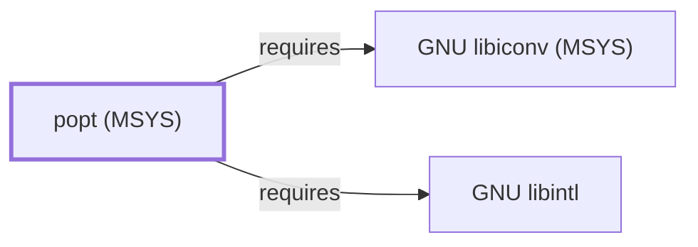

# popt (MSYS)

<!-- BEGIN GENERATED object-facts -->

| Model fact | Value |
| --- | --- |
| Object | `library:rpm:popt@msys` |
| Kind | `library` |
| Status | `partial` |
| Confidence | `high` |
| Authority | RPM project |
| Environments | `msys` |
| Upstream | <http://rpm.org/> |
| Packaged as | `package:msys2:popt` |
| Version (observed) | 1.19-1 |
| License (observed) | custom |
| Architecture (observed) | x86_64 |
| Installed size (observed) | 119.09 KiB |

**Evidence on this object**

- `evidence:catalog:current` — MSYS2 pacman package catalog (`observed`, retrieved 2026-08-05)
- `evidence:rpm:popt-manual-2026-08-02` — popt (rpm.org project site) (`primary`, retrieved 2026-08-02)

Generated from the composed model by `tools/build_object_facts.py`. Observed values come from the catalog snapshot and change when it is refreshed.
Edits between the surrounding markers are overwritten on the next build.

<!-- END GENERATED object-facts -->

## Purpose

This page documents `package:msys2:popt`, a command-line option parser
library originating from the RPM package-manager project, consumed by
rsync's own argument parsing (`package:msys2:rsync`, not yet a modeled
entity in this knowledge base). See the
[official rpm.org project site](https://rpm.org/) for the broader RPM
project context.

## Architectural Classification

`library:rpm:popt@msys` is packaged as `package:msys2:popt` (version
`1.19-1` in the current catalog snapshot, license `custom`), originally
developed for the RPM project. It belongs to the MSYS environment. Both
of its own recorded runtime dependencies were already modeled entities
in this knowledge base before this page was written, letting this
addition close its full dependency footprint in a single pass, the same
full-coverage pattern documented for
[libsasl (MSYS)](LIBSASL-MSYS.md) and
[libarchive (MSYS)](LIBARCHIVE-MSYS.md).

## Responsibilities

- Parsing command-line options and arguments in a structured,
  table-driven way, letting consuming programs declare their option set
  declaratively rather than hand-rolling `getopt`-style parsing loops.

## Boundaries

popt is a command-line parsing library specifically; it has no
awareness of the semantics of the options it parses, leaving option
validation and action entirely to the calling program.

## Interfaces

- The popt C API (`poptGetContext`, `poptGetNextOpt`, and related
  functions, driven by a `struct poptOption` table), per the RPM
  project's popt header documentation.

## Dependencies

The catalog snapshot records two `runtime-depends-on` edges for
`package:msys2:popt`, both now modeled in this knowledge base:

| Dependency | Package | Architectural reason |
| --- | --- | --- |
| [GNU libiconv (MSYS)](GNU-LIBICONV-MSYS.md) | `package:msys2:libiconv` | Backs character-set conversion for popt's command-line argument and message handling. |
| [GNU libintl](GNU-LIBINTL.md) | `package:msys2:libintl` | Backs gettext-based message translation (NLS) for popt's own diagnostic and help output. |

## Reverse Dependencies

The catalog snapshot records 3 relationships targeting
`package:msys2:popt`: `cygutils`, `popt-devel`, and `rsync`. None of
these three are currently modeled as entities in this knowledge base;
see the
[reverse dependency impact analysis](REVERSE-DEPENDENCY-IMPACT-ANALYSIS.md)
for the current full list.

## Configuration

popt has no persistent configuration file of its own; it optionally
supports reading default option aliases from `/etc/popt` and a
per-user `~/.popt` file, a feature of the library that individual
consuming programs may or may not enable.

## Initialization and Execution Flow

As a library, popt has no independent process lifecycle: it initializes
and executes within the process of whatever program links against it —
`rsync` in this dependency chain, though rsync itself is not yet a
modeled entity in this knowledge base.

## Runtime Behavior

popt's option-table-driven parsing model is exercised once per process
invocation, at argument-parsing time, before the consuming program's
main logic runs.

## Compatibility and Variants

Whether other native environments (UCRT64, CLANG64, i686) in this
catalog package popt separately was not confirmed while writing this
page; this is recorded as an open item rather than assumed either way.

## Security Considerations

popt is not itself a security-sensitive component in the usual sense;
malformed or adversarial command-line input is a general parsing-
robustness concern rather than one specific to this library. See
[Threat Model and Supply Chain](THREAT-MODEL-AND-SUPPLY-CHAIN.md) for
the project's general supply-chain posture; no version-qualified CVE
review has been performed for the recorded `1.19-1` version.

## Failure Modes and Diagnostics

A command-line parsing failure in a consuming program should be
checked against that program's own popt option table before being
treated as a popt defect.

## Evidence, Assumptions, and Open Questions

Option-parsing scope is backed by the official rpm.org project site
(`evidence:rpm:popt-manual-2026-08-02`), matching the `project_url`
recorded for `package:msys2:popt` in the catalog. Package identity,
version, license, and both recorded dependency edges are backed by the
pacman catalog snapshot (`evidence:catalog:current`). Open: whether
other native environments package popt separately was not confirmed,
and the three recorded reverse dependents (`cygutils`, `popt-devel`,
`rsync`) are not individually modeled in this knowledge base.

<!-- BEGIN GENERATED dependency-subgraph -->

## Dependency Diagram

Dependencies and dependents of `library:rpm:popt@msys` in the composed graph: 0 dependents and 2 dependencies.

Generated from the composed model by `tools/build_object_diagrams.py`.
Edits between the surrounding markers are overwritten on the next build.

<!-- END GENERATED dependency-subgraph -->

## Related Objects

- [MSYS2 Library Architecture](LIBRARIES-ARCHITECTURE.md)
- [GNU libiconv (MSYS)](GNU-LIBICONV-MSYS.md)
- [GNU libintl](GNU-LIBINTL.md)
