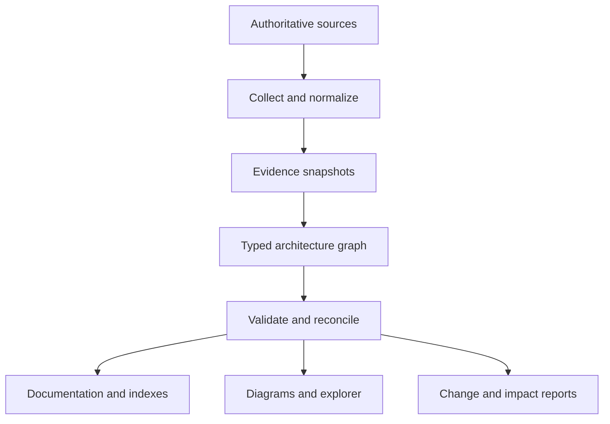

# AKB Project Discussion Record

## Document status

| Field | Value |
| --- | --- |
| Project | MSYS2 Architecture Knowledge Base (AKB) |
| Repository | [baileyrd/AKB](https://github.com/baileyrd/AKB) |
| Record date | 2026-07-28 |
| Current baseline | Bootstrap 0.3 feature increment |
| Current branch | `agent/bootstrap-0.3` |
| Current commit | `0de1f30` |
| Pull request | [#1 — Add Bootstrap 0.3 deep inventory pipeline](https://github.com/baileyrd/AKB/pull/1) |
| Relationship to normative documents | Informational history and decision context |

This document preserves the substantive information, decisions, rationale,
commitments, implementation results, limitations, and next steps established
during the project-forming discussion. It is not a substitute for the
normative project charter, schemas, evidence contracts, Architecture Decision
Records, or operating guides. When this record conflicts with a later
normative artifact, the later reviewed artifact governs.

One-time authentication codes, credentials, tokens, and other transient
security material are intentionally excluded.

## 1. Origin and intent

The project began with a request for a complete architectural breakdown of GNU
and Git Bash on Windows, followed by questions about:

- the complete MSYS2 and MinGW package, library, and module landscape;
- whether MSYS2 replaces MinGW;
- whether MSYS2 has a layered architecture; and
- whether a linkable architecture diagram could provide clear drill-down
  insight across eight architectural layers.

The work then moved from a single diagram or report to a permanent,
repository-backed Architecture Knowledge Base. The governing intent is to
create the most comprehensive architecture reference possible for the MSYS2
ecosystem and its relationships to Windows, MinGW-w64, GNU, LLVM, and Git for
Windows.

The AKB is explicitly not a one-off software architecture document. It is an
evolving, enterprise-quality, documentation-as-code system intended to serve:

- software and systems engineering;
- enterprise and solution architecture;
- reverse engineering and dependency analysis;
- build and toolchain engineering;
- technical writing and training;
- operational troubleshooting;
- security and performance analysis; and
- automated tooling and future architecture generation.

Accuracy, completeness, maintainability, traceability, and navigability take
priority over brevity. The project assumes unknown unknowns and places no
artificial limit on document size.

## 2. Governing roles and quality posture

The work is conducted from the combined perspectives of:

- Principal Systems Architect;
- Software Architect;
- Enterprise Architect;
- Technical Writer;
- Reverse Engineer;
- Build Systems Engineer; and
- Documentation Engineer.

The expected quality level is that of an enterprise architecture reference
manual. The project shall:

- avoid unjustified simplification;
- document architectural details thoroughly;
- use enterprise architecture terminology where it improves precision;
- maintain cross-references among related material;
- make every reusable artifact suitable for version control and regeneration;
- separate verified observations from inference and architectural
  interpretation;
- identify uncertainty and unresolved relationships explicitly; and
- preserve evidence and historical state instead of presenting volatile facts
  as timeless.

## 3. Primary architecture coverage

The knowledge base is expected to cover all major architectural viewpoints,
including:

- executive and ecosystem architecture;
- layered, logical, component, and deployment architecture;
- runtime and process architecture;
- package, library, and repository architecture;
- toolchain and build-system architecture;
- dependency and reverse-dependency architecture;
- filesystem, source-code, and configuration architecture;
- initialization and execution flows;
- build pipelines and package lifecycle;
- ABI, CRT, compiler, linker, and environment compatibility;
- DLL, executable, library, header, and package relationships;
- security, performance, upgrade, migration, and extension architecture; and
- developer and operations guidance.

The architecture must support both forward and reverse navigation. Examples
include package-to-file, file-to-package, binary-to-imported-DLL,
DLL-to-consumer, recipe-to-output-package, package-to-upstream-source, and
library-to-header/import-library/runtime-DLL mappings.

## 4. Technical scope

### 4.1 Windows platform

The Windows volume and related cross-cutting content shall describe the parts
of Windows needed to explain MSYS2 behavior, including:

- NT kernel services;
- Win32 APIs;
- console architecture;
- ConPTY;
- filesystems;
- registry integration;
- Windows security; and
- networking.

Windows internals are contextual: they are documented to the depth necessary
to explain observable ecosystem behavior rather than reproduced as an
unbounded Windows internals encyclopedia.

### 4.2 MSYS2 runtime

The MSYS2 runtime coverage shall include:

- `msys-2.0.dll`;
- POSIX emulation;
- process creation and management;
- `fork()` and `exec()`;
- Windows/POSIX path conversion;
- signal handling;
- mount management;
- pseudo terminals;
- environment management;
- filesystem abstraction;
- symlink implementation; and
- runtime initialization.

The knowledge base must clearly distinguish programs dependent on the MSYS2
POSIX runtime from native MinGW-w64 programs.

### 4.3 Runtime environments

Each of the following environments is modeled separately:

- MSYS;
- UCRT64;
- CLANG64;
- CLANGARM64;
- MINGW64; and
- MINGW32.

For each environment, the documentation shall cover:

- ABI;
- compiler;
- runtime;
- C runtime;
- linker;
- executable format;
- package repository;
- strengths and weaknesses;
- compatibility constraints; and
- migration strategy.

Environment, target architecture, CRT, compiler, linker, ABI, and repository
are distinct architecture concepts. They must not be collapsed into one
attribute or inferred solely from a package-name prefix.

### 4.4 GNU userland

Major GNU and adjacent userland tools include:

- Bash;
- Coreutils;
- Grep;
- Sed;
- Awk;
- Tar;
- Gzip;
- Findutils;
- Diffutils;
- Patch;
- Less;
- Vim;
- Nano;
- SSH; and
- Curl.

Each applicable tool description should cover architecture, runtime behavior,
dependencies, interactions, configuration, and startup.

### 4.5 Library families

The library catalog shall classify and document libraries across at least:

- compression;
- networking;
- cryptography;
- graphics and GUI;
- databases;
- scientific computing;
- XML and JSON;
- text processing and Unicode;
- audio, video, and imaging;
- logging and concurrency;
- build support and testing; and
- internationalization.

For each library, the target model includes:

- purpose and logical identity;
- owning package;
- runtime DLLs;
- import libraries;
- static libraries;
- headers;
- `pkg-config` metadata;
- CMake metadata;
- exported APIs; and
- reverse dependencies.

A logical library, DLL, import library, static library, header set, metadata
file, package, and installed artifact are separate entity types linked by
typed relationships.

### 4.6 Package management

Package-management coverage includes:

- pacman;
- repository and mirror layout;
- package metadata;
- dependency resolution;
- signing and key management;
- installation and removal;
- upgrades;
- cache behavior;
- package databases;
- hooks; and
- transactions.

### 4.7 Toolchains and build systems

Toolchain coverage includes:

- GCC;
- LLVM;
- Binutils;
- Clang;
- LLD;
- GDB;
- LLDB;
- CMake;
- Meson;
- Autotools;
- Make;
- Ninja; and
- `pkg-config`.

For each tool, applicable documentation covers architecture, modules,
executables, internal workflow, generated artifacts, and configuration.

### 4.8 Git for Windows

Git for Windows has a dedicated architecture volume covering:

- launcher behavior;
- Git Bash;
- Mintty;
- shell startup;
- native Git executables;
- interaction with MSYS-derived components;
- Git Credential Manager;
- SSH;
- HTTP transport;
- OpenSSL;
- libcurl;
- DLL loading; and
- package structure.

The documentation must explain both inheritance from and divergence from
MSYS2.

### 4.9 Package catalog and source traceability

The package catalog must support the following traceability chain:

```text
repository
  -> package
  -> files
  -> DLLs and libraries
  -> headers
  -> executables
  -> dependencies
  -> reverse dependencies
```

The deeper evidence chain extends this to:

```text
upstream source
  -> build recipe and patches
  -> package
  -> deployed artifact
  -> runtime or development relationship
  -> consuming component
```

## 5. Architecture depth and navigation

Every architectural view should support drill-down:

| Level | Architectural focus |
| ---: | --- |
| 0 | Entire MSYS2 ecosystem |
| 1 | Layered architecture |
| 2 | Domain or subsystem |
| 3 | Component |
| 4 | Package |
| 5 | Library or deployable module |
| 6 | Executable, DLL, archive, header set, or metadata unit |
| 7 | Source repository, directory, build target, and source file |

This hierarchy is a navigation model, not a claim that all relationships are
strict containment. Runtime, build, ABI, packaging, dependency, and provenance
edges cross levels.

Each architecture object must have a stable, linkable identifier. Diagrams and
pages should link to related views at the same level and to drill-down or
roll-up views.

## 6. Interactive architecture explorer

The project shall produce an interactive HTML/SVG architecture explorer with:

- expand and collapse;
- zoom;
- search;
- filters;
- cross-references;
- breadcrumbs;
- forward dependency navigation;
- reverse dependency navigation;
- layer navigation;
- package navigation;
- library navigation;
- runtime navigation;
- toolchain navigation; and
- repository navigation.

Every architecture object must be directly linkable. The explorer is a
generated view of the architecture model, not an independent hand-maintained
source of truth.

## 7. Documentation standards

Each applicable architecture section should include:

- purpose;
- responsibilities;
- interfaces;
- dependencies;
- reverse dependencies;
- configuration;
- execution flow;
- sequence diagrams;
- component diagrams;
- class diagrams where appropriate;
- package diagrams;
- deployment diagrams where appropriate;
- directory structure;
- examples;
- notes; and
- references.

The standard volume structure additionally accounts for scope, conceptual and
logical views, runtime/process behavior, data and filesystem architecture,
build and deployment, security, performance, compatibility, evolution,
migration, operations, troubleshooting, evidence, assumptions, and coverage
gaps.

Markdown, SVG, HTML, JSON, YAML, Mermaid, PlantUML, and Graphviz are preferred
reusable formats. Generated outputs should identify their input model and
generator revisions.

## 8. Twenty-volume delivery structure

| Volume | Title |
| ---: | --- |
| 1 | Executive Architecture |
| 2 | Windows Platform |
| 3 | MSYS Runtime |
| 4 | Runtime Environments |
| 5 | GNU Userland |
| 6 | Libraries |
| 7 | Package Management |
| 8 | Toolchains |
| 9 | Git for Windows |
| 10 | Interactive Architecture Explorer |
| 11 | Package Catalog |
| 12 | Source Code Organization |
| 13 | Dependency Analysis |
| 14 | Build Systems |
| 15 | Extension and Plugin Architecture |
| 16 | Security |
| 17 | Performance |
| 18 | Developer Guide |
| 19 | Operations Guide |
| 20 | Reference Appendices |

Package inventories belong canonically to Volume 11. Source organization
belongs to Volume 12, build mechanics to Volume 14, security analysis to
Volume 16, and performance analysis to Volume 17. Other volumes may provide
filtered views and interpretation without duplicating canonical model data.

## 9. Machine-readable architecture model

A companion machine-readable architecture model is a primary project
objective, not an optional by-product. Every package, library, executable,
DLL, environment, repository, build recipe, source unit, and dependency shall
be represented in a structured model.

JSON is used for the current bootstrap graph and schemas. YAML or a graph
database may be introduced as justified by scale or workflow needs. All
diagrams, indexes, reports, and repetitive object pages should be generated
from the model.

Key modeling decisions established during Bootstrap 0.1 include:

- package metadata, installed artifacts, logical libraries, DLLs, import
  libraries, static libraries, headers, build recipes, upstream sources,
  environments, CRTs, and ABIs are distinct entity types;
- relationships are directional and typed;
- reverse dependencies are generated from forward relationships rather than
  duplicated as independent facts;
- entity IDs are stable and namespaced;
- generated package observations and authored architectural analysis use
  compatible schemas but remain stored separately;
- unresolved or ambiguous references are retained explicitly; and
- evidence, observation time, authority, version, and confidence are part of
  the knowledge system.

The documentation-as-code workflow is:



## 10. Self-updating knowledge base

The user established that the AKB should be self-updating where possible,
leveraging the previously designed `catalog-msys2-packages.ps1` collector.
That collector is treated as a recurring evidence adapter rather than a
one-time reporting script.

The update design preserves both current truth and history:

1. discover enabled pacman repositories;
2. collect package, dependency, group, and installed-state data;
3. write normalized catalogs and a SHA-256 manifest;
4. validate files, fields, hashes, and record counts;
5. capture a content-addressed, timestamped evidence snapshot;
6. import a generated graph projection;
7. compare it with the preceding snapshot;
8. report additions, removals, version changes, and unresolved references;
9. compose generated observations with the authored graph for validation; and
10. regenerate indexes, reports, documentation views, and eventually the
    explorer.

The current model and generated observations remain separate:

- authored objects express reviewed architectural understanding;
- generated catalog and inventory projections express observed system state;
- snapshot evidence is append-only;
- current projections are replaceable only after successful validation; and
- generated views are reproducible.

### 10.1 Bootstrap 0.2 package catalog

Bootstrap 0.2 rebuilt and integrated `catalog-msys2-packages.ps1` with:

- automatic discovery of enabled repositories;
- complete and per-repository package catalogs;
- installed-package state;
- dependency edges;
- groups and summary reports;
- SHA-256 evidence manifests;
- historical timestamped snapshots;
- stable package and repository identifiers;
- package addition, removal, and version-change reports;
- unresolved-dependency reporting;
- composed validation across authored and generated models;
- on-demand refresh through `Update-Akb.ps1`; and
- optional Windows Scheduled Task registration.

The importer and validators use standard-library Python to keep the AKB
portable. The collector remains native to PowerShell/MSYS2 where access to
pacman and the installation is required.

The end-to-end fixture used during 0.2 validation contained four packages
across two repositories, produced eleven valid relationships, retained two
unresolved references explicitly, and validated when composed with the
authored model. All three importer tests and the original model validation
passed.

Example on-demand refresh:

```powershell
pwsh ./tools/Update-Akb.ps1 -Msys2Root C:\msys64
```

Example daily refresh registration:

```powershell
pwsh ./tools/Register-AkbRefreshTask.ps1 `
    -DailyAt 03:00 `
    -Msys2Root C:\msys64
```

### 10.2 Evidence trust boundary

The self-updating design makes a critical distinction:

- pacman file databases can provide repository-wide ownership metadata;
- local bytes can provide deep binary and metadata observations; and
- absent bytes must not produce fabricated binary claims.

Files known from repository metadata may therefore be represented with
`present: false`. Deep PE, archive, metadata, or hash facts are emitted only
when the relevant bytes are available.

## 11. Bootstrap history

### 11.1 Bootstrap 0.1 — Foundation

Bootstrap 0.1 established:

- the project charter and governance model;
- the twenty-volume master index;
- documentation and evidence standards;
- the initial JSON architecture graph;
- JSON Schema;
- controlled entity and relationship vocabularies;
- stable object-ID conventions;
- a starter MSYS2 environment model;
- generated forward and reverse relationship indexes;
- an authoritative-source registry;
- an incremental roadmap; and
- a Python validation and generation tool.

The initial model validated nine foundational entities and eight
relationships.

### 11.2 Bootstrap 0.2 — Self-updating package catalog

Bootstrap 0.2 converted the catalog concept into an operational,
snapshot-based reconciliation pipeline. It established:

- Windows/MSYS2-native collection;
- portable import and validation;
- source/generated separation;
- immutable evidence snapshots;
- current-state projections;
- historical change reports; and
- scheduled or on-demand refresh.

The Bootstrap 0.2 source baseline was packaged as a reproducible archive and
later imported into GitHub.

### 11.3 Bootstrap 0.3 — Authoritative deep inventory

Bootstrap 0.3 extends package metadata into package contents and artifact
relationships. Its implemented scope includes:

- package ownership and artifact hashing;
- standard-library PE32 and PE32+ parsing;
- imported and exported DLL symbol observations;
- machine, subsystem, timestamp, image-base, section, characteristic, and
  debug-directory observations;
- GNU and BSD `ar` archive inspection;
- `.a`, `.dll.a`, and `.lib` member catalogs;
- header discovery;
- `pkg-config` metadata extraction;
- CMake metadata extraction;
- static, non-executing PKGBUILD analysis;
- typed artifact and build-recipe graph projection;
- DLL dependency resolution;
- explicit unresolved and ambiguous references;
- snapshot-to-snapshot artifact change detection;
- forward and reverse DLL dependency reports;
- development-artifact catalogs; and
- generated warnings and change reports.

PKGBUILDs are parsed as untrusted text and never sourced or executed.
Dynamically computed shell values are retained as dynamic observations instead
of guessed.

Bootstrap 0.3 supports:

- `installed` collection through `pacman -Ql`, including deep inspection of
  locally present files; and
- `repositories` collection through `pacman -Fl`, including complete
  repository ownership metadata while limiting deep analysis to available
  bytes.

Local validation completed successfully:

- 10 tests passed;
- Python sources compiled;
- both JSON schemas validated;
- the composed model validated;
- generated indexes were reproducible; and
- whitespace checks passed.

PowerShell was not installed in the Linux implementation workspace. The
PowerShell wrappers were reviewed, while their Python collector/importer
payloads were tested. Execution of the full wrappers on a Windows host with
PowerShell 7 and MSYS2 remains an environment-specific verification activity.

## 12. Repository decision and structure

The project was connected to the public GitHub repository
[`baileyrd/AKB`](https://github.com/baileyrd/AKB). GitHub is the durable
engineering backbone for:

- version control and architecture history;
- pull-request review;
- automated schema, model, link, evidence, and generation validation;
- scheduled catalog refreshes;
- generated documentation and explorer deployment;
- issue tracking for research gaps and unresolved dependencies; and
- milestone releases.

The repository organization adopted or planned during the discussion is:

```text
AKB/
├── .github/
│   └── workflows/
├── charter/
├── model/
│   ├── schema/
│   ├── catalog/
│   └── inventory/
├── docs/
├── evidence/
├── generated/
├── tests/
├── tools/
├── diagrams/       # planned/generated visual specifications and outputs
├── explorer/       # planned interactive explorer
├── CHANGELOG.md    # planned as release process matures
├── CONTRIBUTING.md # planned as contribution process matures
├── GOVERNANCE.md   # planned as governance expands
├── LICENSE         # to be governed explicitly
└── README.md
```

Large raw package archives and binary-analysis snapshots should not be
committed indiscriminately. Git should contain source, schemas, authored
models, scripts, compact manifests, fixtures, and selected generated views.
Large evidence belongs in appropriately governed artifact, release, or object
storage with hashes and provenance retained in the repository.

## 13. GitHub publication history

The repository was initially empty, with no default branch, commits, README,
issues, or pull requests. This allowed the validated Bootstrap 0.2 source tree
to become a clean root baseline.

The GitHub CLI was installed as a workspace-local portable tool because it was
not initially available in the environment. Several device-authentication
attempts did not persist because transient terminal sessions or configuration
paths ended before credentials were written. The final successful approach
used a workspace-scoped GitHub configuration and an active session retained
through approval.

Important repository milestones:

| Milestone | Result |
| --- | --- |
| Bootstrap 0.2 root publication | `main` created at commit `a9e875f` |
| Bootstrap 0.2 tag | Annotated tag `v0.2.0` |
| Bootstrap 0.3 feature commit | Commit `0de1f30` |
| Bootstrap 0.3 branch | `agent/bootstrap-0.3` |
| Bootstrap 0.3 review | Draft pull request #1 |
| GitHub Actions | Validation passed |

Two GitHub permission distinctions were encountered and resolved:

1. repository visibility and reported push/admin access did not imply that the
   installed GitHub App had `Contents: write`; and
2. an OAuth token with repository access still required the separate
   `workflow` scope to add `.github/workflows/validate.yml`.

The `workflow` scope was explicitly authorized. The feature branch was then
published intact, including CI. The connected GitHub App could inspect the
repository but lacked PR-creation permission, so the authenticated CLI was
used as the permitted fallback to create draft PR #1.

## 14. Current project state

At the conclusion of the captured discussion:

- Bootstrap 0.2 is published on `main`;
- `v0.2.0` identifies the Bootstrap 0.2 baseline;
- Bootstrap 0.3 is implemented on `agent/bootstrap-0.3`;
- the 0.3 feature commit is `0de1f30`;
- draft PR #1 targets `main`;
- the GitHub Actions validation job passed;
- the local feature checkout was clean and tracked the remote branch; and
- PR review and merge remained pending.

This discussion record is being added to the same Bootstrap 0.3 feature branch.

## 15. Delivery roadmap

The agreed progression is:

| Increment | Intended outcome |
| --- | --- |
| 0.1 | Charter, metamodel, schemas, standards, and starter graph |
| 0.2 | Self-updating package catalog and snapshot reconciliation |
| 0.3 | Deep package, file, DLL, library, metadata, and build evidence |
| 0.4 | Runtime observation and environment comparison |
| 0.5 | Interactive HTML/SVG architecture explorer |
| 1.0 | Volume 1 Executive Architecture generated from validated evidence |
| 1.x | Windows platform and MSYS2 runtime deep dives |
| 2.x and later | Remaining volumes and comprehensive package catalog |

The immediate post-0.3 evidence extensions are:

1. extraction of uninstalled package-archive payloads;
2. source and patch retrieval with verified checksums;
3. symbol/version and ABI comparison across snapshots;
4. runtime probes;
5. performance and security observations;
6. official documentation and source-repository change detection; and
7. expanded change and impact analysis.

Every new source adapter must emit:

- schema version;
- observation time;
- source identity;
- source version;
- cryptographic hashes;
- exact record counts; and
- collector version.

## 16. Project constraints and non-negotiable decisions

The discussion established the following durable constraints:

1. Do not manually author thousands of repetitive package or component pages.
   Establish evidence collectors and generators first.
2. Do not allow generated observations to overwrite reviewed architectural
   analysis.
3. Do not infer byte-level facts from package metadata when the payload is not
   present.
4. Do not execute untrusted PKGBUILDs to obtain static architecture data.
5. Do not silently discard unresolved dependencies or ambiguous DLL targets.
6. Do not treat package names, versions, repository membership, or dependency
   state as timeless.
7. Do not place large raw package payloads indiscriminately in Git history.
8. Preserve historical snapshots and make changes observable.
9. Generate reverse navigation from typed directional edges.
10. Validate the composed authored-plus-generated model before replacing
    current views.
11. Keep diagrams, indexes, reports, and repetitive documentation
    reproducible from canonical data.
12. Make every important object linkable and traceable to evidence.

## 17. Related repository documents

- [`../charter/PROJECT-CHARTER.md`](../charter/PROJECT-CHARTER.md) — governing
  mission, scope, quality attributes, and delivery strategy.
- [`MASTER-VOLUME-INDEX.md`](MASTER-VOLUME-INDEX.md) — canonical twenty-volume
  organization.
- [`DOCUMENTATION-STANDARD.md`](DOCUMENTATION-STANDARD.md) — normative content
  and evidence requirements.
- [`SELF-UPDATING-KNOWLEDGE-BASE.md`](SELF-UPDATING-KNOWLEDGE-BASE.md) —
  refresh, reconciliation, execution, and failure architecture.
- [`DEEP-INVENTORY-CONTRACT.md`](DEEP-INVENTORY-CONTRACT.md) — collector and
  importer evidence contract.
- [`../README.md`](../README.md) — repository entry point and current maturity.

## 18. Maintenance guidance

Update this record only when new discussion materially changes project intent,
scope, a cross-cutting decision, milestone history, or the roadmap. Operational
details that are already captured by commits, pull requests, issues, releases,
or generated reports should be linked rather than copied indefinitely.

New normative decisions should be expressed as Architecture Decision Records
or updates to the governing charter and standards. This record should then
summarize the decision context and link to the governing artifact.
