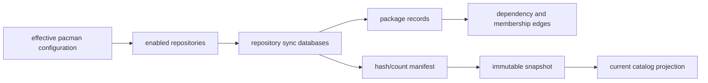

# Repository-to-Package Inventory Model

The repository-to-package inventory is a snapshot-bound projection of enabled
pacman repository metadata. It answers which package records were advertised
by each observed repository; it does not claim that packages are installed,
available from every mirror, or executable on the collecting host.

| Object | Stable identity | Snapshot fields | Excluded inference |
| --- | --- | --- | --- |
| Repository | Repository name and observed configuration scope | Mirror source, retrieval time, database digest | Global repository availability or authority beyond the observation |
| Package record | Repository-qualified package name and version | Architecture, description, groups, licenses, URL, sizes, build date | Installed files or binary contents |
| Dependency declaration | Source package plus declared dependency expression | Required/optional class and version constraint | Resolved runtime DLL edge |
| Package capability | Provided, conflicting, or replacing name | Declared metadata in the same snapshot | Equivalence of implementations or ABI |
| Snapshot | Content-addressed collector result | Schema, hashes, record counts, collector version | Continuity with a later catalog without comparison evidence |

## Inventory Rules

1. Preserve both the repository-qualified record and its content-addressed
   snapshot identifier. Package names alone are not sufficient across
   repositories, versions, or collection times.
2. Treat package state as three separate facts: advertised by a repository,
   installed locally, and present in a collected archive/file inventory.
3. Normalize dependency expressions while retaining their original class and
   version constraints. Unresolved names remain explicit records rather than
   fabricated edges.
4. Promote a new current projection only after required CSV/manifest files,
   hashes, record counts, and schema checks succeed. A failed import leaves
   the preceding projection intact.
5. Generate reverse dependency navigation from canonical directional edges;
   do not duplicate inverse relationships in the graph.

## Reconciliation Sequence

1. Collect effective repository metadata under a fixed locale.
2. Emit complete and per-repository catalog files with a hash/count manifest.
3. Validate inputs and archive immutable evidence under a snapshot identity.
4. Project repositories, packages, environment membership, and dependencies.
5. Compare identities and versions with the preceding snapshot to produce
   additions, removals, and version-change reports.

## Related Views

- [Pacman architecture and transaction model](PACMAN-ARCHITECTURE.md)
- [Pacman repository and trust model](PACMAN-REPOSITORY-TRUST-MODEL.md)
- [Self-updating knowledge base](SELF-UPDATING-KNOWLEDGE-BASE.md)
