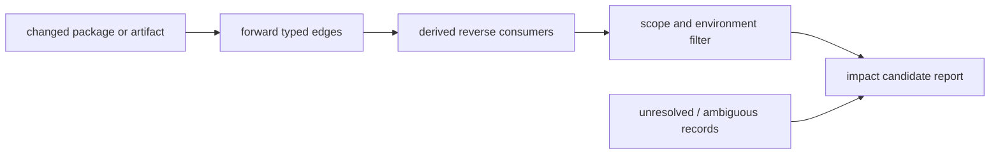

# Reverse Dependency and Impact Analysis Model

Impact analysis is a reproducible query over directional, snapshot-qualified
edges. It identifies observed consumers and changed objects; it does not by
itself prove breakage, load order, or compatibility after a package update.

| Edge family | Reverse query answers | Required qualification | Excluded conclusion |
| --- | --- | --- | --- |
| Package runtime dependency | Which catalog packages declare a requirement | Repository, environment, version, snapshot | Binary import or runtime load result |
| Optional dependency | Which packages declare an optional association | Dependency class and snapshot | Mandatory installation or execution path |
| Recipe build/check dependency | Which recipes use a build/test input | Recipe revision and parser evidence | Runtime deployment consumer |
| PE DLL import | Which analyzed binaries declare a DLL import | Artifact hash and inventory snapshot | Loader resolution or ABI compatibility |
| Metadata requirement | Which `.pc`/CMake modules declare a requirement | Metadata path, parser result, environment | A successful configured build |

## Analysis Rules

1. Derive reverse navigation from canonical forward edges at query time; do
   not store inverse duplicates that could diverge from their evidence.
2. Partition every report by edge type, snapshot, environment, architecture,
   and version constraints before calculating reachability or counts.
3. Include unresolved and ambiguous targets in the report as coverage limits,
   not as inferred relationships.
4. Report a change as an impact candidate when it intersects a qualified edge
   or artifact identity. Elevate it to a breakage conclusion only with API,
   ABI, build, or runtime verification evidence.
5. Keep catalog dependency changes and binary-import changes separately
   attributable so updates can be assessed at the correct architectural layer.

## Impact Workflow

1. Select two immutable snapshots or a single changed object identity.
2. Classify changes as package metadata, artifact bytes, metadata, recipe, or
   runtime observation changes.
3. Traverse only the applicable typed edges under matching scope qualifiers.
4. Include derived reverse consumers, unresolved records, and confidence.
5. Prioritize candidates for controlled rebuild, ABI comparison, or runtime
   validation rather than presenting graph reachability as a defect result.

## Generated Views

Two of the five edge families above are already backed by reproducible
generated views, previously produced but not linked from this page:

- [`generated/reverse-dependency-impact.json`](../generated/reverse-dependency-impact.json)
  — package runtime dependency edges, one entry per package with its
  `declared_consumers` list, snapshot-qualified via its own `snapshot`
  field. Built by `tools/build_catalog_views.py` from
  `evidence:catalog:current`.
- [`generated/binary-dependency-graph.json`](../generated/binary-dependency-graph.json)
  and [`generated/binary-dependency-report.md`](../generated/binary-dependency-report.md)
  — PE DLL import edges (3,058 as of this snapshot) with named-symbol and
  ordinal-import counts and derived reverse-importer counts per DLL. Built
  by `tools/import_deep_inventory.py` from a bounded installed-artifact
  snapshot (`evidence:inventory:20260729T232435Z-f22b2b35e873`); scope is
  that installation only, not every environment or package this knowledge
  base documents.

The Recipe build/check dependency and Metadata requirement edge families
have no corresponding generated view yet.

## Worked Example: zlib

Querying [zlib](ZLIB.md)'s reverse dependents through three different edge
families in this table, on the same package, produces three different and
individually correct numbers — the concrete case Analysis Rules 2 and 5
describe:

- **299** — every edge in `work/official-catalog/dependency-edges.csv`
  targeting `mingw-w64-ucrt-x86_64-zlib`, the figure
  [zlib's own page](ZLIB.md#reverse-dependencies) cites. This mixes two
  dependency classes.
- **297** — the `declared_consumers` count in
  `generated/reverse-dependency-impact.json` for the same package,
  because that view's own stated scope is
  "declared runtime package dependencies only" and so excludes the
  catalog's 2 `optional-depends-on` edges. Partitioning by edge type (Rule
  2) recovers the difference: 297 `runtime-depends-on` + 2
  `optional-depends-on` = 299.
- **34** — the count of `imports-dll` edges in
  `generated/binary-dependency-graph.json` targeting
  `dll:gnu:zlib1.dll`'s installed-artifact counterpart
  (`dll:msys2:/ucrt64/bin/zlib1.dll`) — Binutils and GCC toolchain
  executables (`ld.exe`, `objdump.exe`, `cc1plus.exe`, and 31 others) on
  the one bounded installation this snapshot observed. This is
  byte-level PE import evidence, a categorically different and much
  narrower claim than a catalog-declared package dependency (per the
  table above): it proves an observed import table entry on this
  specific installation, not every UCRT64 install, and not that removing
  zlib would break these 34 binaries at load or run time (per Rule 4).

None of the three numbers is wrong; each answers a differently-scoped
question, which is why Rule 5 requires keeping catalog dependency changes
and binary-import changes separately attributable rather than collapsing
them into one "N things depend on zlib" figure.

## Related Views

- [Repository-to-package inventory](REPOSITORY-PACKAGE-INVENTORY.md)
- [Binary-to-DLL dependency graph](BINARY-DLL-DEPENDENCY-GRAPH.md)
- [Build artifact and flow mappings](BUILD-ARTIFACT-FLOW-MAPPINGS.md)
