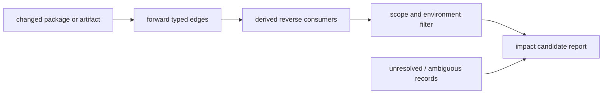

# Reverse Dependency and Impact Analysis Model

Impact analysis is a reproducible query over directional, snapshot-qualified
edges. It identifies observed consumers and changed objects; it does not by
itself prove breakage, load order, or compatibility after a package update.

| Edge family | Reverse query answers | Required qualification | Excluded conclusion |
| --- | --- | --- | --- |
| Package runtime dependency | Which catalog packages declare a requirement | Repository, environment, version, snapshot | Binary import or runtime load result |
| Optional dependency | Which packages declare an optional association | Dependency class and snapshot | Mandatory installation or execution path |
| Recipe build/check dependency | Which recipes use a build/test input | Recipe revision and parser evidence | Runtime deployment consumer |
| PE DLL import | Which analyzed binaries declare a DLL import | Artifact hash and inventory snapshot | Loader resolution or ABI compatibility |
| Metadata requirement | Which `.pc`/CMake modules declare a requirement | Metadata path, parser result, environment | A successful configured build |

## Analysis Rules

1. Derive reverse navigation from canonical forward edges at query time; do
   not store inverse duplicates that could diverge from their evidence.
2. Partition every report by edge type, snapshot, environment, architecture,
   and version constraints before calculating reachability or counts.
3. Include unresolved and ambiguous targets in the report as coverage limits,
   not as inferred relationships.
4. Report a change as an impact candidate when it intersects a qualified edge
   or artifact identity. Elevate it to a breakage conclusion only with API,
   ABI, build, or runtime verification evidence.
5. Keep catalog dependency changes and binary-import changes separately
   attributable so updates can be assessed at the correct architectural layer.

## Impact Workflow

1. Select two immutable snapshots or a single changed object identity.
2. Classify changes as package metadata, artifact bytes, metadata, recipe, or
   runtime observation changes.
3. Traverse only the applicable typed edges under matching scope qualifiers.
4. Include derived reverse consumers, unresolved records, and confidence.
5. Prioritize candidates for controlled rebuild, ABI comparison, or runtime
   validation rather than presenting graph reachability as a defect result.

## Related Views

- [Repository-to-package inventory](REPOSITORY-PACKAGE-INVENTORY.md)
- [Binary-to-DLL dependency graph](BINARY-DLL-DEPENDENCY-GRAPH.md)
- [Build artifact and flow mappings](BUILD-ARTIFACT-FLOW-MAPPINGS.md)
