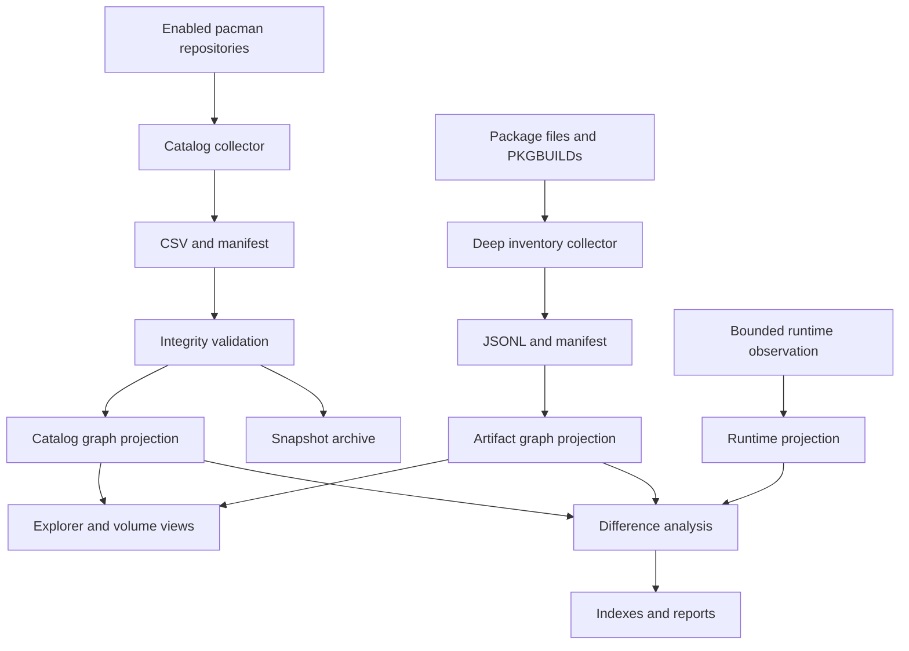

# Self-Updating Knowledge Base Architecture

## Purpose

The AKB continuously reconciles volatile MSYS2 state with a stable,
evidence-backed architecture model. The update pipeline treats generated
inventory as observed evidence; it never overwrites authored architectural
analysis.

## Refresh pipeline



## Source and view separation

| Zone | Mutability | Contents |
| --- | --- | --- |
| `model/graph.json` | Authored | Stable architectural knowledge and reviewed claims |
| `model/catalog/current.json` | Generated | Current package and dependency projection |
| `model/inventory/current.json` | Generated | Current file, binary, library, metadata, and recipe projection |
| `model/runtime/current.json` | Generated | Current bounded runtime-environment projection |
| `evidence/snapshots/<id>/` | Append-only | Collector outputs, hashes, graph projection, changes |
| `evidence/inventory-snapshots/<id>/` | Append-only | Deep artifact observations and reconciliation results |
| `generated/` | Replaceable | Catalog, change, unresolved-reference, and navigation views |
| `work/catalog/` | Disposable | Current collector staging files |

Generated catalog entities use the same stable IDs as the canonical model.
Consumers must compose the authored graph and current catalog projection at
read time. This avoids noisy machine updates to reviewed architectural claims.

## Collection

`tools/catalog-msys2-packages.ps1` discovers the repositories enabled in the
local pacman configuration. It forces `C` locale output, optionally refreshes
repository databases, and records:

- repository, package, version, installation state, and architecture;
- classification, description, groups, licenses, and project URL;
- required and optional dependencies;
- provided names, conflicts, and replacements;
- download size, installed size, and build date;
- normalized dependency edges;
- SHA-256 hashes and collection metadata.

It emits the complete catalog, per-repository catalogs, installed-package
catalog, dependency edges, package groups, summary, and manifest.

## Import and reconciliation

`tools/import_package_catalog.py`:

1. verifies required files, hashes, fields, and record counts;
2. assigns a UTC timestamp plus content digest snapshot ID;
3. maps repositories, packages, environments, and dependencies to typed graph
   entities and relationships;
4. archives the raw and normalized evidence;
5. compares package identity and version with the preceding snapshot;
6. atomically replaces the current generated projection after validation;
7. produces human- and machine-readable change reports.

Dependencies not resolvable to a package in the same snapshot are retained in
`generated/unresolved-dependencies.json`. They are not silently converted into
false architecture relationships.

## Deep inventory and analysis

`tools/deep_inventory.py` uses only the Python standard library. It maps
pacman-owned paths to packages and records file presence, size, and SHA-256.
For locally present artifacts it also performs bounded static analysis:

- PE32 and PE32+ machine, subsystem, timestamp, image base, characteristics,
  section count, debug-directory presence, imported DLLs and imported/exported
  names and ordinals;
- GNU and BSD `ar` archive members for `.a`, `.dll.a`, and `.lib` files;
- header, `pkg-config`, and CMake metadata discovery;
- expanded `pkg-config` paths, flags, versions, and requirements;
- CMake imported targets, locations, and dependency declarations;
- declarative PKGBUILD identity, source, checksum, dependency, package,
  lifecycle-function, and dynamic-field observations.

PKGBUILDs are parsed as text and are never sourced or executed. Shell-expanded
values are retained as dynamic observations rather than guessed.

Two collection scopes are supported:

- `installed` uses `pacman -Ql`, records installed ownership, and deeply
  analyzes files present beneath the MSYS2 root;
- `repositories` refreshes the pacman file databases (`pacman -Fy`) and uses
  `pacman -Fl` to build a complete repository file manifest. Files not locally
  present are recorded but cannot be binary-analyzed until their package is
  installed or its archive is extracted. `-SkipDatabaseRefresh` suppresses
  both package- and file-database synchronization.

`tools/import_deep_inventory.py` validates every JSONL hash and count, creates
typed artifact and recipe entities, resolves package ownership and DLL imports,
attaches exports and archive members, preserves ambiguity, creates a
content-addressed snapshot, and atomically replaces the current projection.

## Execution

Run an on-demand refresh from PowerShell 7:

```powershell
pwsh ./tools/Update-Akb.ps1 -Msys2Root C:\msys64
```

To use already synchronized pacman databases:

```powershell
pwsh ./tools/Update-Akb.ps1 -Msys2Root C:\msys64 -SkipDatabaseRefresh
```

Include a checked-out MSYS2 recipes tree:

```powershell
pwsh ./tools/Update-Akb.ps1 `
    -Msys2Root C:\msys64 `
    -RecipeRoot C:\src\MSYS2-packages
```

Collect repository-wide file ownership (requires synchronized pacman file
databases):

```powershell
pwsh ./tools/Update-Akb.ps1 `
    -Msys2Root C:\msys64 `
    -InventoryScope repositories
```

To refresh package metadata without the larger artifact scan, use
`-SkipDeepInventory`.

Register a daily Windows Scheduled Task:

```powershell
pwsh ./tools/Register-AkbRefreshTask.ps1 -DailyAt 03:00 -Msys2Root C:\msys64
```

Use `-WhatIf` with the registration command to inspect the action without
creating the task.

## Failure behavior

- A pacman failure stops collection.
- Missing files, hash mismatch, schema drift, or count mismatch stops import.
- A failed import leaves the preceding `model/catalog/current.json` usable.
- A failed deep import leaves `model/inventory/current.json` usable.
- Unresolved dependencies are reported and measured.
- Ambiguous DLL names and unresolved development metadata remain explicit.
- Malformed individual binaries become warnings; they do not invalidate
  otherwise trustworthy package ownership evidence.
- Snapshot evidence is immutable by convention and must be version controlled
  or moved to durable object storage.
- Generated views can always be reconstructed from the snapshot.

## Extension stages

The same collector/importer contract will next be extended for:

1. extraction of uninstalled package-archive payloads;
2. source and patch retrieval with verified recipe checksums;
3. symbol/version and ABI comparison across snapshots;
4. richer runtime probes and performance/security observations;
5. official documentation and source-repository change detection.

Every source adapter must emit a manifest with schema version, observation
time, source identity, source version, hashes, record counts, and collector
version.
