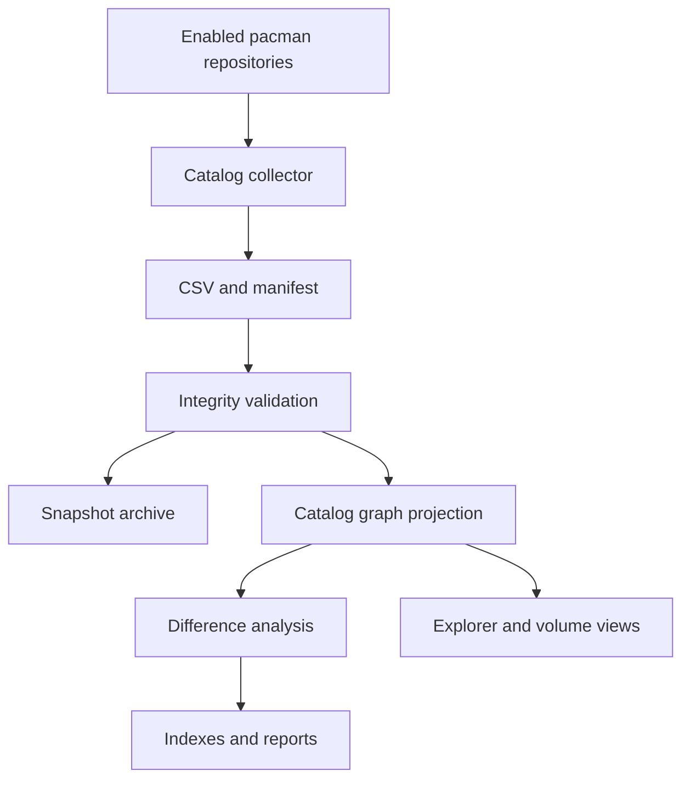

# Self-Updating Knowledge Base Architecture

## Purpose

The AKB continuously reconciles volatile MSYS2 state with a stable,
evidence-backed architecture model. The update pipeline treats generated
inventory as observed evidence; it never overwrites authored architectural
analysis.

## Refresh pipeline



## Source and view separation

| Zone | Mutability | Contents |
| --- | --- | --- |
| `model/graph.json` | Authored | Stable architectural knowledge and reviewed claims |
| `model/catalog/current.json` | Generated | Current package and dependency projection |
| `evidence/snapshots/<id>/` | Append-only | Collector outputs, hashes, graph projection, changes |
| `generated/` | Replaceable | Catalog, change, unresolved-reference, and navigation views |
| `work/catalog/` | Disposable | Current collector staging files |

Generated catalog entities use the same stable IDs as the canonical model.
Consumers must compose the authored graph and current catalog projection at
read time. This avoids noisy machine updates to reviewed architectural claims.

## Collection

`tools/catalog-msys2-packages.ps1` discovers the repositories enabled in the
local pacman configuration. It forces `C` locale output, optionally refreshes
repository databases, and records:

- repository, package, version, installation state, and architecture;
- classification, description, groups, licenses, and project URL;
- required and optional dependencies;
- provided names, conflicts, and replacements;
- download size, installed size, and build date;
- normalized dependency edges;
- SHA-256 hashes and collection metadata.

It emits the complete catalog, per-repository catalogs, installed-package
catalog, dependency edges, package groups, summary, and manifest.

## Import and reconciliation

`tools/import_package_catalog.py`:

1. verifies required files, hashes, fields, and record counts;
2. assigns a UTC timestamp plus content digest snapshot ID;
3. maps repositories, packages, environments, and dependencies to typed graph
   entities and relationships;
4. archives the raw and normalized evidence;
5. compares package identity and version with the preceding snapshot;
6. atomically replaces the current generated projection after validation;
7. produces human- and machine-readable change reports.

Dependencies not resolvable to a package in the same snapshot are retained in
`generated/unresolved-dependencies.json`. They are not silently converted into
false architecture relationships.

## Execution

Run an on-demand refresh from PowerShell 7:

```powershell
pwsh ./tools/Update-Akb.ps1 -Msys2Root C:\msys64
```

To use already synchronized pacman databases:

```powershell
pwsh ./tools/Update-Akb.ps1 -Msys2Root C:\msys64 -SkipDatabaseRefresh
```

Register a daily Windows Scheduled Task:

```powershell
pwsh ./tools/Register-AkbRefreshTask.ps1 -DailyAt 03:00 -Msys2Root C:\msys64
```

Use `-WhatIf` with the registration command to inspect the action without
creating the task.

## Failure behavior

- A pacman failure stops collection.
- Missing files, hash mismatch, schema drift, or count mismatch stops import.
- A failed import leaves the preceding `model/catalog/current.json` usable.
- Unresolved dependencies are reported and measured.
- Snapshot evidence is immutable by convention and must be version controlled
  or moved to durable object storage.
- Generated views can always be reconstructed from the snapshot.

## Extension stages

The same collector/importer contract will be extended for:

1. package file manifests;
2. PE headers, DLL imports and exports;
3. import and static libraries;
4. headers, pkg-config, and CMake metadata;
5. PKGBUILD recipes, sources, patches, and build dependencies;
6. runtime probes and performance/security observations;
7. official documentation and source-repository change detection.

Every source adapter must emit a manifest with schema version, observation
time, source identity, source version, hashes, record counts, and collector
version.
