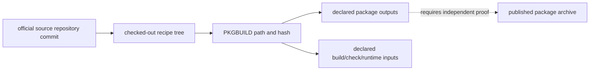

# Source Code Organization and Package Provenance

MSYS2 package source organization is represented as source repositories,
repository-relative recipe paths, declaratively parsed `PKGBUILD` records, and
their stated output-package/dependency expressions. These are source
provenance observations, not proof that a specific published archive was built
from the observed checkout.

| Object | Stable identity | Evidence supplied | Explicit limit |
| --- | --- | --- | --- |
| Source repository | Official repository URL and commit | Source provenance anchor | Package archive byte identity |
| Recipe tree | Repository-relative path plus checkout revision | Collection scope | Unchecked source execution |
| `PKGBUILD` | Relative path and SHA-256 | Declaratively parsed metadata | Arbitrary shell expansion or build result |
| Output package expression | Literal parsed package name/expression | Stated intended package relation | Published package ownership without matching evidence |
| Patch/source declaration | Literal recipe field | Declared upstream inputs | Retrieved source authenticity or application result |

## Collection boundary

The recipe collector never sources or executes `PKGBUILD` files. It records
their bytes, selected declarative fields, and dynamic expressions that cannot
be resolved safely. The compact local projection retains source-to-recipe and
unambiguous recipe-to-package links while keeping unresolved dynamic names
explicit.

## Navigation

1. Start with a snapshot-qualified package in the [package catalog](REPOSITORY-PACKAGE-INVENTORY.md).
2. Follow an observed `packaged-by` relationship only when its parsed output
   name uniquely matches the catalog.
3. Inspect the recipe path, commit, and hash before using any source field.
4. Use [build artifact flow mappings](BUILD-ARTIFACT-FLOW-MAPPINGS.md) for
   build-stage interpretation and [deep inventory](DEEP-INVENTORY-CONTRACT.md)
   for archive/installed-byte observations.

## Evidence boundary

The local snapshots from the official `MSYS2/MINGW-packages` and
`MSYS2/MSYS2-packages` trees demonstrate recipe provenance only. Establishing
an upstream-source → recipe → package archive → deployed artifact chain
requires matching source retrieval, patch application, build, and archive
evidence for the exact revision.

## Related volumes

- Volume 11: [Repository package inventory](REPOSITORY-PACKAGE-INVENTORY.md)
- Volume 14: [Build artifact flow mappings](BUILD-ARTIFACT-FLOW-MAPPINGS.md)
- Volume 9: [Git for Windows package and source mappings](GIT-FOR-WINDOWS-PACKAGE-SOURCE-MAPPINGS.md)
