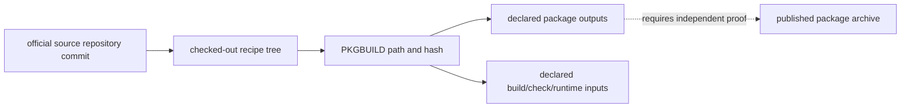

# Source Code Organization and Package Provenance

MSYS2 package source organization is represented as source repositories,
repository-relative recipe paths, declaratively parsed `PKGBUILD` records, and
their stated output-package/dependency expressions. These are source
provenance observations, not proof that a specific published archive was built
from the observed checkout.

| Object | Stable identity | Evidence supplied | Explicit limit |
| --- | --- | --- | --- |
| Source repository | Official repository URL and commit | Source provenance anchor | Package archive byte identity |
| Recipe tree | Repository-relative path plus checkout revision | Collection scope | Unchecked source execution |
| `PKGBUILD` | Relative path and SHA-256 | Declaratively parsed metadata | Arbitrary shell expansion or build result |
| Output package expression | Literal parsed package name/expression | Stated intended package relation | Published package ownership without matching evidence |
| Patch/source declaration | Literal recipe field | Declared upstream inputs | Retrieved source authenticity or application result |

## Collection boundary

The recipe collector never sources or executes `PKGBUILD` files. It records
their bytes, selected declarative fields, and dynamic expressions that cannot
be resolved safely. The compact local projection retains source-to-recipe and
unambiguous recipe-to-package links while keeping unresolved dynamic names
explicit.

## Navigation

1. Start with a snapshot-qualified package in the [package catalog](REPOSITORY-PACKAGE-INVENTORY.md).
2. Follow an observed `packaged-by` relationship only when its parsed output
   name uniquely matches the catalog.
3. Inspect the recipe path, commit, and hash before using any source field.
4. Use [build artifact flow mappings](BUILD-ARTIFACT-FLOW-MAPPINGS.md) for
   build-stage interpretation and [deep inventory](DEEP-INVENTORY-CONTRACT.md)
   for archive/installed-byte observations.

## Evidence boundary

The local snapshots from the official `MSYS2/MINGW-packages` and
`MSYS2/MSYS2-packages` trees demonstrate recipe provenance only. Establishing
an upstream-source → recipe → package archive → deployed artifact chain
requires matching source retrieval, patch application, build, and archive
evidence for the exact revision.

## Bounded provenance slice: zlib

On 2026-07-30, the retained MSYS2 `zlib/PKGBUILD` declared upstream
`zlib-1.3.2.tar.xz` and SHA-256
`d7a0654783a4da529d1bb793b7ad9c3318020af77667bcae35f95d0e42a792f3`.
A local retrieval of that exact URL matched the declared digest. The same
isolated installation contains `zlib 1.3.2-1` and `/usr/bin/msys-z.dll`.
The two recipe-local patches also matched their declared SHA-256 values.
This establishes recipe-declared source retrieval and installed ownership as
separate observations; it does not prove patch application, build execution,
or byte identity between the retrieved source and the installed DLL.

A controlled local build then applied both verified patches successfully but
failed under MSYS GCC `15.3.0` while compiling `gzlib.c`, which referenced
`lseek` without a visible declaration. This is a version-qualified failed
build observation, not evidence that the recipe or installed DLL is invalid.

## Measured shape of the two recipe trees

The sections above state how source organization is *modelled*. This one
states what the trees actually contain, measured on 2026-08-03 from
`model/recipe-dependencies/current.json` — the projection built by
`tools/import_recipe_dependencies.py` from the MSYS2 and MinGW-w64 PKGBUILD
trees.

| | Recipes | Packages declared |
| --- | ---: | ---: |
| `MSYS2-packages` (plain directory names) | 458 | 619 |
| `MINGW-packages` (`mingw-w64-*` directories) | 3,040 | 13,037 |
| **Total** | **3,498** | **13,656** |

Two things follow from that table, and neither is visible from a package
listing alone.

**The source tree is overwhelmingly native, and the catalog more so.** 87%
of recipes live in `MINGW-packages`, and they account for 95% of declared
packages. The MSYS side — the POSIX-emulating half this knowledge base
treats as the ecosystem's defining boundary — is 458 recipes.

**One recipe is normally four packages.** 2,014 recipes, 58% of the tree,
declare exactly four: the expansion of `${MINGW_PACKAGE_PREFIX}` across the
active MINGW environments. This is the structural reason a package count
overstates the amount of independently authored software in the ecosystem,
and the reason a build-dependency graph resolved without expanding that
variable produces the wrong answer, as
[the library family classification](LIBRARY-FAMILY-CLASSIFICATION.md)
records.

Fan-out is not uniform. The widest are single recipes producing dozens of
packages:

| Packages | Recipe |
| ---: | --- |
| 75 | `mingw-w64-git/PKGBUILD` |
| 64 | `mingw-w64-swi-prolog/PKGBUILD` |
| 36 | `mingw-w64-llvm/PKGBUILD` |
| 36 | `mingw-w64-wxwidgets3.2/PKGBUILD` |
| 36 | `mingw-w64-objfw/PKGBUILD` |

Per-environment declared package counts track the lifecycle labels in
[runtime environments](RUNTIME-ENVIRONMENTS.md) without being derived from
them: UCRT64 3,355, CLANG64 3,285, CLANGARM64 3,245, MINGW64 2,832, MSYS
633, MINGW32 306. MINGW32's position as the smallest is consistent with its
deprecated status; CLANGARM64 sitting near the top is the more surprising
figure, since no CLANGARM64 runtime observation exists anywhere in this
knowledge base.

### What these numbers are not

**Every figure here is a floor.** The projection records a recipe only when
at least one of its declared build or check dependencies resolves to a
catalog package. A recipe declaring nothing resolvable does not appear, so
3,498 is a lower bound on tree size — an earlier read of the same trees
found 3,956 `PKGBUILD` files — and each fan-out count is a lower bound on
that recipe's outputs.

The 13,656 declared packages cover 86.9% of the 15,711-package catalog. The
remaining 2,055 are not evidence of recipes that do not exist: they are
packages no retained recipe edge names, which includes recipes that declare
no resolvable dependency and any catalog entry whose recipe was absent from
the trees as read.

No claim here establishes that a published archive was built from the
recipe that names it. That remains the boundary the rest of this page
describes.

## Related volumes

- Volume 11: [Repository package inventory](REPOSITORY-PACKAGE-INVENTORY.md)
- Volume 14: [Build artifact flow mappings](BUILD-ARTIFACT-FLOW-MAPPINGS.md)
- Volume 9: [Git for Windows package and source mappings](GIT-FOR-WINDOWS-PACKAGE-SOURCE-MAPPINGS.md)

<!-- BEGIN GENERATED dependency-subgraph -->

## Dependency Diagram

Dependencies and dependents of `ecosystem:msys2:msys2` in the composed graph: 0 dependents and 1 dependency.

Generated from the composed model by `tools/build_object_diagrams.py`.
Edits between the surrounding markers are overwritten on the next build.

<!-- END GENERATED dependency-subgraph -->
