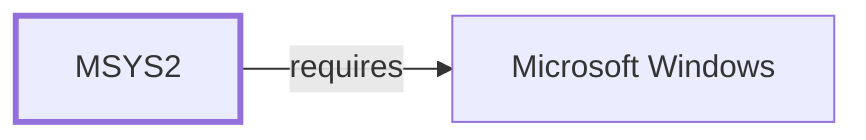

# The Measured Supply-Chain Surface

[The threat model](THREAT-MODEL-AND-SUPPLY-CHAIN.md) reasons about where
trust enters this ecosystem. This page measures how wide each of those
surfaces actually is, from the catalog snapshot's 15,711 packages.

It is a measurement of *declared upstream metadata*, not an audit. Nothing
here inspects a package's contents or verifies that a project URL is where
its source came from.

## Upstream concentration

15,696 packages declare a `project_url`, across **1,335 distinct hosts**.
The distribution is heavily skewed:

| Packages | Share | Host |
| ---: | ---: | --- |
| 5,685 | 36.2% | `github.com` |
| 610 | 3.9% | `qt.io` |
| 597 | 3.8% | `metacpan.org` |
| 297 | 1.9% | `gnu.org` |
| 216 | 1.4% | `nerdfonts.com` |
| 167 | 1.1% | `community.kde.org` |
| 154 | 1.0% | `gitlab.gnome.org` |

**Over a third of this ecosystem's declared upstream sources sit behind one
hostname**, and the top ten account for 51.4%. Eighty hosts serve exactly
one package each.

The concentration figure is the one worth carrying forward. Whatever the
threat model says about upstream compromise, the blast radius of a single
host is not evenly distributed across 1,335 of them — it is concentrated in
one, and that one is the same host this repository's own tooling has been
unable to reach through its proxy on more than one occasion.

## Transport

| Scheme | Packages |
| ---: | --- |
| `https` | 15,252 |
| `http` | 444 |
| `ftp` | 4 |
| none declared | 11 |

**444 packages declare a plain-`http` project URL and four declare `ftp`.**
That is not itself a vulnerability: a `project_url` is a homepage reference
rather than the download the package was built from, and the recipe's
`source` array is what determines retrieval. But it is a measurable count of
metadata pointing at unauthenticated transports, and this knowledge base
holds no observation of what the corresponding `source` entries use.

## License identification

- **6 packages declare no license field at all.**
- 420 distinct license identifiers appear.
- **115 of those are not SPDX-prefixed** — bare strings such as `GPL`,
  `LGPL`, `GPL-2+`, and `GPL;PerlArtistic` sit alongside `spdx:MIT` and
  `spdx:Apache-2.0`.
- 617 package-license pairs use an identifier containing "custom" or
  "unknown".

The most common identifiers are `spdx:MIT` (3,137), `spdx:Apache-2.0`
(1,722), and `spdx:BSD-3-Clause` (1,502).

Mixed identifier conventions matter for a supply-chain review because
license obligations cannot be evaluated mechanically across a field that is
SPDX in one row and freeform in the next. This is a data-quality
observation about the catalog, not a compliance finding about any package.

## What this does not establish

This page reads catalog metadata. It does not:

- verify that any package's contents match its declared upstream;
- observe what the recipes' `source` arrays retrieve, or over what
  transport — [source code organization](SOURCE-CODE-ORGANIZATION.md)
  records that only for the bounded zlib slice;
- evaluate signature coverage, which
  [the pacman repository trust model](PACMAN-REPOSITORY-TRUST-MODEL.md)
  holds, and which rests on one verified archive signature plus one
  installation's `pacman -Qi` output rather than a catalog-wide measure;
- distinguish a homepage from a download origin. `project_url` is the
  former.

The single-host concentration figure is the most robust claim here, because
it depends only on parsing a field that 99.9% of packages declare.

## Related views

- [Threat model and supply chain](THREAT-MODEL-AND-SUPPLY-CHAIN.md)
- [Pacman repository trust model](PACMAN-REPOSITORY-TRUST-MODEL.md)
- [Source code organization](SOURCE-CODE-ORGANIZATION.md)

<!-- BEGIN GENERATED dependency-subgraph -->

## Dependency Diagram

Dependencies and dependents of `ecosystem:msys2:msys2` in the composed graph: 0 dependents and 1 dependency.

Generated from the composed model by `tools/build_object_diagrams.py`.
Edits between the surrounding markers are overwritten on the next build.

<!-- END GENERATED dependency-subgraph -->
