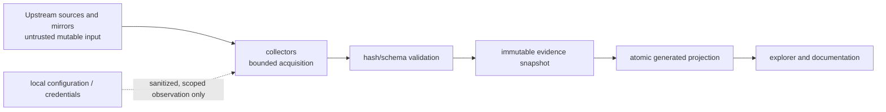

# AKB Threat Model and Supply-Chain Analysis

AKB ingests mutable external metadata and package-adjacent artifacts. Its
primary security objective is evidence integrity: an attacker or malfunction
must not silently turn untrusted input into an authoritative architectural
claim or replace a previously verified projection.

| Asset / boundary | Threat | Existing control | Remaining assurance need |
| --- | --- | --- | --- |
| Source registry | Impersonated or unreviewed source locator | Primary-source registration and reviewed commits | Periodic source ownership/release review |
| Mirror and repository transfer | Tampered, stale, or inconsistent metadata | Snapshot hashes, retrieval identity, pacman verification boundary | Mirror-divergence monitoring and alerting |
| Catalog/deep-inventory streams | Truncation, path traversal, schema abuse, parser failure | Required streams, hashes/counts, normalized paths, bounded parsers | Adversarial corpus and fuzz testing |
| Package recipes | Shell-side effects or dynamic-value misinterpretation | Static parsing only; PKGBUILDs never execute | Expanded dynamic-field coverage and source checksum retrieval |
| Generated projections | Partial import replacing trustworthy state | Validation before atomic current-view replacement | Cross-process locking and recovery drills |
| Explorer / generated documents | Script or markup injection from names or metadata | HTML escaping and static generation | Browser security headers when hosted |
| Credentials and local configuration | Secret leakage through collection or evidence | Sanitization rules; credential stores excluded | Automated secret-scanning gate for snapshots |
| Refresh automation | Privilege abuse or task tampering | Explicit task registration and inspectable command | Least-privilege service account guidance |

## Trust Boundaries

## Security Rules

1. Treat every network response, archive path, metadata field, and recipe text
   as untrusted until it passes format, path, count, and integrity validation.
2. Retain the prior current projection whenever collection, validation, or
   import fails; never promote partial output.
3. Keep raw evidence immutable and attach provenance, retrieval date, hashes,
   parser/collector version, and scope before deriving graph facts.
4. Never collect private keys, tokens, credential-store contents, or proxy
   userinfo. Redact sensitive local configuration before evidence retention.
5. Separate provenance evidence from behavioral or compatibility claims; a
   signed package or source commit is not proof of runtime behavior.
6. Escalate unresolved dependency, ambiguous DLL, parser-warning, and source
   drift records as coverage limits rather than filling gaps with inference.

## Measured control verification: Explorer script/markup injection

No entity in the current authored `model/graph.json` contains an HTML
metacharacter (`<`, `>`, `&`, `"`) in its `name` or `summary`, so the
"HTML escaping and static generation" control for the Explorer row above
has never actually been exercised by this repository's own real data. On
2026-07-30, it was exercised directly against `tools/build_explorer.py`'s
own `build()` function (not a reimplementation) using synthetic,
non-committed test entities — an XSS-shaped name
(``) and a quote-breaking id
(`component:test:"onmouseover="alert(1)`) — run through a temporary
output directory, never staged in this repository:

- The generated `index.html` and `overview.svg` contained the
  HTML-entity-escaped form (`&lt;script&gt;...`) and did not contain the
  raw, unescaped payload as a live tag or attribute break-out.
- The one raw-substring match in `index.html` was the payload appearing
  inside the page's embedded `const data = {...}` JSON blob, itself
  inside a `` to `<\/script>`, the standard, correct mitigation that
  prevents a JSON string value from prematurely closing that script
  block.
- That same generated page's client-side JavaScript defines its own
  `esc()` function
  (`value => String(value).replace(/[&<>"]/g, c => ({'&':'&amp;','<':'&lt;','>':'&gt;','"':'&quot;'}[c]))`)
  and applies it to every entity name/id/kind/status value before
  inserting it via `innerHTML` in the hash-routed dynamic views (search
  results, per-object dossier, breadcrumbs, relationship lists) —
  confirming the escaping control operates at both the static-generation
  layer (Python, `html.escape`) and the client-rendering layer
  (JavaScript, `esc`), independently.
- `overview.txt` is plain text, not rendered as HTML, so it was not
  escaped and this is not itself a finding.

This verifies the control functions correctly against the specific
payloads tested; it does not constitute a general security audit, does
not cover every possible injection vector (URL-fragment routing, SVG
`<title>` content beyond what was tested, or a future code change that
bypasses `esc`/`html.escape`), and should be re-run after any change to
`tools/build_explorer.py` or its generated client-side script.

## Measured control verification: Package recipes never execute

A 2026-07-31 direct code inspection (not a black-box test) of the two
real functions that touch PKGBUILD text verified the "Static parsing
only; PKGBUILDs never execute" control for the Package recipes row
above:

- `tools/deep_inventory.py`'s `parse_pkgbuild()` (the function
  `tools/collect_recipe_tree.py`'s collector actually calls) reads the
  PKGBUILD file with `Path.read_text()` and extracts every field with
  `re.search`/`re.findall` against that string; it contains no `exec`,
  `eval`, `subprocess`, `os.system`, or any other code-execution call
  operating on PKGBUILD content anywhere in its body.
- `tools/collect_recipe_tree.py` does call `subprocess.run` exactly
  once, but for `git -C <root> rev-parse HEAD` — reading the checked-out
  tree's own revision, not interpreting any PKGBUILD's shell syntax.
- `tools/import_recipe_tree.py`, which consumes the collector's output,
  contains no execution call either; it only validates and imports the
  already-statically-parsed JSON records `parse_pkgbuild()` produced.

This confirms the control as implemented today, for these three files at
this commit; it does not constitute a general audit of every code path
that might touch recipe text (for example, any future collector or
importer added under this or a different extension point), and — per the
row's own "Remaining assurance need" — does not cover the still-open
work of expanding dynamic-field coverage or retrieving source checksums.

## Response and Review

On a suspected integrity failure, preserve the failing inputs and logs, stop
promotion, retain the last verified projection, and record the affected source
and snapshot scope. Review source provenance, hashes, parser behavior, and
downstream generated differences before a corrected snapshot is promoted.

## Related Views

- [Pacman repository and trust model](PACMAN-REPOSITORY-TRUST-MODEL.md)
- [Self-updating knowledge base](SELF-UPDATING-KNOWLEDGE-BASE.md)
- [Runtime observation contract](RUNTIME-OBSERVATION-CONTRACT.md)
