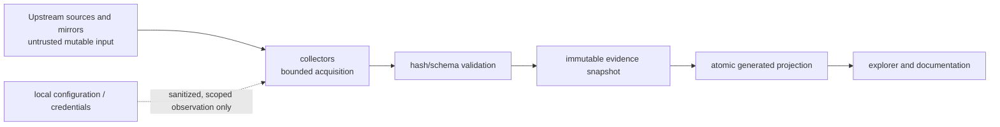

# AKB Threat Model and Supply-Chain Analysis

AKB ingests mutable external metadata and package-adjacent artifacts. Its
primary security objective is evidence integrity: an attacker or malfunction
must not silently turn untrusted input into an authoritative architectural
claim or replace a previously verified projection.

| Asset / boundary | Threat | Existing control | Remaining assurance need |
| --- | --- | --- | --- |
| Source registry | Impersonated or unreviewed source locator | Primary-source registration and reviewed commits | Periodic source ownership/release review |
| Mirror and repository transfer | Tampered, stale, or inconsistent metadata | Snapshot hashes, retrieval identity, pacman verification boundary | Mirror-divergence monitoring and alerting |
| Catalog/deep-inventory streams | Truncation, path traversal, schema abuse, parser failure | Required streams, hashes/counts, normalized paths, bounded parsers | Adversarial corpus and fuzz testing |
| Package recipes | Shell-side effects or dynamic-value misinterpretation | Static parsing only; PKGBUILDs never execute | Expanded dynamic-field coverage and source checksum retrieval |
| Generated projections | Partial import replacing trustworthy state | Validation before atomic current-view replacement | Cross-process locking and recovery drills |
| Explorer / generated documents | Script or markup injection from names or metadata | HTML escaping and static generation | Browser security headers when hosted |
| Credentials and local configuration | Secret leakage through collection or evidence | Sanitization rules; credential stores excluded | Automated secret-scanning gate for snapshots |
| Refresh automation | Privilege abuse or task tampering | Explicit task registration and inspectable command | Least-privilege service account guidance |

## Trust Boundaries

## Security Rules

1. Treat every network response, archive path, metadata field, and recipe text
   as untrusted until it passes format, path, count, and integrity validation.
2. Retain the prior current projection whenever collection, validation, or
   import fails; never promote partial output.
3. Keep raw evidence immutable and attach provenance, retrieval date, hashes,
   parser/collector version, and scope before deriving graph facts.
4. Never collect private keys, tokens, credential-store contents, or proxy
   userinfo. Redact sensitive local configuration before evidence retention.
5. Separate provenance evidence from behavioral or compatibility claims; a
   signed package or source commit is not proof of runtime behavior.
6. Escalate unresolved dependency, ambiguous DLL, parser-warning, and source
   drift records as coverage limits rather than filling gaps with inference.

## Response and Review

On a suspected integrity failure, preserve the failing inputs and logs, stop
promotion, retain the last verified projection, and record the affected source
and snapshot scope. Review source provenance, hashes, parser behavior, and
downstream generated differences before a corrected snapshot is promoted.

## Related Views

- [Pacman repository and trust model](PACMAN-REPOSITORY-TRUST-MODEL.md)
- [Self-updating knowledge base](SELF-UPDATING-KNOWLEDGE-BASE.md)
- [Runtime observation contract](RUNTIME-OBSERVATION-CONTRACT.md)
