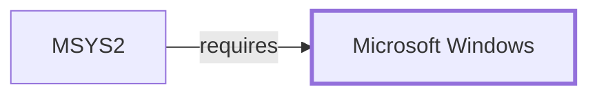

# Windows Console and ConPTY Boundary

> **Contextual scope.** This page documents the *boundary* between MSYS2 and
> a Windows subsystem — what MSYS2 depends on, where this knowledge base's
> claims stop, and what evidence an exact claim would need. It is not a
> Windows internals reference. See
> [ADR 0001](../charter/adr/0001-windows-platform-contextual-scope.md).

## Purpose

Terminal behavior is where MSYS2's POSIX presentation and Windows' console
model meet most visibly, and where a single session can contain programs
that disagree about what a terminal is.

## What MSYS2 depends on

The Windows console subsystem and **ConPTY**, the pseudoconsole API
Microsoft documents, which is what allows a POSIX-style pseudo-terminal to
be bridged to Windows console semantics. The
[MSYS PTY and console subsystem](MSYS-PTY-AND-CONSOLE.md) sits on this.

## Where the boundary sits

An MSYS-linked program sees a PTY; a native program invoked from the same
terminal interacts with the console directly. They can therefore disagree
about line discipline, echo, and — most visibly — whether output is
interactive.

That disagreement is a boundary effect, not a defect in either program. It
is the mechanism behind a native tool disabling colour when run from
Git Bash.

## Evidence required for an exact claim

A terminal and PTY test matrix on a named Windows build, exercising both
MSYS-linked and native programs in the same session.

## What this knowledge base holds

One probe: `/dev` and `/dev/tty` existed on 2026-07-30. The collector's own
note is explicit that this "is not a PTY allocation or ConPTY integration
test". Console output was redirected in the collection context, so
interactive behavior was not exercised at all.

No test matrix exists.

## Host observation

The one controlled host observation this knowledge base holds, from
2026-07-30: Windows NT `10.0.26200.8973` on x64, system directory
`C:\Windows\system32`. WMI operating-system and volume queries were
**denied by host access policy**, so edition, filesystem type, and
management-API behavior are not established. Console output was redirected
in the collection context.

Every page in this volume inherits that boundary: one host, one build, no
privileged queries.

<!-- BEGIN GENERATED dependency-subgraph -->

## Dependency Diagram

Dependencies and dependents of `platform:microsoft:windows` in the composed graph: 1 dependent and 0 dependencies.

Generated from the composed model by `tools/build_object_diagrams.py`.
Edits between the surrounding markers are overwritten on the next build.

<!-- END GENERATED dependency-subgraph -->

## Related Objects

- [Windows platform boundaries](WINDOWS-PLATFORM-BOUNDARIES.md)
- [MSYS PTY and console](MSYS-PTY-AND-CONSOLE.md)
- [mintty](MINTTY.md)
