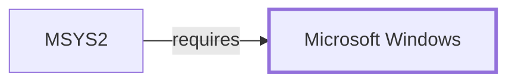

# Windows Networking Boundary

> **Contextual scope.** This page documents the *boundary* between MSYS2 and
> a Windows subsystem — what MSYS2 depends on, where this knowledge base's
> claims stop, and what evidence an exact claim would need. It is not a
> Windows internals reference. See
> [ADR 0001](../charter/adr/0001-windows-platform-contextual-scope.md).

## Purpose

Network operations from MSYS2 cross into Windows sockets and, for TLS,
potentially into a Windows-supplied verification path. Which one is used is
a per-program decision with visible consequences.

## What MSYS2 depends on

Winsock for transport. For TLS, the choice is the program's: a bundled
library such as [OpenSSL](OPENSSL.md), or the platform's own SChannel.

## Where the boundary sits

The TLS backend determines the **trust store**, and the two do not hold the
same anchors:

| Backend | Anchors |
| --- | --- |
| OpenSSL | A CA bundle shipped or configured with the distribution |
| SChannel | The Windows certificate store |

[Git for Windows HTTP transport](GIT-FOR-WINDOWS-HTTP-TRANSPORT.md)
documents this concretely — `http.sslBackend` selects between them, and an
enterprise CA in the Windows store is invisible to OpenSSL unless separately
added.

An MSYS-linked program's socket calls are adapted by the runtime; a native
program's are not. That adaptation is an MSYS2 fact; Winsock's behavior is a
Windows fact.

## Evidence required for an exact claim

Captured transport configuration plus an execution trace — which backend was
selected, which anchors were consulted, what the handshake did.

## What this knowledge base holds

None. No handshake has been observed, no TLS backend selection recorded, and
no certificate store enumerated. The trust-store divergence above is
documented from configuration semantics, not from observation.

## Host observation

The one controlled host observation this knowledge base holds, from
2026-07-30: Windows NT `10.0.26200.8973` on x64, system directory
`C:\Windows\system32`. WMI operating-system and volume queries were
**denied by host access policy**, so edition, filesystem type, and
management-API behavior are not established. Console output was redirected
in the collection context.

Every page in this volume inherits that boundary: one host, one build, no
privileged queries.

<!-- BEGIN GENERATED dependency-subgraph -->

## Dependency Diagram

Dependencies and dependents of `platform:microsoft:windows` in the composed graph: 1 dependent and 0 dependencies.

Generated from the composed model by `tools/build_object_diagrams.py`.
Edits between the surrounding markers are overwritten on the next build.

<!-- END GENERATED dependency-subgraph -->

## Related Objects

- [Windows platform boundaries](WINDOWS-PLATFORM-BOUNDARIES.md)
- [Git for Windows HTTP transport](GIT-FOR-WINDOWS-HTTP-TRANSPORT.md)
- [OpenSSL](OPENSSL.md)
- [ca-certificates](CA-CERTIFICATES.md)
