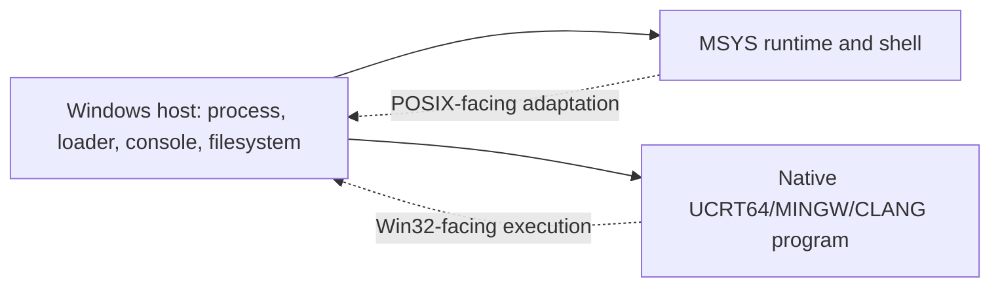

# Windows Platform Boundaries for MSYS2

Windows is the host platform for both the MSYS POSIX-emulation runtime and
native MinGW-w64 environment executables. This volume records only the host
services needed to understand those boundaries; it is not a general Windows
internals reference.

**That narrowing is now recorded as a decision** rather than left implicit:
[ADR 0001](../charter/adr/0001-windows-platform-contextual-scope.md). It also
explains why this volume will stay thinner than volumes covering MSYS2's own
components — permanently, and by design.

Each row below has its own boundary page as of 2026-08-02.

| Host concern | Boundary relevant to MSYS2 | Evidence needed for an exact claim |
| --- | --- | --- |
| [NT kernel](WINDOWS-NT-KERNEL-BOUNDARY.md) — process and handles | MSYS-dependent processes adapt POSIX-facing lifecycle expectations; native programs use Windows process semantics directly | Version-qualified runtime source and controlled process probe |
| [Win32 APIs and loader](WINDOWS-WIN32-API-BOUNDARY.md) | PE executables and DLLs are loaded by the Windows loader; import tables identify declared imports, not the resolved runtime load result | PE import evidence plus controlled loader observation |
| [Console and ConPTY](WINDOWS-CONSOLE-CONPTY-BOUNDARY.md) | Terminal-facing behavior crosses between Windows console facilities, pipes, PTYs, and the selected shell/runtime | Terminal/PTY test matrix on a named Windows build |
| [Filesystems](WINDOWS-FILESYSTEM-BOUNDARY.md) | Drive letters, UNC paths, file attributes, case behavior, and reparse points remain host filesystem concerns | Filesystem probes on the target volume and policy configuration |
| [Registry](WINDOWS-REGISTRY-BOUNDARY.md) | Windows registry integration is a host/application concern, not an implied MSYS runtime service | Specific application configuration evidence |
| [Security](WINDOWS-SECURITY-BOUNDARY.md) | ACLs, tokens, process integrity, signing, and credential stores are Windows boundaries; package signatures are a separate distribution trust control | Host-security configuration and package-signature evidence |
| [Networking](WINDOWS-NETWORKING-BOUNDARY.md) | Native Winsock/TLS behavior and MSYS process adaptation are distinct layers | Captured transport configuration and execution trace |

## Runtime distinction

An MSYS process may expose POSIX paths and mounts while still executing on a
Windows host. A UCRT64, MINGW64, or CLANG64 executable is a native Windows PE
program unless direct binary evidence shows it depends on `msys-2.0.dll`.
Distribution branding, shell selection, and a package-name prefix do not prove
that dependency.

The bounded local MSYS observation records path conversion and the mount table
of the shell that executed it. It is evidence of that MSYS runtime context,
not proof of Windows loader, registry, filesystem, console, or networking
behavior generally.

## Controlled local host observation

On 2026-07-30, non-privileged host APIs reported Windows NT `10.0.26200.8973`
on x64, with `C:\Windows\system32` as the system directory. Console output
was redirected in the automated collection context. WMI operating-system and
volume queries were denied by host access policy in that specific
context, so that observation did not claim filesystem type, edition, or
management-API behavior.

A second 2026-07-30 observation, from a different (non-elevated, interactive)
session on the same host, found the WMI/CIM restriction did not reproduce —
itself evidence that the earlier denial was a property of the automated
collector's execution context, not the host generally.
`Get-CimInstance Win32_OperatingSystem` reported edition
`Microsoft Windows 11 Home`, version `10.0.26200`, build `26200`, 64-bit.
`Get-Volume` on the `C:` drive reported filesystem `NTFS`, health
`Healthy`. A disposable temp-directory probe found
`New-Item -ItemType SymbolicLink` failed with "Administrator privilege
required for this operation" in this non-elevated session — a
directly relevant boundary for MSYS2's own symlink emulation strategy,
covered further in the [MSYS runtime behavior map](MSYS-RUNTIME-BEHAVIOR-MAP.md)
— and a mixed-case filename lookup matched its lowercase counterpart,
confirming this volume's default case-insensitive behavior. All of this
remains single-host, single-session evidence: it does not establish
edition, filesystem, or symlink-privilege facts for an elevated session,
a different Windows edition, or a volume with case-sensitivity enabled
per directory (settable independently of this default on this NTFS
version).

## Registry, security, and networking observation

A third 2026-07-31 observation, from the same non-elevated interactive
session, covers three previously unobserved rows above:

- **Registry**: `HKLM:\SOFTWARE\GitForWindows` exists and records
  `InstallPath` = `C:\Program Files\Git`, `CurrentVersion` = `2.55.0.3`,
  and `LibexecPath` = `C:\Program Files\Git\mingw64\libexec\git-core`.
  The registry's `CurrentVersion` string (`2.55.0.3`) differs in format
  from `git --version`'s own report (`2.55.0.windows.3`, per
  [Git for Windows boundary](GIT-FOR-WINDOWS-BOUNDARY.md)) — the same
  release, two different version-string conventions, not a version
  mismatch. This is registry evidence for one application (Git for
  Windows) only, not a general MSYS2-registry-integration survey.
- **Security**: `Get-AuthenticodeSignature` on both
  `Git\cmd\git.exe` and `Git\mingw64\bin\git.exe` reported `Status:
  Valid`, `StatusMessage: Signature verified`, signer `CN=Johannes
  Schindelin, O=Johannes Schindelin, L=Bruehl, C=DE` — the real-world
  Git for Windows maintainer. The signing certificate's own `NotAfter`
  date (2026-07-11) is *before* this observation date (2026-07-31);
  Windows still reports the signature `Valid` because Authenticode
  timestamping validates against the time of signing, not the time of
  verification — a real, version-qualified fact about this build's
  certificate lifecycle, not a claim that expired-certificate signing
  is universally trusted. No MSYS2 pacman package signature was checked
  here; that remains
  [pacman repository trust model](PACMAN-REPOSITORY-TRUST-MODEL.md)'s
  separate, still-undischarged scope.
- **Networking**: `HTTP_PROXY`/`HTTPS_PROXY` were unset in this session,
  and `netsh winhttp show proxy` reported "Direct access (no proxy
  server)" for the system-wide WinHTTP proxy configuration. This
  establishes the transport-configuration context for this one host and
  session only; it does not characterize TLS handshake behavior or any
  other host's network configuration.

Console/ConPTY remains the only row in the table above with no
controlled observation of any kind — a genuine terminal/PTY test matrix
requires interactive session instrumentation this collection method
does not attempt.

## Interface map

## Related views

- [MSYS runtime behavior map](MSYS-RUNTIME-BEHAVIOR-MAP.md)
- [Runtime environments](RUNTIME-ENVIRONMENTS.md)
- [Binary DLL dependency graph](BINARY-DLL-DEPENDENCY-GRAPH.md)
- [Threat model and supply chain](THREAT-MODEL-AND-SUPPLY-CHAIN.md)

<!-- BEGIN GENERATED dependency-subgraph -->

## Dependency Diagram

Dependencies and dependents of `ecosystem:msys2:msys2` in the composed graph: 0 dependents and 1 dependency.

Generated from the composed model by `tools/build_object_diagrams.py`.
Edits between the surrounding markers are overwritten on the next build.

<!-- END GENERATED dependency-subgraph -->
